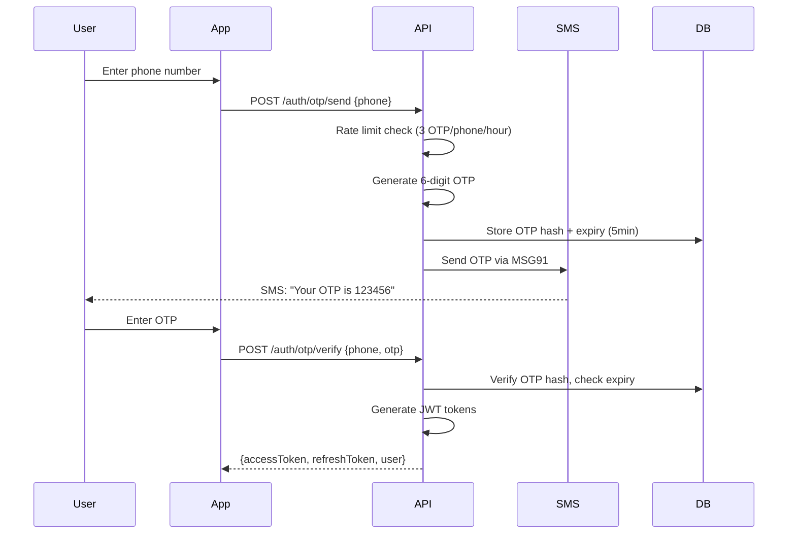

# PetZonic — Security Design

> **Version**: 1.0.0  
> **Date**: May 28, 2026

---

## 1. Security Principles

1. **Defense in Depth** — Multiple layers of security controls
2. **Least Privilege** — Minimum access required for each role/service
3. **Secure by Default** — Security baked into architecture, not bolted on
4. **Data Minimization** — Collect only what's needed
5. **Zero Trust** — Verify every request, trust no input

---

## 2. Authentication

### 2.1 Auth Flow (Phone OTP)



### 2.2 JWT Token Strategy

| Token | Lifetime | Storage | Purpose |
|-------|----------|---------|---------|
| Access Token | 15 minutes | Memory (mobile: secure storage) | API authentication |
| Refresh Token | 7 days | HttpOnly cookie (web) / Secure storage (mobile) | Renew access token |

**Token Payload (Access):**
```json
{
  "sub": "user_uuid",
  "roles": ["buyer", "seller"],
  "iat": 1716883200,
  "exp": 1716884100
}
```

**Refresh Token Rotation:**
- Each refresh issues a new refresh token
- Old refresh token invalidated immediately
- If reused old token detected → revoke all user sessions (compromised)

### 2.3 Session Security
- Max 5 concurrent sessions per user
- Session revocation on password change
- Device fingerprinting for suspicious login detection
- Forced re-auth for sensitive operations (payment, account deletion)

---

## 3. Authorization (RBAC)

### 3.1 Role Hierarchy

```
Super Admin → Admin → Franchise Owner
                    → Service Provider (Vet, Groomer, Sitter)
                    → Breeder (Verified Seller)
                    → Seller (KYC Verified)
                    → Buyer (Basic User)
```

### 3.2 Permission Matrix (Key Endpoints)

| Endpoint | Buyer | Seller | Breeder | Admin |
|----------|:-----:|:------:|:-------:|:-----:|
| GET /pets | ✅ | ✅ | ✅ | ✅ |
| POST /pets | ❌ | ✅ | ✅ | ✅ |
| POST /orders | ✅ | ❌ | ✅ | ✅ |
| GET /admin/users | ❌ | ❌ | ❌ | ✅ |
| POST /admin/verify-kyc | ❌ | ❌ | ❌ | ✅ |
| GET /seller/earnings | ❌ | ✅ | ✅ | ✅ |
| PUT /pets/:id | ❌ | Own only | Own only | Any |

### 3.3 Implementation
```typescript
// NestJS Guard Example
@UseGuards(JwtAuthGuard, RolesGuard)
@Roles('seller', 'breeder')
@Post('pets')
createPetListing(@Body() dto: CreatePetDto) { ... }
```

---

## 4. Input Validation & Sanitization

### 4.1 Validation Strategy

| Layer | Tool | Purpose |
|-------|------|---------|
| API Input | class-validator (NestJS) | Type checking, constraints, format |
| File Upload | multer + custom pipes | File type, size, magic bytes |
| Database | Prisma schema constraints | NOT NULL, unique, relations |
| Frontend | Zod (web) / flutter_form_builder | Client-side validation (UX) |

### 4.2 Validation Rules

```typescript
// Example: Create Pet Listing DTO
class CreatePetDto {
  @IsString() @Length(3, 100) title: string;
  @IsEnum(Species) species: Species;
  @IsUUID() breedId: string;
  @IsInt() @Min(0) @Max(30) ageMonths: number;
  @IsEnum(Gender) gender: Gender;
  @IsNumber() @Min(100) @Max(10000000) price: number;
  @IsString() @Length(20, 2000) description: string;
  @IsArray() @ArrayMinSize(3) @ArrayMaxSize(10) photoUrls: string[];
  @IsEnum(PriceType) priceType: PriceType;
  @IsOptional() @IsString() @MaxLength(500) healthInfo?: string;
}
```

### 4.3 Sanitization
- Strip HTML from all text inputs (prevent XSS)
- Trim whitespace
- Normalize Unicode (prevent homoglyph attacks)
- SQL injection: prevented by Prisma ORM (parameterized queries)
- NoSQL injection: not applicable (PostgreSQL)

---

## 5. API Security

### 5.1 Rate Limiting

| Endpoint Category | Limit | Window |
|-------------------|-------|--------|
| OTP send | 3 requests | per hour per phone |
| Login attempts | 5 requests | per 15 min per IP |
| API (authenticated) | 1000 requests | per minute per user |
| API (unauthenticated) | 100 requests | per minute per IP |
| File upload | 20 requests | per minute per user |
| Search | 60 requests | per minute per user |

### 5.2 CORS Configuration
```typescript
{
  origin: [
    'https://petzonic.com',
    'https://admin.petzonic.com',
    'https://seller.petzonic.com',
    // Staging origins (non-production)
  ],
  methods: ['GET', 'POST', 'PUT', 'PATCH', 'DELETE'],
  credentials: true,
  maxAge: 86400
}
```

### 5.3 Security Headers
```
X-Content-Type-Options: nosniff
X-Frame-Options: DENY
X-XSS-Protection: 1; mode=block
Strict-Transport-Security: max-age=31536000; includeSubDomains
Content-Security-Policy: default-src 'self'; img-src 'self' https://media.petzonic.com
Referrer-Policy: strict-origin-when-cross-origin
```

### 5.4 Request Security
- All requests over HTTPS (TLS 1.3)
- Request body size limit: 10MB (50MB for file uploads)
- Timeout: 30 seconds per request
- Helmet.js for security headers
- CSRF protection for web (SameSite cookies + CSRF token)

---

## 6. Data Security

### 6.1 Encryption

| Data State | Method |
|-----------|--------|
| In transit | TLS 1.3 (HTTPS everywhere) |
| At rest (DB) | AWS RDS encryption (AES-256) |
| At rest (S3) | Server-side encryption (SSE-S3) |
| At rest (Redis) | ElastiCache encryption |
| Passwords | bcrypt (12 salt rounds) |
| OTP storage | SHA-256 hash (not plaintext) |
| Tokens | JWT with RS256 signing |

### 6.2 Sensitive Data Handling

| Data | Storage | Access |
|------|---------|--------|
| Aadhaar/PAN (KYC) | Encrypted in DB, masked in responses | Admin only (full view during verification) |
| Bank account details | Encrypted, stored only for payouts | User (own) + Admin |
| Phone numbers | Stored, masked in public profiles | User (own) + Admin |
| Payment info | NOT stored (Razorpay handles) | Never |
| Chat messages | Encrypted at rest (DB encryption) | Participants + Admin (moderation) |

### 6.3 Data Masking

```
Phone: +91 98XXX XX890 (public view)
Email: s***n@gmail.com (public view)
Aadhaar: XXXX XXXX 4567 (admin dashboard)
Bank: XXXXXXXXX890 (user's own view)
```

---

## 7. File Upload Security

### 7.1 Validation Pipeline

```
User Upload → Size Check → Extension Check → MIME Type Check → 
Magic Bytes Check → Virus Scan (optional) → Image Processing → S3 Upload
```

### 7.2 Rules

| File Type | Max Size | Allowed Extensions | Additional |
|-----------|----------|-------------------|-----------|
| Pet photos | 10MB | .jpg, .jpeg, .png, .webp | Strip EXIF data |
| Pet video | 50MB | .mp4, .mov | Transcode to mp4 |
| Documents (KYC) | 5MB | .pdf, .jpg, .png | Watermark with user ID |
| Product images | 5MB | .jpg, .jpeg, .png, .webp | Auto-resize to standard dimensions |

### 7.3 S3 Security
- Bucket policy: no public access
- Access via pre-signed URLs (time-limited) or CloudFront
- Upload via pre-signed POST (direct to S3, bypasses API server)
- Separate bucket for user uploads vs processed/approved media

---

## 8. Payment Security

### 8.1 PCI DSS Compliance
- **No card data stored** on PetZonic servers
- All card processing handled by Razorpay (PCI DSS Level 1 certified)
- Payment page rendered by Razorpay SDK
- Only payment IDs and status stored in our database

### 8.2 Payment Verification
```
1. Client initiates → API creates Razorpay order
2. Client pays via Razorpay SDK
3. Razorpay sends webhook to API
4. API verifies webhook signature (HMAC SHA256)
5. API verifies payment status via Razorpay API (double verification)
6. Only then: order confirmed, stock deducted
```

### 8.3 Escrow Security (Pet Purchases)
- Payment held by Razorpay (Route feature)
- Release only after buyer confirms receipt
- Auto-release after 7 days if no dispute raised
- Admin can manually release/refund during disputes

---

## 9. Infrastructure Security

### 9.1 Network Security

| Layer | Control |
|-------|---------|
| VPC | Private subnets for DB and app servers |
| Security Groups | Least privilege (API → DB: port 5432 only) |
| NAT Gateway | Outbound internet without public IP on app servers |
| WAF | SQL injection, XSS, bot protection rules |
| CloudFront | DDoS protection (AWS Shield Standard included) |

### 9.2 Access Control
- IAM roles per service (ECS task role, Lambda role)
- No root account usage (MFA on root)
- Admin access via IAM users with MFA
- Programmatic access: IAM roles (not static keys)
- SSH access: disabled (ECS Fargate = serverless containers)

### 9.3 Secrets Management
- AWS Secrets Manager for all secrets
- Environment-specific secrets (staging ≠ production)
- Auto-rotation for database credentials
- No secrets in code, Dockerfiles, or environment files committed to Git
- `.env.example` with placeholder values only

---

## 10. Application Security (OWASP Top 10)

| # | Vulnerability | Mitigation |
|---|--------------|-----------|
| A01 | Broken Access Control | RBAC guards on every endpoint, ownership validation |
| A02 | Cryptographic Failures | TLS 1.3, AES-256 at rest, bcrypt for passwords |
| A03 | Injection | Prisma ORM (parameterized), class-validator, no raw SQL |
| A04 | Insecure Design | Threat modeling, escrow for payments, verification for sellers |
| A05 | Security Misconfiguration | Terraform (IaC), security headers, no debug in prod |
| A06 | Vulnerable Components | Dependabot alerts, weekly dependency audit, lockfile |
| A07 | Auth Failures | OTP rate limit, token rotation, session management |
| A08 | Data Integrity Failures | Webhook signature verification, CI/CD pipeline integrity |
| A09 | Logging Failures | Structured logging, audit trail, no sensitive data in logs |
| A10 | SSRF | No user-controlled URLs in server requests, allowlists for webhooks |

---

## 11. Audit & Logging

### 11.1 Audit Events (Stored in DB)

| Event | Data Captured |
|-------|--------------|
| Login/Logout | User, IP, device, timestamp, success/failure |
| KYC submission | User, documents submitted, timestamp |
| Listing create/edit/delete | User, listing ID, changes made |
| Order placed/cancelled | User, order ID, amount |
| Payment received/refunded | User, payment ID, amount, method |
| Admin actions | Admin user, action, target entity, before/after |
| Account suspension/ban | Admin, target user, reason, duration |

### 11.2 Security Logging (Never logged)
- Passwords, OTPs
- Full credit card numbers
- Aadhaar/PAN numbers
- JWT token values
- API keys

---

## 12. Incident Response

### 12.1 Security Incident Categories

| Severity | Example | Response Time |
|----------|---------|--------------|
| Critical | Data breach, payment compromise | < 1 hour |
| High | Account takeover, API key leak | < 4 hours |
| Medium | DDoS attempt, bot attack | < 24 hours |
| Low | Single failed brute-force attempt | Monitor |

### 12.2 Response Steps
1. **Detect** — Monitoring alerts (CloudWatch, Sentry, WAF)
2. **Contain** — Block IP, revoke token, disable account
3. **Investigate** — Audit logs, access logs, timeline
4. **Remediate** — Fix vulnerability, patch, deploy
5. **Communicate** — Notify affected users if data exposed
6. **Post-mortem** — Document and prevent recurrence

---

## 13. Compliance

| Regulation | Applicability | Compliance Approach |
|-----------|--------------|-------------------|
| India DPDP Act 2023 | User personal data | Consent management, data minimization, deletion rights |
| RBI Payment Guidelines | Payment processing | Razorpay handles compliance, no card storage |
| IT Act 2000 | Platform operations | Content moderation, user grievance officer |
| Prevention of Cruelty to Animals Act | Pet trade | Listing guidelines, banned species, health requirements |
| GST Compliance | E-commerce | Invoice generation, TDS on seller payouts |
| Consumer Protection Act | Buyer rights | Return policy, refund processing, grievance redressal |
