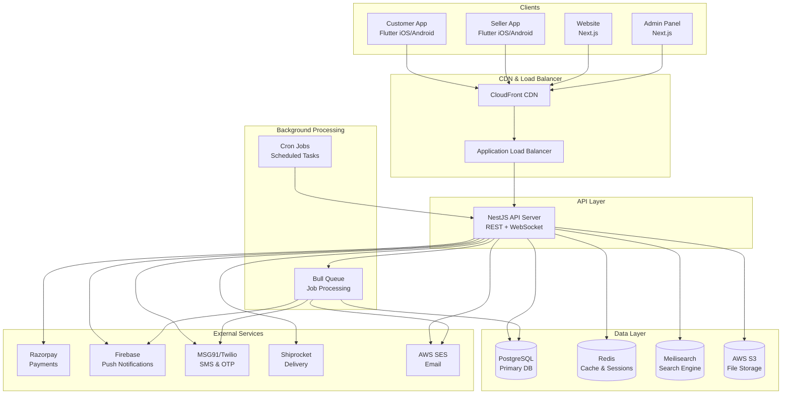
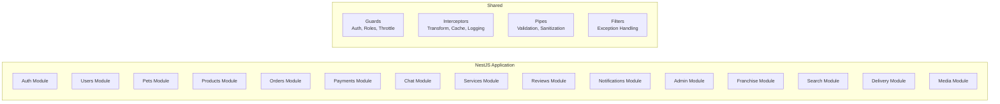
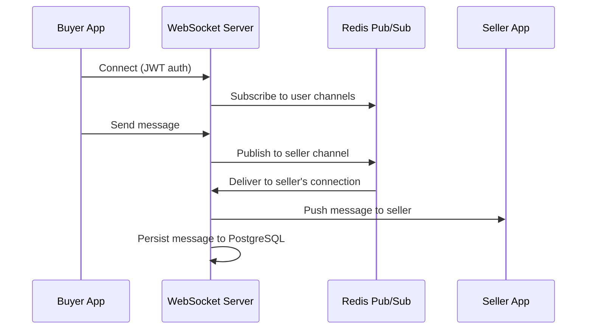
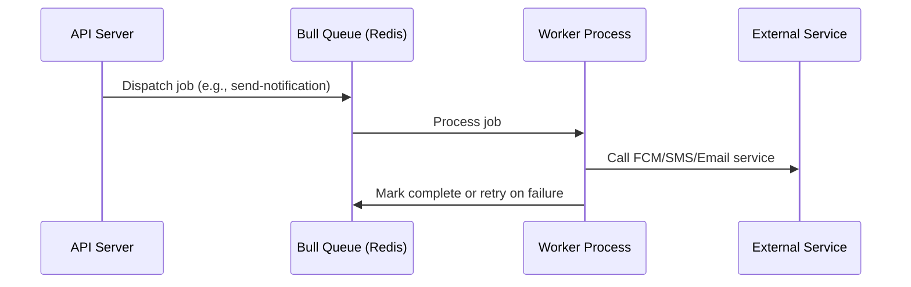
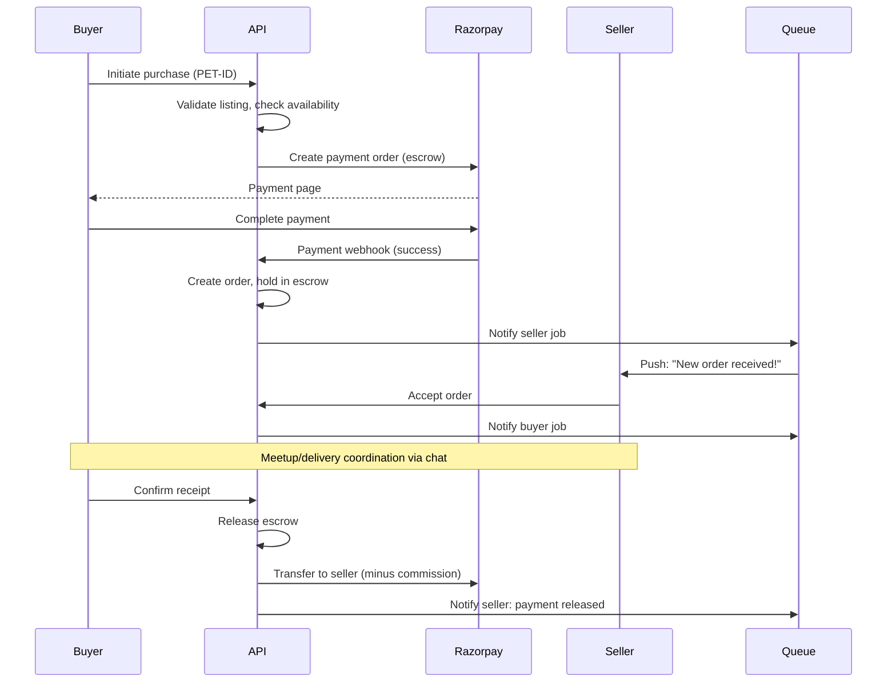
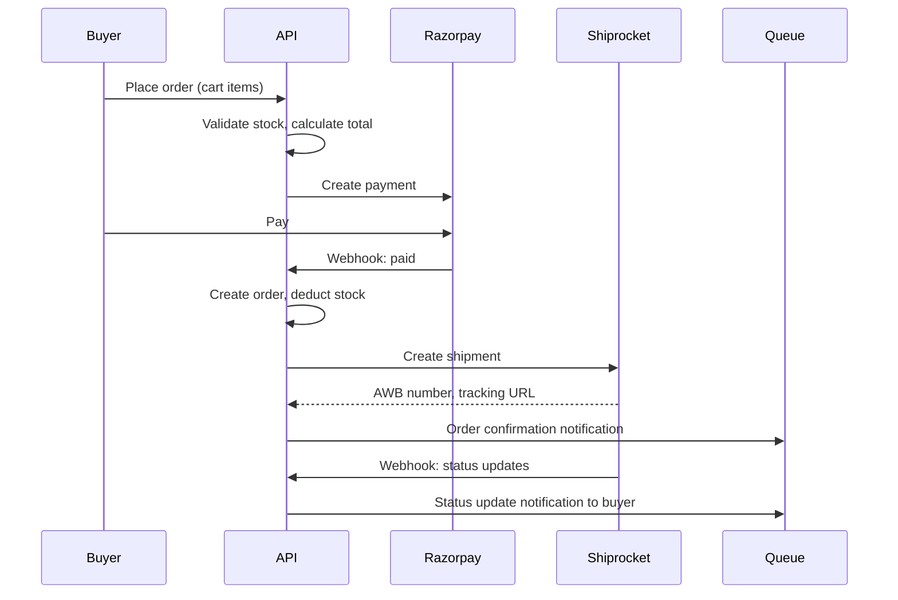
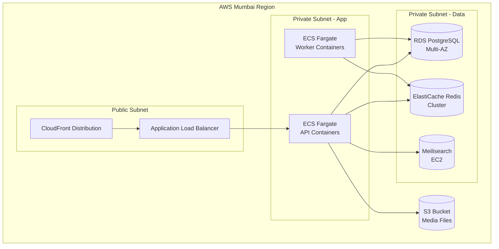

# PetZonic — System Architecture

> **Version**: 1.0.0  
> **Date**: May 28, 2026

---

## 1. Architecture Overview

PetZonic follows a **client-server architecture** with multiple frontend clients communicating with a single unified backend API. The system uses a **modular monolith** approach initially (NestJS modules), designed to evolve into microservices if scale demands it.

---

## 2. High-Level Architecture Diagram



---

## 3. Architecture Layers

### 3.1 Client Layer

| Client | Technology | Purpose | Communication |
|--------|-----------|---------|---------------|
| Customer App | Flutter (Dart) | iOS + Android buyer experience | REST API + WebSocket |
| Seller App | Flutter (Dart) | iOS + Android seller experience | REST API + WebSocket |
| Website | Next.js (React) | Customer web + SEO | REST API (SSR + CSR) |
| Admin Panel | Next.js (React) | Platform management | REST API |

**Key Design Decisions:**
- Flutter chosen for single codebase → iOS + Android with near-native performance
- Next.js for web: SSR for SEO-critical pages (product listings, pet pages), CSR for interactive sections
- Separate apps for buyer and seller (like Amazon) for focused UX and smaller app size
- Admin panel is web-only (no mobile app for admin)

### 3.2 API Gateway Layer

| Component | Technology | Purpose |
|-----------|-----------|---------|
| CDN | AWS CloudFront | Static asset delivery, SSL termination, DDoS protection |
| Load Balancer | AWS ALB | Request routing, health checks, SSL offloading |
| API Server | NestJS on ECS | Request handling, business logic, response |

**API Design:**
- RESTful API (OpenAPI/Swagger documented)
- WebSocket server for real-time chat
- API versioning: `/api/v1/...`
- Rate limiting: 100 req/min (public), 1000 req/min (authenticated)
- Request timeout: 30 seconds

### 3.3 Application Layer (NestJS Modular Monolith)



**Module Responsibility:**

| Module | Responsibility |
|--------|---------------|
| **Auth** | Registration, login, OTP, JWT, session management |
| **Users** | Profile management, KYC, role management |
| **Pets** | Pet CRUD, listing lifecycle, moderation |
| **Products** | Product catalog, variants, inventory |
| **Orders** | Cart, checkout, order lifecycle, returns |
| **Payments** | Razorpay integration, escrow, payouts, refunds |
| **Chat** | WebSocket messaging, chat rooms, message persistence |
| **Services** | Vet/groomer/sitter listings, bookings, scheduling |
| **Reviews** | Ratings, reviews, moderation |
| **Notifications** | Push (FCM), SMS, email, in-app notifications |
| **Admin** | Dashboard, moderation queues, platform config |
| **Franchise** | Franchise management, onboarding, revenue sharing |
| **Search** | Meilisearch integration, indexing, filters |
| **Delivery** | Shiprocket integration, tracking, logistics |
| **Media** | Image/video upload, S3 management, compression |

### 3.4 Data Layer

| Store | Technology | Purpose | Data |
|-------|-----------|---------|------|
| **Primary DB** | PostgreSQL 15 | Transactional data | Users, orders, listings, payments, reviews |
| **Cache** | Redis 7 | Performance + real-time | Sessions, API cache, rate limits, online status, pub/sub for chat |
| **Search** | Meilisearch | Full-text search | Pet listings index, product index, service provider index |
| **File Storage** | AWS S3 | Binary assets | Pet photos/videos, documents, product images, user avatars |
| **Queue** | Redis (Bull) | Async job processing | Email sending, SMS, push notifications, image processing |

### 3.5 Background Processing

| Job Type | Examples | Queue |
|----------|---------|-------|
| **Notifications** | Send push, SMS, email after events | notifications-queue |
| **Media Processing** | Image resize, video thumbnail, watermark | media-queue |
| **Scheduled Tasks** | Listing expiry check, payout processing, analytics aggregation | cron |
| **Search Indexing** | Update Meilisearch when listings change | search-queue |
| **Payment Settlement** | Weekly seller payouts | payments-queue |

---

## 4. Communication Patterns

### 4.1 Synchronous (REST API)

```
Client → ALB → NestJS Controller → Service → Repository → PostgreSQL
                                                        → Redis (cache)
                                                        → S3 (files)
```

### 4.2 Real-time (WebSocket)



### 4.3 Async (Event-driven)



---

## 5. Data Flow — Key Scenarios

### 5.1 Pet Purchase Flow



### 5.2 Product Order Flow



---

## 6. Scalability Strategy

### Phase 1 (Launch — 5K users)
- Single API server (2 vCPU, 4GB RAM)
- Single PostgreSQL instance (db.t3.medium)
- Single Redis instance
- Good enough for initial traffic

### Phase 2 (Growth — 50K users)
- Auto-scaling API servers (2-4 instances behind ALB)
- PostgreSQL read replica for read-heavy queries
- Redis cluster for sessions + cache
- Meilisearch dedicated instance

### Phase 3 (Scale — 500K+ users)
- Consider splitting into microservices (Chat, Payments, Notifications)
- Database sharding by region/tenant
- Dedicated WebSocket cluster
- Event-driven architecture (EventBridge/Kafka)
- Multi-region deployment

---

## 7. Fault Tolerance & Reliability

| Component | Strategy |
|-----------|----------|
| API Server | Multi-AZ deployment, auto-scaling, health checks |
| Database | Multi-AZ RDS, automated backups, point-in-time recovery |
| Redis | ElastiCache with replica, auto-failover |
| File Storage | S3 (99.999999999% durability) |
| External APIs | Circuit breaker pattern, retry with backoff, fallback responses |
| Background Jobs | Retry with exponential backoff (3 attempts), dead letter queue |

---

## 8. Monitoring & Observability

| Layer | Tool | Purpose |
|-------|------|---------|
| Application | Sentry | Error tracking, crash reporting |
| Infrastructure | CloudWatch | CPU, memory, disk, network metrics |
| Logs | CloudWatch Logs | Centralized logging (structured JSON) |
| APM | AWS X-Ray or Sentry Performance | Request tracing, slow query detection |
| Uptime | AWS Route53 Health Checks | Endpoint monitoring, alerting |
| Alerts | CloudWatch Alarms → SNS | PagerDuty/Slack integration for on-call |

---

## 9. Security Architecture

See [Security Document](security.md) for detailed security design.

**Summary:**
- All traffic over HTTPS (TLS 1.3)
- JWT authentication (short-lived access + long-lived refresh tokens)
- Role-based access control (RBAC) at API level
- Input validation on every endpoint (class-validator)
- Rate limiting per IP and per user
- File upload scanning
- No sensitive data in logs
- Secrets managed via AWS Secrets Manager

---

## 10. Deployment Architecture


