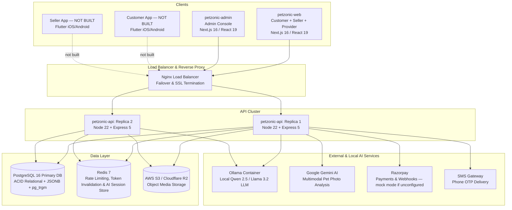
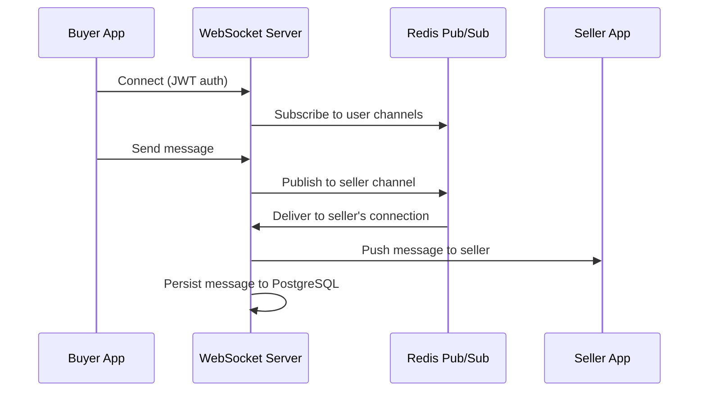
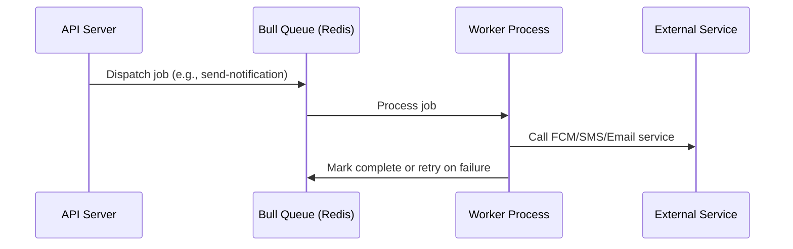
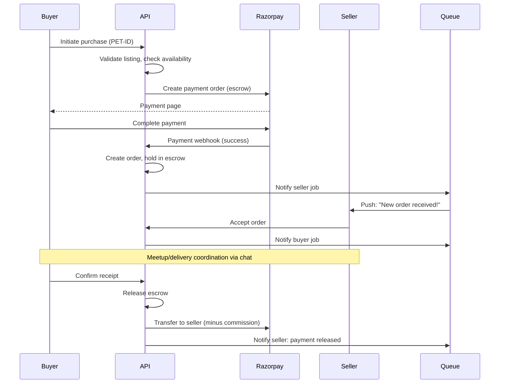
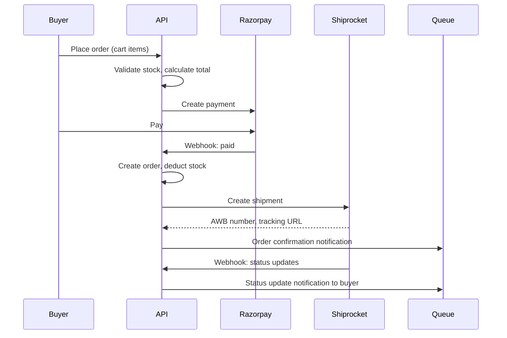
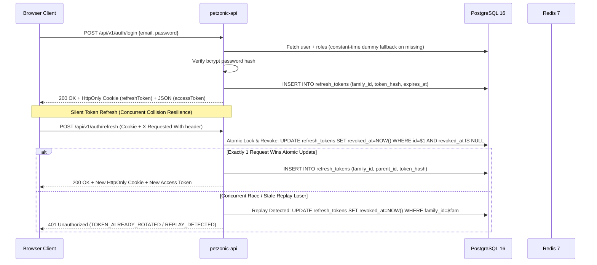
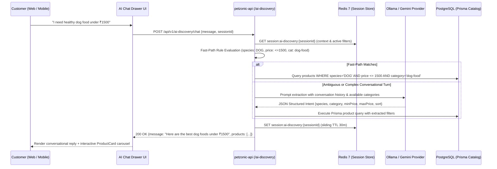
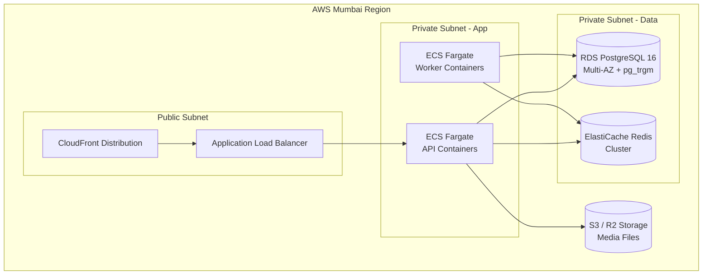

# PetZonic — System Architecture

> **Version**: 1.0.0  
> **Date**: May 28, 2026 · **Accuracy-checked against source**: 2026-09-26

---

## 1. Architecture Overview

PetZonic follows a **client-server architecture** in which web clients communicate with a
single unified backend API. The backend is an **Express 5 modular monolith** in TypeScript,
using a strict **Router → Controller → Service → Repository** 4-tier architecture across
**25 domain modules** (verified 2026-09-20). It is not a microservice system.

**Built clients**: `petzonic-web` (customer, seller and provider portals in one Next.js app)
and `petzonic-admin` (separate Next.js admin console).
**Not built**: the Flutter mobile apps shown dashed in the diagram below. Their repos contain
no application code. They are included only to show intended future topology.

---

## 2. High-Level Architecture Diagram



> **Push notifications**: Firebase FCM is *not* wired up. The push provider in
> `petzonic-api/src/modules/notifications/providers.ts` is a permanent stub that reports
> itself unconfigured, so the notification outbox marks push sends as `SKIPPED` rather than
> pretending they were delivered.
>
> **Nginx & multi-replica**: the compose topology for this exists in `petzonic-infra`, but it
> has never been deployed. There is no TLS termination configured anywhere today.

---

## 3. Architecture Layers

### 3.1 Client Layer

| Client | Technology | Purpose | Communication |
|--------|-----------|---------|---------------|
| Website & Admin | Next.js 16 (React 19) | Customer e-commerce, listings, chat, & admin panel | REST API (Axios) + Socket.io |
| Customer App | Flutter (Dart) | iOS + Android mobile buyer experience | REST API + Socket.io |
| Seller App | Flutter (Dart) | iOS + Android mobile seller experience | REST API + Socket.io |

### 3.2 Reverse Proxy & Load Balancer

| Component | Technology | Purpose |
|-----------|-----------|---------|
| Reverse Proxy | Nginx | SSL termination, static gzip caching, path-based routing |
| Load Balancer | Nginx Upstream | Round-robin load balancing across replicas with health failover (`max_fails=3`) |
| WebSockets | Nginx `/socket.io/` | Sticky connection upgrade for live real-time chat |

### 3.3 Application Layer (Express 5 Modular Monolith)

The backend organizes all platform capabilities into **26 domain modules** (`petzonic-api/src/modules/`, measured 2026-09-26), each following the 4-layer design:
- **Router**: Thin route definitions, middleware chains, auth & rate-limit guards
- **Controller**: HTTP request parsing, Zod validation, status codes, response envelope
- **Service**: Domain business rules, transactions, external provider integration
- **Repository**: Prisma ORM database interactions

**Active Modules:**

| Module | Scope / Responsibility |
|--------|------------------------|
| **Auth** | Registration, login, phone OTP lockout, JWT refresh rotation, Google OAuth |
| **Users** | Profile management, KYC verification, address book, roles |
| **Pets** | Pet listings, breed taxonomy, negotiable pricing, boosts, Gemini AI assist |
| **Products** | E-commerce catalog, categories, inventory, brands, **pre-owned peer listings with admin moderation** (2026-09-17) |
| **Pharmacy** | Pet medicine catalog, prescription vault and upload, customer pet profiles, admin prescription verification, Rx gating at checkout (2026-09-20) |
| **Breeders** | District-scoped breeder profiles and district browse; verification admin-granted (2026-09-20/22) |
| **Brands** | Brand directory and brand pages |
| **Support** | Customer support tickets and admin replies |
| **Metrics** | Prometheus `/metrics`, HTTP latency, subsystem probes (2026-09-17) |
| **Cart & Orders** | Server-backed cart, checkout, multi-item orders, status lifecycle, returns, **tax invoice (JSON/HTML)**, abandoned-order expiry |
| **Payments** | Razorpay order creation, HMAC webhook verification, COD, escrow holds, payouts |
| **Chat** | Socket.io real-time WebSocket chat gateway, rooms, message history |
| **Services** | Vet, grooming, sitting, training provider listings and slot bookings |
| **Reviews** | Star ratings, text reviews, helpfulness upvoting, seller/admin replies |
| **Notifications** | In-app notifications, device tokens, transactional outbox queue |
| **Community** | Discussion forums, categories, post voting, replies, lost & found board |
| **Education** | Training courses, chapters, enrollments, vet Q&A, feeding calculator |
| **Insurance** | Partner plans, coverage comparison, policy issuance, claim filing |
| **Promotions** | Discount coupons, flat/percentage rules, checkout code validation |
| **Banners** | Homepage carousel banners, schedules, link targets |
| **Media** | S3 / Cloudflare R2 upload with local disk `/uploads` fallback |
| **Newsletter** | Email subscription capture and verification |
| **Admin** | Unified admin dashboard, metrics, user moderation, dispute resolution, audit logs |
| **AI Discovery** | Conversational concierge across products, pets, breeders, services, pre-owned, pharmacy, brands, insurance and lost-and-found; multi-tab routing via `targetTab` (2026-09-23); hybrid rule-based & Ollama/Gemini intent extraction; Redis sessions |
| **Docs** | Interactive OpenAPI 3.0 Swagger UI mounted at `/api/docs` |

### 3.4 Data Layer

| Store | Technology | Purpose |
|-------|-----------|---------|
| **Primary Database** | PostgreSQL 16 | 58 tables: transactional ACID data, user accounts, listings, orders, JSONB |
| **Search Engine** | PostgreSQL `pg_trgm` | Zero-latency full-text and fuzzy trigram matching directly in DB |
| **Cache, Limiter & Session** | Redis 7 | Distributed sliding-window rate limiting (`rate-limit-redis`), AI multi-turn session cache, and token family invalidation with memory fallback |
| **Object Storage** | AWS S3 / Cloudflare R2 | Media images & documents with automated local disk fallback |

---

## 4. Communication Patterns

### 4.1 Synchronous (REST API)

```
Client ➔ Nginx ➔ Express Thin Router ➔ Controller ➔ Service ➔ Repository ➔ PostgreSQL 16
                                                            ➔ Redis 7 (rate limiting)
                                                            ➔ S3 / Cloudflare R2 (files)
```

### 4.2 Real-time (WebSocket)



### 4.3 Async (Event-driven)



**Queues in code (2026-09-26)**: `petzonic-email-queue`, `petzonic-broadcast-queue`, and
`petzonic-maintenance-queue` — the last one runs **scheduled jobs**: `auto-release-escrows`
(hourly) and `expire-abandoned-orders` (every 15 minutes, 30-minute unpaid TTL). Workers run
inside the API process. Push delivery (FCM) is still a stub that reports itself unconfigured.

---

## 5. Data Flow — Key Scenarios

### 5.1 Pet Purchase Flow



### 5.2 Product Order Flow



### 5.3 Database-Atomic Authentication & Session Lifecycle



### 5.4 Conversational Shopping & Product Discovery Flow



---

## 6. Scalability Strategy

### Phase 1 (Launch — 5K users)
- Single API server (2 vCPU, 4GB RAM)
- Single PostgreSQL instance (db.t3.medium)
- Single Redis instance
- Good enough for initial traffic

### Phase 2 (Growth — 50K users)
- Auto-scaling API servers (2-4 instances behind ALB)
- PostgreSQL read replica for read-heavy queries
- Redis cluster for sessions + cache
- Dedicated background worker container for outbox events

### Phase 3 (Scale — 500K+ users)
- Consider splitting into microservices (Chat, Payments, Notifications)
- Database sharding by region/tenant
- Dedicated WebSocket cluster
- Event-driven architecture (EventBridge/Kafka)
- Multi-region deployment

---

## 7. Fault Tolerance & Reliability

| Component | Strategy |
|-----------|----------|
| API Server | Multi-AZ deployment, auto-scaling, health checks |
| Database | Multi-AZ RDS, automated backups, point-in-time recovery |
| Redis | ElastiCache with replica, auto-failover |
| File Storage | S3 (99.999999999% durability) |
| External APIs | Circuit breaker pattern, retry with backoff, fallback responses |
| Background Jobs | Retry with exponential backoff (3 attempts), dead letter queue |

---

## 8. Monitoring & Observability

> **Implemented (2026-09-17/18)**: Prometheus + Grafana + Alertmanager + Loki/Promtail +
> cAdvisor + Node Exporter via Docker Compose, scraping the API's `/metrics`. Sentry, CloudWatch
> and X-Ray in the table below are **planned, not used**. See
> [Infrastructure §9.0](infrastructure.md#90-implemented-stack-docker-compose-since-2026-091718).

| Layer | Tool (planned) | Purpose |
|-------|------|---------|
| Application | Sentry | Error tracking, crash reporting |
| Infrastructure | CloudWatch | CPU, memory, disk, network metrics |
| Logs | CloudWatch Logs | Centralized logging (structured JSON) |
| APM | AWS X-Ray or Sentry Performance | Request tracing, slow query detection |
| Uptime | AWS Route53 Health Checks | Endpoint monitoring, alerting |
| Alerts | CloudWatch Alarms → SNS | PagerDuty/Slack integration for on-call |

---

## 9. Security Architecture

See [Security Document](security.md) for detailed security design.

**Summary:**
- All traffic over HTTPS (TLS 1.3)
- JWT authentication (short-lived access + long-lived refresh tokens)
- Role-based access control (RBAC) at API level
- Input validation on every endpoint (class-validator)
- Rate limiting per IP and per user
- File upload scanning
- No sensitive data in logs
- Secrets managed via AWS Secrets Manager

---

## 10. Deployment Architecture


