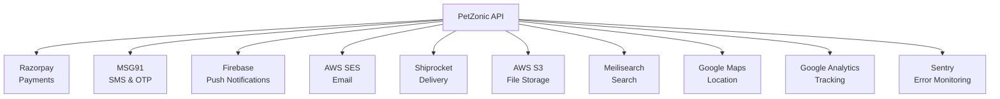

# PetZonic — Third-Party Integrations

> **Version**: 1.0.0  
> **Date**: May 28, 2026

---

## 1. Integration Overview



---

## 2. Payment — Razorpay

### Purpose
Process all payments: UPI, cards, net banking, wallets, and handle marketplace payouts.

### Integration Points

| Feature | Razorpay Product | Usage |
|---------|-----------------|-------|
| Accept payments | Razorpay Payment Gateway | Checkout for products & pets |
| Split payments | Razorpay Route | Auto-split commission from seller payments |
| Escrow/hold | Razorpay Route (on-hold) | Hold pet purchase funds until delivery confirmed |
| Seller payouts | Razorpay Payouts | Weekly settlement to seller bank accounts |
| Refunds | Razorpay Refunds API | Process returns and cancellations |
| Subscriptions (future) | Razorpay Subscriptions | Premium seller plans |

### Configuration
```
Environment Variables:
- RAZORPAY_KEY_ID
- RAZORPAY_KEY_SECRET
- RAZORPAY_WEBHOOK_SECRET

Webhook Events to Handle:
- payment.authorized
- payment.captured
- payment.failed
- refund.processed
- transfer.processed
- payout.processed
```

### Pricing
- 2% per transaction (standard)
- Route: additional 0.25% per transfer
- Payouts: ₹5-₹25 per payout depending on mode

---

## 3. SMS & OTP — MSG91

### Purpose
Send OTP for phone verification, transactional SMS (order updates, payment confirmations).

### Integration Points

| Feature | MSG91 Product | Usage |
|---------|--------------|-------|
| OTP verification | MSG91 OTP | Phone registration, login |
| Transactional SMS | MSG91 Transactional | Order confirmation, delivery updates, payment alerts |
| Promotional SMS (future) | MSG91 Promotional | Offers, new listings (opt-in only) |

### Configuration
```
Environment Variables:
- MSG91_AUTH_KEY
- MSG91_SENDER_ID (6 chars, e.g., "PTZNIC")
- MSG91_OTP_TEMPLATE_ID
- MSG91_ORDER_TEMPLATE_ID
- MSG91_DELIVERY_TEMPLATE_ID

DLT Registration:
- Entity registration with TRAI
- Template approval for each SMS type
- Sender ID registration
```

### SMS Templates (DLT Registered)

| Template | Content |
|----------|---------|
| OTP | "Your PetZonic verification code is {OTP}. Valid for 5 minutes. Do not share." |
| Order Placed | "Your order #{ORDER_ID} is confirmed! Amount: ₹{AMOUNT}. Track at {LINK}" |
| Order Delivered | "Your order #{ORDER_ID} has been delivered. Rate your experience on PetZonic!" |
| Payment Received (Seller) | "Payment of ₹{AMOUNT} received for order #{ORDER_ID}. Check your PetZonic dashboard." |

### Pricing
- OTP: ₹0.15-0.20 per OTP
- Transactional SMS: ₹0.12-0.18 per SMS
- Estimated monthly (5K users): ₹5,000-8,000

---

## 4. Push Notifications — Firebase Cloud Messaging (FCM)

### Purpose
Send real-time push notifications to mobile apps (iOS & Android).

### Integration Points

| Trigger | Notification | Priority |
|---------|-------------|----------|
| New message | "New message from {seller_name}" | High |
| Order status change | "Your order #{ID} is shipped!" | High |
| New order (seller) | "New order received! Check your dashboard" | High |
| Listing approved | "Your pet listing is now live!" | Normal |
| Price drop (wishlist) | "{pet_breed} price dropped to ₹{price}" | Normal |
| New matching listing | "A {breed} is listed near you!" | Normal |
| Appointment reminder | "Vet appointment tomorrow at {time}" | High |
| Promotional | "Flat 20% off on pet food! Shop now" | Low |

### Configuration
```
Environment Variables:
- FIREBASE_PROJECT_ID
- FIREBASE_PRIVATE_KEY (service account)
- FIREBASE_CLIENT_EMAIL

Implementation:
- Store FCM device tokens per user (multiple devices)
- Topic-based notifications for broadcasts
- Token refresh handling
- Silent notifications for data sync
```

### Pricing
- Free (unlimited notifications via FCM)

---

## 5. Email — AWS SES

### Purpose
Send transactional and notification emails (order confirmations, weekly summaries, password reset).

### Integration Points

| Email Type | Trigger | Template |
|-----------|---------|----------|
| Welcome | User registration | Welcome + getting started guide |
| Order confirmation | Order placed | Order details, items, amount |
| Shipping update | Status change | Tracking info |
| Password reset | Forgot password request | Reset link (30min expiry) |
| Seller weekly summary | Every Monday | Sales, earnings, pending actions |
| Admin alerts | System events | Critical system notifications |
| Invoice | Order delivered | GST invoice PDF attachment |

### Configuration
```
Environment Variables:
- AWS_SES_REGION: ap-south-1
- SES_FROM_EMAIL: no-reply@petzonic.com
- SES_REPLY_TO: support@petzonic.com

Setup:
- Domain verification (petzonic.com)
- DKIM + SPF + DMARC configuration
- Request production access (move out of sandbox)
- Bounce/complaint handling
```

### Pricing
- $0.10 per 1,000 emails
- Estimated: ₹500-1,000/month

---

## 6. Delivery & Logistics — Shiprocket

### Purpose
Handle product shipping: create shipments, generate AWB, track deliveries, manage returns.

### Integration Points

| Feature | API | Usage |
|---------|-----|-------|
| Serviceability check | Pincode API | Check if delivery available to buyer's pincode |
| Create shipment | Order API | Generate AWB after order confirmed |
| Track shipment | Tracking API | Real-time status updates |
| Cancel shipment | Cancel API | When order cancelled before dispatch |
| Return pickup | Return API | Schedule pickup for returns |
| Rate calculation | Rate API | Show shipping cost at checkout |

### Configuration
```
Environment Variables:
- SHIPROCKET_EMAIL
- SHIPROCKET_PASSWORD
- SHIPROCKET_WEBHOOK_SECRET

Webhook Events:
- shipment.created
- shipment.pickup_scheduled
- shipment.in_transit
- shipment.out_for_delivery
- shipment.delivered
- shipment.rto (return to origin)
```

### Pricing
- Starting ₹25/500g within city
- ₹50-80/500g intercity
- Volume discounts available
- Estimated: ₹20-40 per order average

---

## 7. Location & Maps — Google Maps Platform

### Purpose
Location detection, address autocomplete, distance calculation, map views.

### Integration Points

| Feature | API | Usage |
|---------|-----|-------|
| Address autocomplete | Places API | Address form auto-fill |
| Geocoding | Geocoding API | Convert address to coordinates |
| Reverse geocoding | Geocoding API | Convert coordinates to address |
| Distance calculation | Distance Matrix API | Pet listing distance from buyer |
| Map display | Maps SDK (Flutter + Web) | Location picker, pet map view |
| Place details | Places API | Vet clinic info enrichment |

### Configuration
```
Environment Variables:
- GOOGLE_MAPS_API_KEY_WEB
- GOOGLE_MAPS_API_KEY_ANDROID
- GOOGLE_MAPS_API_KEY_IOS
- GOOGLE_MAPS_API_KEY_SERVER

Restrictions:
- Web key: HTTP referrer restricted (petzonic.com)
- Android key: Package name restricted
- iOS key: Bundle ID restricted
- Server key: IP restricted
```

### Pricing
- $7/1000 autocomplete requests
- $5/1000 geocoding requests
- $5/1000 distance matrix elements
- Maps SDK: free (mobile), $7/1000 loads (web)
- Estimated: ₹3,000-5,000/month (with $200 free credit)

---

## 8. File Storage — AWS S3

### Purpose
Store all media files: pet photos, product images, user documents, videos.

### Bucket Structure
```
petzonic-media-{env}/
├── pets/
│   ├── {pet_id}/
│   │   ├── original/       # Original uploads
│   │   ├── thumbnails/     # 200x200
│   │   ├── medium/         # 600x600
│   │   └── large/          # 1200x1200
├── products/
│   ├── {product_id}/
│   │   ├── original/
│   │   └── optimized/
├── users/
│   ├── avatars/{user_id}/
│   └── kyc/{user_id}/      # Encrypted bucket
├── documents/
│   └── invoices/{order_id}/
└── chat/
    └── {chat_room_id}/
```

### Configuration
```
- Bucket: petzonic-media-production
- Region: ap-south-1
- Encryption: SSE-S3
- Versioning: Enabled
- Lifecycle: Move to IA after 90 days, Glacier after 365 days
- CORS: Allow uploads from petzonic.com origins
- CloudFront: media.petzonic.com → S3 bucket
```

---

## 9. Search — Meilisearch

### Purpose
Fast full-text search with typo tolerance, filters, and faceted navigation for pets and products.

### Indexes

| Index | Documents | Key Fields | Filterable | Sortable |
|-------|-----------|-----------|-----------|----------|
| `pets` | Pet listings | title, breed, species, description, location | species, breed, gender, age, price, city, vaccinated | price, createdAt, distance |
| `products` | Store products | name, description, brand, category | category, brand, price, rating, inStock | price, rating, createdAt |
| `services` | Service providers | name, specialization, city | type, city, rating, available | rating, distance |

### Configuration
```
Environment Variables:
- MEILISEARCH_HOST: http://meilisearch:7700
- MEILISEARCH_MASTER_KEY: (production key)

Settings per Index:
- searchableAttributes: ordered by relevance
- filterableAttributes: for faceted search
- sortableAttributes: for result ordering
- typoTolerance: enabled (1 typo for 5+ chars, 2 for 9+ chars)
- pagination: maxTotalHits: 1000
```

### Sync Strategy
- On listing create/update → update Meilisearch index (via Bull queue)
- On listing delete/expire → remove from index
- Full reindex: nightly cron job (safety net)

---

## 10. Error Monitoring — Sentry

### Purpose
Capture, track, and alert on application errors across all platforms.

### Integration

| Platform | SDK |
|----------|-----|
| NestJS backend | @sentry/node |
| Next.js web | @sentry/nextjs |
| Flutter apps | sentry_flutter |

### Configuration
```
Environment Variables:
- SENTRY_DSN_BACKEND
- SENTRY_DSN_WEB
- SENTRY_DSN_FLUTTER

Features:
- Error capturing with stack traces
- Performance monitoring (transaction tracing)
- Release tracking (associate errors with deployments)
- User context (identify which user hit the error)
- Environment separation (staging vs production)
- Alert rules: Slack notification on new errors
```

### Pricing
- Developer plan: Free (5K errors/month)
- Team plan: $26/month (50K errors) — recommended

---

## 11. Analytics — Google Analytics 4 + Mixpanel

### Purpose
Track user behavior, conversion funnels, and engagement metrics.

### Web Analytics (GA4)

| Event | Trigger |
|-------|---------|
| page_view | Every page navigation |
| view_pet_listing | Pet detail page opened |
| add_to_cart | Product added to cart |
| begin_checkout | Checkout initiated |
| purchase | Order completed |
| sign_up | Registration complete |
| search | Search performed |

### Product Analytics (Mixpanel — future)
- User journey tracking
- A/B test analysis
- Retention cohorts
- Funnel analysis (listing → chat → purchase)

---

## 12. Integration Security Best Practices

| Practice | Implementation |
|----------|---------------|
| API keys in Secrets Manager | Never in code or environment files in Git |
| Webhook signature verification | HMAC verification for Razorpay, Shiprocket webhooks |
| IP allowlisting | Restrict server-side API keys to ECS IPs |
| Key rotation | Quarterly rotation schedule for all keys |
| Least privilege | Each service key has minimum required permissions |
| Fallback handling | Graceful degradation if third-party is down |
| Rate limit awareness | Implement client-side rate limiting for external APIs |
| Monitoring | Alert on 4xx/5xx from third-party services |

---

## 13. Integration Dependency Matrix

| Feature | Critical (blocks user) | Degraded (feature reduced) | Nice-to-have |
|---------|:-----:|:-----:|:-----:|
| Razorpay (payments) | ✅ | | |
| MSG91 (OTP) | ✅ | | |
| FCM (push) | | ✅ | |
| AWS SES (email) | | ✅ | |
| Shiprocket (delivery) | | ✅ | |
| Google Maps | | | ✅ |
| Meilisearch | | ✅ (fallback to DB search) | |
| Sentry | | | ✅ |

**Fallback Strategy:**
- Razorpay down → Show "payment temporarily unavailable" + retry
- MSG91 down → Fallback to Twilio (secondary provider)
- Shiprocket down → Manual order processing, notify admin
- Meilisearch down → Fallback to PostgreSQL full-text search (slower)
