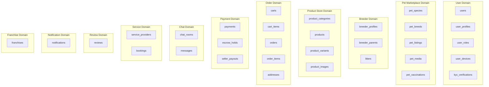

# PetZonic — Entity Relationship Diagram

> **Version**: 1.0.0  
> **Date**: May 28, 2026

---

## 1. Core ER Diagram

```mermaid
erDiagram
    %% === USER DOMAIN ===
    users {
        uuid id PK
        string phone UK
        string email UK
        string password_hash
        enum status
        timestamp created_at
        timestamp updated_at
    }

    user_profiles {
        uuid id PK
        uuid user_id FK
        string first_name
        string last_name
        string avatar_url
        string bio
        string city
        string state
        float latitude
        float longitude
        enum gender
        jsonb preferences
    }

    user_roles {
        uuid id PK
        uuid user_id FK
        enum role
        boolean is_active
        timestamp assigned_at
    }

    user_devices {
        uuid id PK
        uuid user_id FK
        string fcm_token
        string device_type
        string device_name
        timestamp last_active
    }

    kyc_verifications {
        uuid id PK
        uuid user_id FK
        enum document_type
        string document_number_encrypted
        string document_url
        string selfie_url
        enum status
        string rejection_reason
        uuid verified_by FK
        timestamp submitted_at
        timestamp verified_at
    }

    %% === PET DOMAIN ===
    pet_species {
        uuid id PK
        string name UK
        string slug UK
        string icon_url
        int sort_order
    }

    pet_breeds {
        uuid id PK
        uuid species_id FK
        string name
        string slug
        string description
        string image_url
        boolean is_popular
    }

    pet_listings {
        uuid id PK
        uuid seller_id FK
        uuid species_id FK
        uuid breed_id FK
        string title
        text description
        enum gender
        int age_months
        float weight_kg
        string color
        decimal price
        enum price_type
        enum status
        string city
        string state
        float latitude
        float longitude
        boolean is_vaccinated
        boolean is_neutered
        jsonb health_info
        int view_count
        timestamp expires_at
        timestamp created_at
        timestamp updated_at
    }

    pet_media {
        uuid id PK
        uuid pet_listing_id FK
        string url
        enum media_type
        int sort_order
        boolean is_primary
    }

    pet_vaccinations {
        uuid id PK
        uuid pet_listing_id FK
        string vaccine_name
        date administered_date
        string certificate_url
    }

    %% === BREEDER DOMAIN ===
    breeder_profiles {
        uuid id PK
        uuid user_id FK
        string kennel_name
        string license_number
        string license_url
        date license_expiry
        int experience_years
        text breeding_philosophy
        jsonb facility_photos
        enum verification_status
        float trust_score
    }

    breeder_parents {
        uuid id PK
        uuid breeder_id FK
        uuid breed_id FK
        string name
        enum gender
        date birth_date
        jsonb health_tests
        string photo_url
        string pedigree_info
    }

    litters {
        uuid id PK
        uuid breeder_id FK
        uuid sire_id FK
        uuid dam_id FK
        date birth_date
        int total_count
        int available_count
    }

    %% === PRODUCT DOMAIN ===
    product_categories {
        uuid id PK
        uuid parent_id FK
        string name
        string slug
        string icon_url
        int sort_order
    }

    products {
        uuid id PK
        string name
        string slug
        text description
        uuid category_id FK
        string brand
        jsonb specifications
        boolean is_active
        decimal base_price
        float avg_rating
        int review_count
        timestamp created_at
    }

    product_variants {
        uuid id PK
        uuid product_id FK
        string name
        string sku UK
        decimal price
        decimal compare_price
        int stock_quantity
        jsonb attributes
        string image_url
    }

    product_images {
        uuid id PK
        uuid product_id FK
        string url
        int sort_order
        boolean is_primary
    }

    %% === ORDER DOMAIN ===
    carts {
        uuid id PK
        uuid user_id FK
        timestamp updated_at
    }

    cart_items {
        uuid id PK
        uuid cart_id FK
        uuid product_variant_id FK
        int quantity
    }

    orders {
        uuid id PK
        string order_number UK
        uuid buyer_id FK
        uuid address_id FK
        enum order_type
        enum status
        decimal subtotal
        decimal shipping_fee
        decimal discount
        decimal tax
        decimal total
        string coupon_code
        timestamp placed_at
        timestamp delivered_at
    }

    order_items {
        uuid id PK
        uuid order_id FK
        uuid product_variant_id FK
        uuid pet_listing_id FK
        uuid seller_id FK
        int quantity
        decimal unit_price
        decimal total_price
        enum status
    }

    addresses {
        uuid id PK
        uuid user_id FK
        string label
        string full_name
        string phone
        string address_line1
        string address_line2
        string city
        string state
        string pincode
        float latitude
        float longitude
        boolean is_default
    }

    %% === PAYMENT DOMAIN ===
    payments {
        uuid id PK
        uuid order_id FK
        uuid user_id FK
        string razorpay_order_id
        string razorpay_payment_id
        decimal amount
        enum status
        enum method
        jsonb metadata
        timestamp created_at
    }

    escrow_holds {
        uuid id PK
        uuid payment_id FK
        uuid order_item_id FK
        uuid seller_id FK
        decimal amount
        enum status
        timestamp hold_until
        timestamp released_at
    }

    seller_payouts {
        uuid id PK
        uuid seller_id FK
        decimal amount
        decimal commission
        decimal net_amount
        string razorpay_payout_id
        enum status
        timestamp initiated_at
        timestamp completed_at
    }

    %% === CHAT DOMAIN ===
    chat_rooms {
        uuid id PK
        uuid pet_listing_id FK
        uuid buyer_id FK
        uuid seller_id FK
        timestamp last_message_at
        boolean is_active
    }

    messages {
        uuid id PK
        uuid chat_room_id FK
        uuid sender_id FK
        text content
        enum message_type
        string media_url
        boolean is_read
        timestamp sent_at
    }

    %% === SERVICE DOMAIN ===
    service_providers {
        uuid id PK
        uuid user_id FK
        enum service_type
        string business_name
        string license_number
        string license_url
        text description
        string city
        float latitude
        float longitude
        jsonb services_offered
        jsonb availability
        float avg_rating
        enum verification_status
    }

    bookings {
        uuid id PK
        uuid customer_id FK
        uuid provider_id FK
        string service_name
        date booking_date
        time start_time
        time end_time
        decimal price
        enum status
        text notes
        timestamp created_at
    }

    %% === REVIEW DOMAIN ===
    reviews {
        uuid id PK
        uuid reviewer_id FK
        uuid target_id
        enum target_type
        int rating
        text content
        jsonb photos
        string seller_response
        boolean is_verified_purchase
        timestamp created_at
    }

    %% === NOTIFICATION DOMAIN ===
    notifications {
        uuid id PK
        uuid user_id FK
        string title
        text body
        enum type
        jsonb data
        boolean is_read
        timestamp created_at
    }

    %% === FRANCHISE DOMAIN ===
    franchises {
        uuid id PK
        uuid owner_id FK
        string name
        string city
        string address
        enum status
        decimal revenue_share_pct
        timestamp onboarded_at
    }

    %% === RELATIONSHIPS ===
    users ||--o| user_profiles : has
    users ||--o{ user_roles : has
    users ||--o{ user_devices : has
    users ||--o{ kyc_verifications : submits
    users ||--o| breeder_profiles : has
    users ||--o{ pet_listings : creates
    users ||--o{ orders : places
    users ||--o{ addresses : has
    users ||--o{ reviews : writes
    users ||--o{ notifications : receives
    users ||--o{ payments : makes
    users ||--o| carts : has

    pet_species ||--o{ pet_breeds : contains
    pet_listings ||--o{ pet_media : has
    pet_listings ||--o{ pet_vaccinations : has
    pet_listings }o--|| pet_species : belongs_to
    pet_listings }o--|| pet_breeds : belongs_to

    breeder_profiles ||--o{ breeder_parents : owns
    breeder_profiles ||--o{ litters : produces

    product_categories ||--o{ products : contains
    products ||--o{ product_variants : has
    products ||--o{ product_images : has

    carts ||--o{ cart_items : contains
    cart_items }o--|| product_variants : references

    orders ||--o{ order_items : contains
    orders }o--|| addresses : ships_to
    orders ||--o{ payments : paid_by

    payments ||--o{ escrow_holds : holds
    escrow_holds }o--|| order_items : for

    chat_rooms ||--o{ messages : contains
    chat_rooms }o--|| pet_listings : about

    service_providers ||--o{ bookings : receives

    users ||--o{ seller_payouts : receives
    users ||--o| service_providers : is
    users ||--o{ franchises : owns
```

---

## 2. Domain Boundaries

---

## 3. Key Relationships Summary

| Relationship | Type | Description |
|-------------|------|-------------|
| User → Pet Listings | 1:N | One user (seller) can have many listings |
| User → Orders | 1:N | One user (buyer) can place many orders |
| User → Breeder Profile | 1:1 | One user can have one breeder profile |
| Pet Listing → Pet Media | 1:N | One listing has multiple photos/videos |
| Species → Breeds | 1:N | One species has many breeds |
| Product → Variants | 1:N | One product has multiple variants (SKUs) |
| Order → Order Items | 1:N | One order has multiple items |
| Order → Payment | 1:N | One order can have multiple payment attempts |
| Payment → Escrow Hold | 1:N | One payment can hold multiple seller amounts |
| Chat Room → Messages | 1:N | One chat room has many messages |
| User → Reviews | 1:N | One user can write many reviews |
| Service Provider → Bookings | 1:N | One provider receives many bookings |

---

## 4. Indexes Strategy

### Primary Lookup Indexes
- `users`: phone, email
- `pet_listings`: seller_id, species_id, breed_id, status, city
- `products`: category_id, slug, is_active
- `orders`: buyer_id, order_number, status
- `payments`: razorpay_payment_id, order_id
- `chat_rooms`: (buyer_id, seller_id, pet_listing_id) composite
- `messages`: chat_room_id, sent_at
- `reviews`: target_id + target_type

### Composite Indexes
- `pet_listings`: (status, city, species_id) — common filter combination
- `pet_listings`: (status, expires_at) — expiry cron job
- `order_items`: (seller_id, status) — seller dashboard
- `notifications`: (user_id, is_read, created_at) — notification feed

### GiST Indexes (Geospatial)
- `pet_listings`: (latitude, longitude) — location-based search
- `service_providers`: (latitude, longitude) — nearby services
