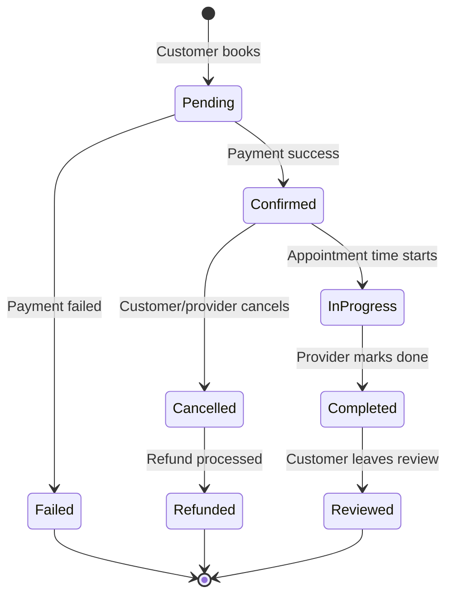

# PetZonic — Services API

> **Version**: 1.0.0  
> **Base URL**: `/api/v1/services`

---

## 1. Overview

The Services API handles service providers (veterinarians, groomers, trainers, pet sitters), their availability, and the booking lifecycle. Providers register, set their schedule, and customers book available slots.

---

## 2. Service Types

| Type | Code | Description |
|------|------|-------------|
| Veterinary | `vet` | Clinics, home visits, emergency |
| Grooming | `grooming` | Bath, haircut, spa packages |
| Training | `training` | Obedience, agility, puppy training |
| Pet Sitting | `sitting` | Home sitting, daycare, overnight |
| Pet Walking | `walking` | Daily walks, group walks |
| Pet Boarding | `boarding` | Overnight facility boarding |
| Pet Taxi | `taxi` | Pet transport services |

---

## 3. Provider Endpoints

### 3.1 List Service Providers

```
GET /api/v1/services/providers
```

**Query Parameters**:

| Param | Type | Default | Description |
|-------|------|---------|-------------|
| type | string | — | Service type filter (`vet`, `grooming`, etc.) |
| lat | number | — | Latitude for geo-search |
| lng | number | — | Longitude for geo-search |
| radius | number | 10 | Radius in km (max 50) |
| rating | number | — | Minimum rating filter |
| page | integer | 1 | Page number |
| limit | integer | 20 | Items per page |
| sort | string | distance | `distance`, `rating`, `price_asc`, `price_desc` |
| species | string | — | Species they serve |
| available | boolean | — | Has slots today |

**Response** `200 OK`:

```json
{
  "data": [
    {
      "id": "sp_vet_001",
      "name": "Dr. Priya's Pet Clinic",
      "type": "vet",
      "subTypes": ["general", "vaccination", "surgery"],
      "description": "10+ years experience with dogs and cats",
      "profileImage": "https://cdn.petzonic.com/providers/drpriya.jpg",
      "images": ["..."],
      "location": {
        "address": "123 MG Road, Indiranagar",
        "city": "Bangalore",
        "lat": 12.9716,
        "lng": 77.5946,
        "distance": 2.3
      },
      "rating": {
        "average": 4.7,
        "count": 156
      },
      "services": [
        {
          "id": "svc_001",
          "name": "General Checkup",
          "duration": 30,
          "price": 500
        },
        {
          "id": "svc_002",
          "name": "Vaccination",
          "duration": 15,
          "price": 800
        }
      ],
      "speciesServed": ["dog", "cat", "bird"],
      "isVerified": true,
      "nextAvailable": "2026-05-29T10:00:00+05:30",
      "operatingHours": {
        "monday": { "open": "09:00", "close": "20:00" },
        "tuesday": { "open": "09:00", "close": "20:00" },
        "sunday": null
      }
    }
  ],
  "pagination": {
    "page": 1,
    "limit": 20,
    "total": 34,
    "totalPages": 2
  }
}
```

---

### 3.2 Get Provider Detail

```
GET /api/v1/services/providers/:id
```

Returns full provider profile including all services, gallery, reviews, credentials.

---

### 3.3 Get Provider Availability

```
GET /api/v1/services/providers/:id/availability
```

**Query Parameters**:

| Param | Type | Description |
|-------|------|-------------|
| serviceId | string | Specific service to check |
| date | string | Date (YYYY-MM-DD) |
| days | integer | Number of days to fetch (default 7, max 30) |

**Response** `200 OK`:

```json
{
  "providerId": "sp_vet_001",
  "serviceId": "svc_001",
  "slots": [
    {
      "date": "2026-05-29",
      "dayOfWeek": "Thursday",
      "available": [
        { "start": "09:00", "end": "09:30", "slotId": "slot_001" },
        { "start": "10:00", "end": "10:30", "slotId": "slot_002" },
        { "start": "14:00", "end": "14:30", "slotId": "slot_003" }
      ]
    },
    {
      "date": "2026-05-30",
      "dayOfWeek": "Friday",
      "available": [
        { "start": "09:00", "end": "09:30", "slotId": "slot_010" }
      ]
    }
  ]
}
```

---

## 4. Booking Endpoints

### 4.1 Create Booking

```
POST /api/v1/services/bookings
```

**Headers**: `Authorization: Bearer <token>`

**Body**:

```json
{
  "providerId": "sp_vet_001",
  "serviceId": "svc_001",
  "slotId": "slot_002",
  "petDetails": {
    "name": "Bruno",
    "species": "dog",
    "breed": "Golden Retriever",
    "age": "3 years",
    "weight": "30 kg"
  },
  "notes": "Annual checkup, slightly limping on front left paw",
  "paymentMethod": "razorpay"
}
```

**Response** `201 Created`:

```json
{
  "id": "bkg_abc123",
  "status": "confirmed",
  "provider": {
    "id": "sp_vet_001",
    "name": "Dr. Priya's Pet Clinic",
    "phone": "+91-98765XXXXX"
  },
  "service": {
    "name": "General Checkup",
    "duration": 30,
    "price": 500
  },
  "schedule": {
    "date": "2026-05-29",
    "startTime": "10:00",
    "endTime": "10:30"
  },
  "payment": {
    "amount": 500,
    "status": "paid",
    "razorpayOrderId": "order_xyz"
  },
  "confirmationCode": "PZ-BKG-7892"
}
```

---

### 4.2 List My Bookings

```
GET /api/v1/services/bookings
```

**Query Parameters**:

| Param | Type | Default | Description |
|-------|------|---------|-------------|
| status | string | — | `upcoming`, `completed`, `cancelled` |
| page | integer | 1 | Page |
| limit | integer | 10 | Per page |

---

### 4.3 Get Booking Detail

```
GET /api/v1/services/bookings/:id
```

---

### 4.4 Cancel Booking

```
POST /api/v1/services/bookings/:id/cancel
```

**Body**:

```json
{
  "reason": "Schedule conflict"
}
```

**Cancellation Policy**:
- > 24 hours before: Full refund
- 12-24 hours before: 50% refund
- < 12 hours before: No refund

**Response** `200 OK`:

```json
{
  "id": "bkg_abc123",
  "status": "cancelled",
  "refund": {
    "amount": 500,
    "status": "processing",
    "estimatedDate": "2026-05-30"
  }
}
```

---

### 4.5 Reschedule Booking

```
POST /api/v1/services/bookings/:id/reschedule
```

**Body**:

```json
{
  "newSlotId": "slot_015",
  "reason": "Need a later time"
}
```

---

## 5. Provider Management (Provider Role)

### 5.1 Register as Provider

```
POST /api/v1/services/providers/register
```

**Body**:

```json
{
  "businessName": "Dr. Priya's Pet Clinic",
  "type": "vet",
  "subTypes": ["general", "vaccination", "surgery"],
  "description": "Experienced veterinarian...",
  "credentials": {
    "licenseNumber": "KA-VET-2015-1234",
    "qualification": "BVSc & AH, MVSc",
    "experience": 10
  },
  "location": {
    "address": "123 MG Road, Indiranagar",
    "city": "Bangalore",
    "pincode": "560038",
    "lat": 12.9716,
    "lng": 77.5946
  },
  "speciesServed": ["dog", "cat", "bird"],
  "operatingHours": {
    "monday": { "open": "09:00", "close": "20:00" },
    "sunday": null
  }
}
```

---

### 5.2 Manage Services

```
POST /api/v1/services/providers/me/services
```

**Body**:

```json
{
  "name": "Dental Cleaning",
  "description": "Professional dental cleaning under sedation",
  "duration": 60,
  "price": 3000,
  "speciesApplicable": ["dog", "cat"],
  "isActive": true
}
```

---

### 5.3 Manage Schedule / Slots

```
PUT /api/v1/services/providers/me/schedule
```

**Body**:

```json
{
  "date": "2026-06-01",
  "slots": [
    { "start": "09:00", "end": "09:30" },
    { "start": "09:30", "end": "10:00" },
    { "start": "10:00", "end": "10:30" }
  ],
  "blockOff": [
    { "start": "13:00", "end": "14:00", "reason": "Lunch break" }
  ]
}
```

---

### 5.4 Provider's Booking Queue

```
GET /api/v1/services/providers/me/bookings
```

Returns today's and upcoming appointments.

---

### 5.5 Complete Appointment (Add Notes)

```
POST /api/v1/services/bookings/:id/complete
```

**Body**:

```json
{
  "notes": "General checkup done. Mild ear infection detected. Prescribed Otoclean.",
  "prescriptions": [
    {
      "medicine": "Otoclean Ear Drops",
      "dosage": "3 drops each ear",
      "frequency": "Twice daily",
      "duration": "7 days"
    }
  ],
  "followUpDate": "2026-06-15",
  "attachments": ["https://cdn.petzonic.com/reports/blood_report_123.pdf"]
}
```

---

## 6. Error Responses

| Status | Code | Description |
|--------|------|-------------|
| 404 | `PROVIDER_NOT_FOUND` | Provider doesn't exist |
| 404 | `BOOKING_NOT_FOUND` | Booking doesn't exist |
| 409 | `SLOT_UNAVAILABLE` | Slot already taken |
| 400 | `CANCEL_TOO_LATE` | Past cancellation window |
| 400 | `INVALID_RESCHEDULE` | Can't reschedule completed/cancelled |
| 403 | `PROVIDER_NOT_VERIFIED` | Provider not yet approved |

---

## 7. Booking Lifecycle


