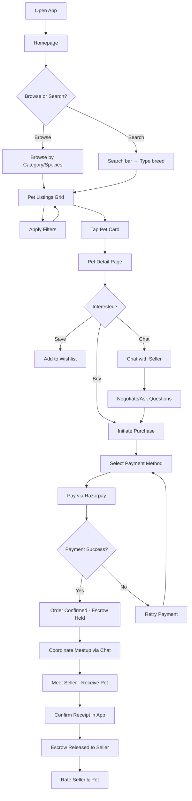
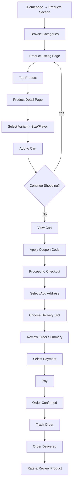
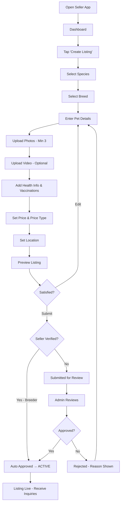
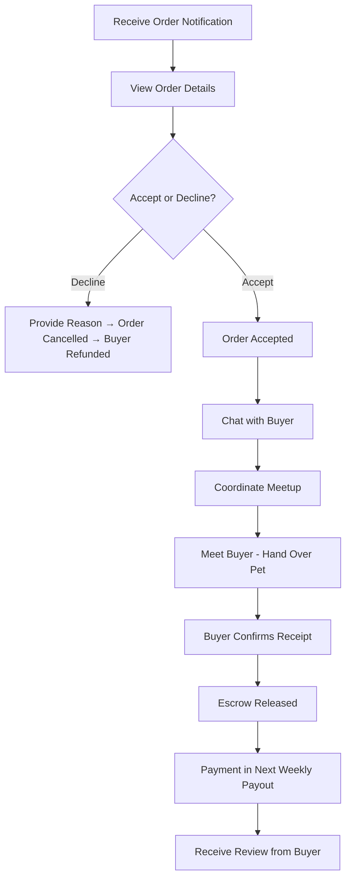
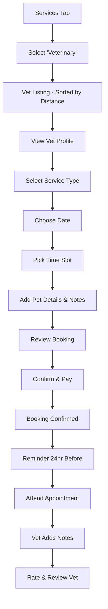
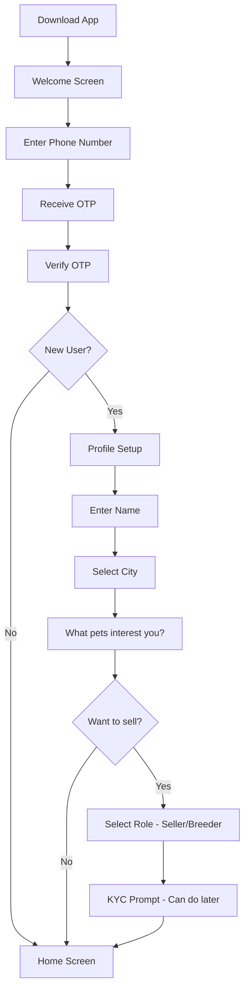
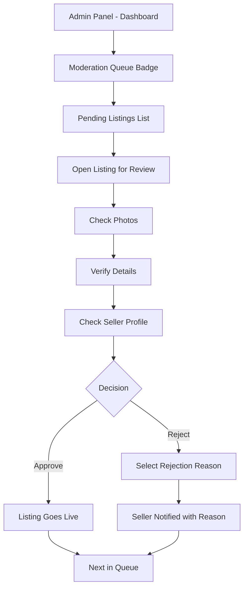
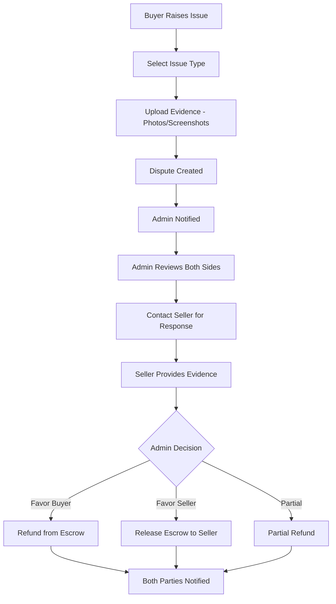

# PetZonic — User Flows

> **Version**: 1.0.0  
> **Date**: May 28, 2026

---

## 1. Buyer: Browse & Purchase Pet

---

## 2. Buyer: Purchase Products

---

## 3. Seller: Create Pet Listing

---

## 4. Seller: Handle Pet Order

---

## 5. Buyer: Book Vet Appointment

---

## 6. New User: Onboarding

---

## 7. Admin: Moderate Listing

---

## 8. Dispute Resolution Flow

