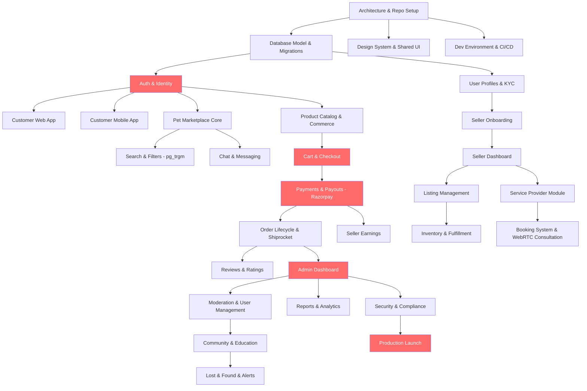

# PetZonic — Full Product Dependency Map & Critical Path

> **Version**: 2.0.0  
> **Date**: August 23, 2026  
> **Scope**: Full web + mobile product implementation including customer, seller, admin, and backend platform layers

---

## 1. Dependency Overview



---

## 2. Critical Path

The critical path for the full product is:

```
Architecture Setup → Database Model → Auth & Identity → Pet Marketplace + Product Catalog →
Cart & Checkout → Payments & Payouts → Order Management → Seller Dashboard → Admin Dashboard →
Security & Launch Readiness → Production Launch
```

This path controls the minimum time required to deliver a usable, launch-ready platform.

---

## 3. Key Dependencies by Team

### Backend dependencies
- Auth and user model must be finalized before web/mobile can proceed
- Product and pet schemas must be ready before catalog UI and search work
- Payment flow depends on order and checkout APIs
- Seller module depends on auth, KYC, and order flow
- Admin workflows depend on user, order, listing, and moderation data

### Web app dependencies
- Shared design system must exist before page implementation
- Auth API must be stable before profile, orders, and checkout pages
- Search and listing APIs must be stable before catalog pages ship
- Admin pages are blocked until moderation and reporting APIs exist

### Mobile app dependencies
- Shared auth and user model are required for onboarding
- Catalog APIs must be ready before browsing and detail screens
- Checkout payment integration depends on backend payment services
- Notification and chat flows depend on backend event infrastructure

### Seller/admin dependencies
- Seller dashboard requires same auth model, listing APIs, and order APIs
- Admin dashboard requires product, order, user, and moderation pipelines
- Payout and reporting depend on commerce and accounting layers

---

## 4. Parallel Work Streams

### Stream A — Core backend
- Auth
- Users and KYC
- Pets and products
- Orders
- Payments

### Stream B — Seller + admin platform
- Seller onboarding
- Seller dashboard
- Admin dashboard
- Reports and moderation

### Stream C — Web frontend
- Home and marketing pages
- Catalog and search
- Cart and checkout
- Profile and orders
- Admin web dashboard

### Stream D — Mobile frontend
- Customer app onboarding
- Pet and product browsing
- Checkout and payment
- Orders and profile
- Seller mobile workflows

### Stream E — Growth and engagement
- Services
- Community and education
- Notifications
- Lost & Found and insurance

---

## 5. Integration Points Requiring Sync

| Integration | Teams Involved | Why It Matters |
|------------|----------------|----------------|
| Auth contract | Backend + Web + Mobile + Seller/Admin | Blocks onboarding and protected screens |
| Catalog and search schema | Backend + Web + Mobile | Required for listing screens |
| Cart and checkout flow | Web + Mobile + Backend | Critical for transaction completion |
| Payment gateway | Backend + Web + Mobile | Needed for order processing |
| Seller payouts | Backend + Seller app + Admin | Business operations and compliance |
| Chat and notifications | Backend + Web + Mobile | Engagement and support |
| Admin moderation | Backend + Admin UI | Required for governance |
| Production deployment | Infra + Backend + Frontend | Final launch readiness |

---

## 6. External Dependencies & Lead Times

| Dependency | Impact | Lead Time | Mitigation |
|------------|--------|-----------|-----------|
| Razorpay account activation | Cannot test payments | 3-5 business days | Apply in Phase 0 |
| AWS account setup | Cannot deploy | 1-2 days | Setup Day 1 |
| Apple Developer account | Cannot test iOS | 1-2 days (if existing org) | Apply immediately |
| Google Play Console | Cannot test Android | 1 day | Apply immediately |
| Firebase project | No push notifications | 1 hour | Setup in Phase 0 |
| MSG91 account (SMS) | No OTP in production | 1-2 days | Use Firebase Auth in dev |
| Domain (petzonic.com) | No website deploy | 1 hour | Purchase Day 1 |
| SSL certificate | No HTTPS | Minutes (via Cloudflare) | Setup with domain |
| Shiprocket account | No delivery tracking | 1-2 days | Setup in Phase 2 |
| PostgreSQL pg_trgm | Native database extension | Instant | Enabled in PostgreSQL 16 |

---

## 6. External Dependencies

| Dependency | Impact | Lead Time |
|------------|--------|-----------|
| Razorpay setup | Payment testing | 3-5 business days |
| AWS / infra setup | Deployment and storage | 2-5 days |
| Firebase / FCM | Notification delivery | 1 day |
| Domain and SSL | Production access | 1 day |
| App store accounts | Mobile release | 2-5 days |
| SMS / OTP provider | Login and verification | 2-5 days |
| Analytics tools | Product metrics | 1-3 days |
| Cloud storage | Media uploads | 1 day |

---

## 7. Risk Areas

| Risk | Impact | Mitigation |
|------|--------|------------|
| Auth API delay | Blocks all app flows | Finalize API contract early |
| Payment integration issues | Blocks orders | Test in sandbox before production |
| Incomplete seller/admin flows | Reduces launch readiness | Prioritize with commerce module |
| Search or listing instability | Hurts buyer discovery | Build API contract and sample data early |
| Notification errors | Weak user engagement | Validate push and in-app delivery in staging |
| Security gaps | Launch blocker | Require audit before production |

---

## 8. Recommended Release Strategy

### Release 1 — Core commerce launch
- Customer website
- Customer mobile app
- Basic seller dashboard
- Product and pet listings
- Cart, checkout, and payments

### Release 2 — Seller and admin maturity
- Advanced seller operations
- Admin moderation and dashboards
- Reports and payouts

### Release 3 — Community and services growth
- Services and bookings
- Community and education features
- Lost & Found and insurance expansion

### Release 4 — Scale and hardening
- Performance tuning
- Security review
- Production stabilization
- Full public launch

---

## 9. Definition of Done for a Phase

A phase is done only when:
- Core feature set is live in dev
- Web and mobile flows are validated together
- API contracts are stable
- QA and regression are completed
- Edge cases and failure states are handled
- Business and technical owners sign off

This keeps the project aligned with the actual full-platform scope rather than a temporary MVP shortcut.

