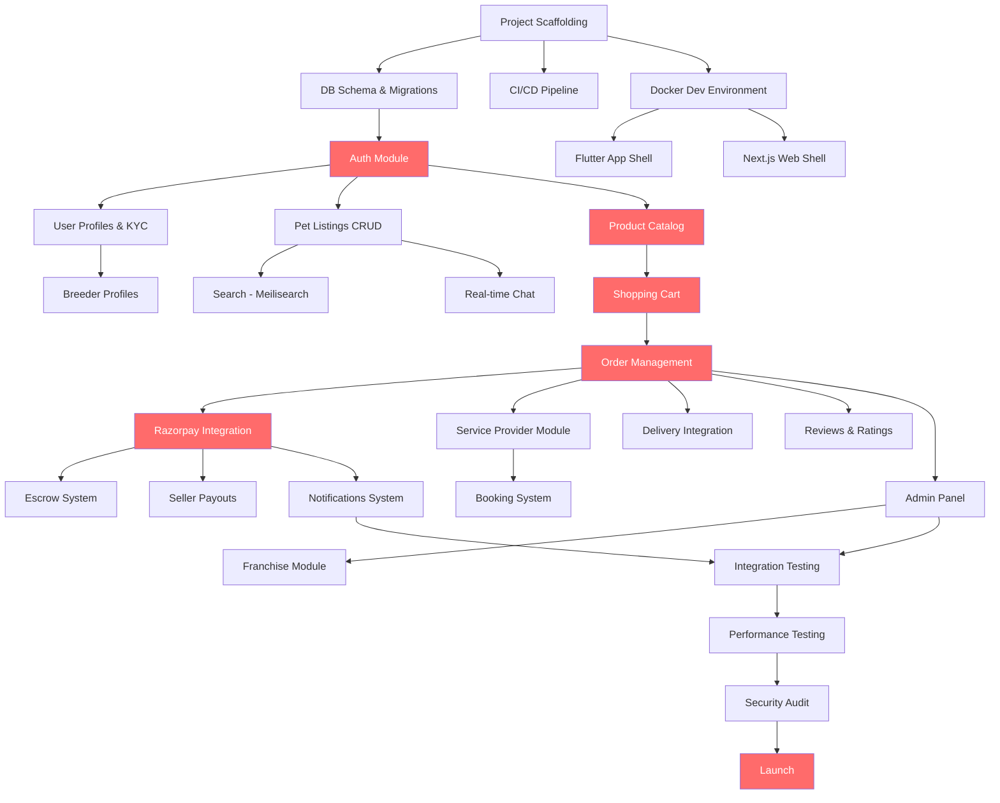

# PetZonic — Task Dependencies & Critical Path

> **Version**: 1.0.0  
> **Date**: May 28, 2026

---

## 1. Dependency Graph



---

## 2. Critical Path

The **critical path** is the longest chain of dependent tasks that determines minimum project duration:

```
Project Setup → DB Migrations → Auth Module → Product Catalog → Shopping Cart → 
Order Management → Razorpay Integration → Admin Panel → Integration Testing → 
Performance Testing → Security Audit → Launch
```

**Estimated critical path duration**: ~14-16 weeks

### Critical Path Tasks

| # | Task | Duration | Depends On | Risk |
|---|------|:--------:|-----------|------|
| 1 | Project Scaffolding | 1 week | — | Low |
| 2 | DB Schema & Migrations | 1 week | #1 | Low |
| 3 | Auth Module | 1.5 weeks | #2 | Medium |
| 4 | Product Catalog | 1.5 weeks | #3 | Low |
| 5 | Shopping Cart | 1.5 weeks | #4 | Low |
| 6 | Order Management | 1.5 weeks | #5 | Medium |
| 7 | Razorpay Integration | 1.5 weeks | #6 | High |
| 8 | Admin Panel | 2 weeks | #6 | Medium |
| 9 | Integration Testing | 2 weeks | #8 | Medium |
| 10 | Performance & Security | 2 weeks | #9 | Medium |
| 11 | Launch Prep | 1 week | #10 | Low |

---

## 3. Parallel Work Streams

These can be developed simultaneously by different team members:

### Stream A: Backend Core (Backend Dev 1)
```
Auth → Pets CRUD → Orders → Payments → Escrow → Payouts
```

### Stream B: Backend Features (Backend Dev 2)
```
Products → Cart → Search → Chat → Services → Bookings → Notifications
```

### Stream C: Mobile (Flutter Dev 1 - Customer App)
```
App Shell → Auth Screens → Home → Pet Browse → Product Browse → Cart → Checkout → Chat → Services
```

### Stream D: Mobile (Flutter Dev 2 - Seller App)
```
App Shell → Auth → Dashboard → Create Listing → Orders → Earnings → Chat
```

### Stream E: Web (Frontend Dev)
```
Web Shell → Homepage → Listings (SSR) → Products → Cart/Checkout → Account → Admin Panel
```

---

## 4. Integration Points (Sync Required)

These moments require coordination between teams:

| Integration Point | Teams | Sync Needed |
|-------------------|-------|-------------|
| API contracts finalized | Backend + Mobile + Web | Before Phase 1 coding starts |
| Auth flow complete | Backend + All clients | Mobile/web blocked until API ready |
| Payment integration | Backend + Mobile + Web | Same Razorpay SDK version |
| Real-time chat | Backend + Mobile + Web | WebSocket protocol agreement |
| Push notifications | Backend + Mobile | FCM token flow |
| Search integration | Backend + All clients | Query format, filter params |
| Admin moderation → Listing status | Backend + Mobile | Status webhook/polling strategy |
| Escrow flow | Backend + Mobile | Complete flow testing together |

---

## 5. External Dependencies

| Dependency | Impact | Lead Time | Mitigation |
|------------|--------|-----------|-----------|
| Razorpay account activation | Cannot test payments | 3-5 business days | Apply in Phase 0 |
| AWS account setup | Cannot deploy | 1-2 days | Setup Day 1 |
| Apple Developer account | Cannot test iOS | 1-2 days (if existing org) | Apply immediately |
| Google Play Console | Cannot test Android | 1 day | Apply immediately |
| Firebase project | No push notifications | 1 hour | Setup in Phase 0 |
| MSG91 account (SMS) | No OTP in production | 1-2 days | Use Firebase Auth in dev |
| Domain (petzonic.com) | No website deploy | 1 hour | Purchase Day 1 |
| SSL certificate | No HTTPS | Minutes (via Cloudflare) | Setup with domain |
| Shiprocket account | No delivery tracking | 1-2 days | Setup in Phase 2 |
| Meilisearch Cloud | No search | 1 hour | Self-host in Docker for dev |

---

## 6. Risk-Adjusted Schedule

| Task | Optimistic | Expected | Pessimistic | Buffer |
|------|:----------:|:--------:|:-----------:|:------:|
| Auth + User module | 1.5 wk | 2 wk | 3 wk | +0.5 wk |
| Pet marketplace | 2 wk | 3 wk | 4 wk | +0.5 wk |
| Payment integration | 1.5 wk | 2.5 wk | 4 wk | +1 wk |
| Chat system | 1.5 wk | 2 wk | 3 wk | +0.5 wk |
| Services + Booking | 2 wk | 2.5 wk | 3.5 wk | +0.5 wk |
| Admin panel | 1.5 wk | 2 wk | 3 wk | +0.5 wk |
| Testing & QA | 2 wk | 3 wk | 4 wk | +1 wk |
| **Total** | **12 wk** | **17 wk** | **24.5 wk** | — |

**Recommended plan**: 17 weeks expected + 2 weeks buffer = **19 weeks to launch**

---

## 7. Task Blockers & Unblocking Strategy

| Blocker | Impact | Unblocking Strategy |
|---------|--------|-------------------|
| API not ready for mobile | Mobile team idle | Use mock API server (json-server or MSW) |
| Design not ready | Frontend delayed | Build with placeholder UI, skin later |
| Third-party API down | Feature blocked | Circuit breakers + fallback behavior |
| Key developer unavailable | Critical path delayed | Cross-train, document architecture |
| Payment gateway issues | Orders blocked | Sandbox testing early, escalation contacts |
| App store rejection | Launch delayed | Follow guidelines strictly, submit early |

---

## 8. Definition of Done (Per Task)

A task is "Done" when:
- [ ] Code written and self-reviewed
- [ ] Unit tests passing (>80% coverage)
- [ ] API endpoint tested with Postman/Insomnia
- [ ] Code reviewed by at least one peer
- [ ] No lint errors or type errors
- [ ] Documentation updated (API docs, comments)
- [ ] Works in Docker dev environment
- [ ] Edge cases handled (empty states, errors, loading)
- [ ] Merged to development branch
