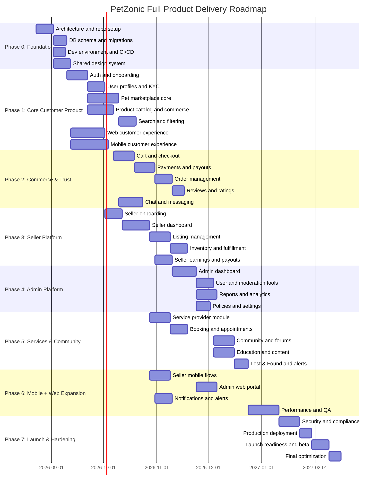
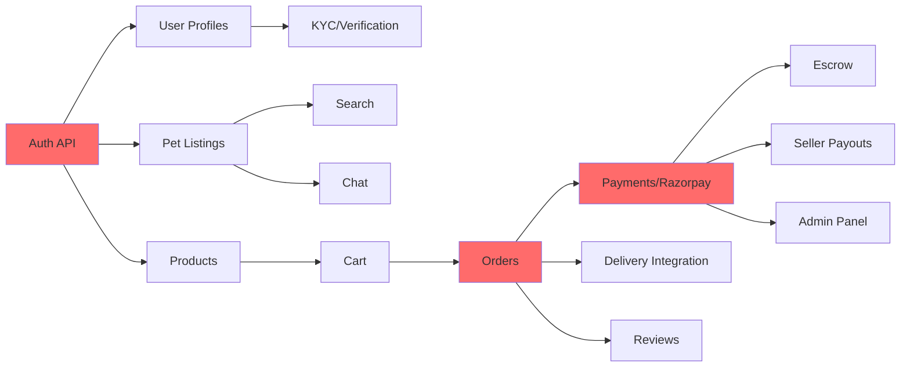

# PetZonic — Full Product Roadmap & Milestones

> **Version**: 2.0.0  
> **Date**: August 23, 2026  
> **Scope**: Full platform implementation across website, mobile apps, seller portal, admin panel, and backend services

---

## 1. Product Scope Summary

PetZonic is a complete pet ecosystem with the following product surfaces:

- Customer website
- Customer mobile app
- Seller app / dashboard
- Admin panel
- Backend APIs and services
- Integrations for payments, notifications, chat, search, and delivery

This roadmap is designed for the real business requirement, not a minimal MVP. It treats PetZonic as a full multi-role marketplace and services platform.

---

## 2. Delivery Phases

---

## 3. Phase Details

### Phase 0 — Foundation and Architecture

| Deliverable | Description | Owner |
|-------------|-------------|-------|
| Repo setup | Create all repos (api, customer-app, seller-app, web, infra) | Tech Lead |
| Express 5 API setup | Modular monolith API with auth middleware, Zod validation, error handling | Backend |
| Flutter boilerplate | Base app with navigation, state management, API client | Mobile |
| Next.js boilerplate | Base web with layout, routing, API integration | Frontend |
| Database setup | Prisma schema, initial migration, seed data | Backend |
| Docker Compose | Local dev environment (Postgres 16, Redis, API, Web) | DevOps |
| CI pipeline | GitHub Actions: lint, test, build on PR | DevOps |
| AWS foundation | VPC, ECR, S3 bucket (Terraform) | DevOps |

Exit criteria:
- All teams can work locally without blockers
- API contracts are agreed by web/mobile/backend
- Core architecture is documented and approved

---

### Phase 1 — Core Customer Product

| Deliverable | Description | Priority |
|-------------|-------------|----------|
| **Backend** | | |
| Auth API | OTP, email/password, Google, Apple, JWT, refresh | P0 |
| User management | Profile CRUD, roles, KYC submission | P0 |
| Pet listings API | Full CRUD, status management, moderation queue | P0 |
| Product catalog API | Products, variants, categories, inventory | P0 |
| Media upload | S3 / Cloudflare R2 pre-signed URLs, image processing | P0 |
| Search API | PostgreSQL pg_trgm trigram indexing, search, filters | P0 |
| Gemini AI assist | Pet photo multimodal analysis & welfare checks | P0 |
| Taxonomy API | Species, breeds, categories CRUD | P0 |
| **Mobile** | | |
| Auth screens | Login, OTP, profile setup | P0 |
| Home screen | Categories, featured listings | P0 |
| Pet browse & detail | Listings grid, filters, detail page | P0 |
| Product browse | Product listing, detail | P0 |
| Navigation | Bottom tabs, drawer, routing | P0 |
| **Web** | | |
| Homepage | Hero, categories, featured content | P0 |
| Pet listing pages | SSR, filters, pagination | P0 |
| Product pages | Categories, detail, SEO | P0 |
| Auth flow | Login/register pages | P0 |

| Area | Deliverables | Priority |
|------|--------------|----------|
| Web app | Home, listings, filters, pet details, products, cart, auth, profile, orders | P0 |
| Mobile app | Home, categories, pet browsing, product browsing, auth, cart, checkout, account | P0 |
| Backend | Auth, roles, profile management, pet CRUD, product catalog, search indexing | P0 |

Key outcomes:
- Users can sign up and sign in
- Buyers can browse pets and products
- Buyers can filter and search listings
- Users can manage profiles and order history

---

### Phase 2 — Commerce, Payments, and Trust

| Area | Deliverables | Priority |
|------|--------------|----------|
| Checkout | Add-to-cart, quantity updates, address validation, order summary | P0 |
| Payments | Razorpay integration, order payment verification, webhooks | P0 |
| Order lifecycle | Pending, confirmed, shipped, delivered, refunded | P0 |
| Trust features | Ratings, reviews, dispute states | P1 |
| Chat | Buyer-seller messaging, conversation threads, notifications | P1 |

Key outcomes:
- Buyers can complete purchases on web and mobile
- Sellers receive orders and manage flow
- Reviews and chat increase trust and confidence

---

### Phase 3 — Seller Platform

| Area | Deliverables | Priority |
|------|--------------|----------|
| Seller onboarding | Registration, verification, profile setup, KYC | P0 |
| Seller dashboard | Overview, sold items, orders, revenue, inventory | P0 |
| Listing management | Add/edit/delete pet and product listings | P0 |
| Inventory and fulfillment | Stock tracking, fulfillment status, shipping updates | P1 |
| Payouts | Commissions, payouts, settlement reports | P1 |

Key outcomes:
- Sellers can manage their business from the platform
- Orders are handled end-to-end by sellers
- Revenue and payouts are trackable

---

### Phase 4 — Admin Platform

| Area | Deliverables | Priority |
|------|--------------|----------|
| Admin dashboard | KPIs, sales overview, user count, activity summary | P0 |
| Moderation | Listing approval/rejection, user review, compliance actions | P0 |
| Reports | Sales, traffic, order analytics, payout analytics | P1 |
| Settings | Policies, roles, categories, app configuration | P1 |

Key outcomes:
- Platform administrators can govern the marketplace
- Moderation and risk controls are active
- Business reporting is available for operations

---

### Phase 5 — Services, Community, and Engagement

| Area | Deliverables | Priority |
|------|--------------|----------|
| Services | Vet, grooming, pet care listings and booking flow | P1 |
| Community | Forums, posts, threads, categories, comments | P1 |
| Education | Guides, articles, videos, learning resources | P1 |
| Lost & Found | Pet alerts, search, local notifications | P2 |
| Insurance | Plan discovery and claims workflow | P2 |

Key outcomes:
- Platform becomes a full pet ecosystem, not only a marketplace
- Users stay engaged beyond buying and selling
- Trust and retention increase through services and community

---

### Phase 6 — Mobile + Web Expansion and Quality

| Area | Deliverables | Priority |
|------|--------------|----------|
| Seller mobile flows | Seller order management, listing updates, reports | P1 |
| Admin web experience | Full admin portal for platform operations | P1 |
| Notifications | Push notifications, email, SMS flows | P0 |
| QA and regression | Cross-platform validation, fixes, accessibility | P0 |
| Performance | Optimization, caching, load testing, mobile speed tuning | P0 |

Key outcomes:
- Every major app surface is production-ready
- The full ecosystem works consistently across environments
- Quality is hardened before launch

---

### Phase 7 — Launch, Hardening, and Production Readiness

| Area | Deliverables | Priority |
|------|--------------|----------|
| Security review | Auth, audit logs, access control, data protection | P0 |
| Compliance | Privacy, KYC, payment compliance, disclosures | P0 |
| Production deployment | Infra, domain, containers, CDN, monitoring | P0 |
| Beta launch | Controlled release and user feedback loop | P0 |
| Public launch | Full web + mobile rollout | P0 |

Exit criteria:
- All critical flows pass in production-like environment
- Security review is approved
- Launch checklist is signed off by product, engineering, and operations

---

## 4. Full Product Milestone Summary

| Milestone | Goal | Target |
|-----------|------|--------|
| M1 — Architecture & foundation | Shared structure and backend foundations | Weeks 1-2 |
| M2 — Customer web + mobile core | Core marketplace browsing, auth, and profiles | Weeks 3-7 |
| M3 — Commerce & payment | Cart, checkout, order lifecycle, payments | Weeks 8-11 |
| M4 — Seller platform | Seller onboarding, dashboard, management tools | Weeks 12-16 |
| M5 — Admin and moderation | Admin operations and governance | Weeks 15-18 |
| M6 — Services & engagement | Community, services, education, retention features | Weeks 18-22 |
| M7 — Launch hardening | QA, security, production readiness, beta, launch | Weeks 23-26 |

---

## 5. Priority Definitions

| Priority | Meaning | Action |
|----------|---------|--------|
| P0 | Must have before launch | Mandatory |
| P1 | Important for product maturity | Ship in planned release |
| P2 | Valuable, but not launch-blocking | Post-launch or later phase |

---

## 6. Recommended Execution Order

1. Foundation and architecture
2. Customer web + mobile core
3. Commerce and payments
4. Seller platform
5. Admin platform
6. Services and community
7. Hardening and launch

This sequence reduces risk and keeps the product build aligned to the real business need.

**Critical Path**: Auth → Pet Listings → Cart → Orders → Payments

Secondary paths:
- Auth → Forums → Lost & Found
- Auth → Educational Content → Courses → Telemedicine
- Orders → Insurance Recommendations → Policy Purchase → Claims

If payments are delayed, entire launch is blocked.

---

## 5. Risk Mitigation by Phase

| Phase | Risk | Mitigation |
|-------|------|-----------|
| Phase 0 | Wrong architecture decisions | Document decisions, get team buy-in |
| Phase 1 | Scope creep on features | Strict feature freeze (this document) |
| Phase 2 | Payment integration issues | Start Razorpay sandbox early, dedicated testing |
| Phase 3 | Third-party API reliability | Circuit breakers, fallbacks, mock for testing |
| Phase 4 | Admin panel taking too long | Use off-the-shelf admin UI (React Admin/refine) |
| Phase 5 | Too many bugs | Continuous testing from Phase 1, not just Phase 5 |

---

## 6. Team Composition (Recommended)

| Role | Count | Responsibility |
|------|:-----:|---------------|
| Tech Lead / Architect | 1 | Architecture decisions, code review, unblocking |
| Backend Developer (Node.js / Express 5) | 2 | API development, database, integrations |
| Flutter Developer | 2 | Customer app + Seller app |
| Frontend Developer (React/Next.js) | 1 | Website + Admin panel |
| UI/UX Designer | 1 | App & web design, prototypes |
| QA Engineer | 1 | Testing strategy, manual + automated testing |
| DevOps / Cloud | 1 (part-time) | AWS, CI/CD, monitoring |
| Product Manager | 1 | Requirements, priorities, stakeholder communication |
| **Total** | **9-10** | |

For a smaller team (5-6), combine:
- Tech Lead also does backend
- One Flutter dev handles both apps
- Frontend dev also handles admin
- QA shared with developers

---

## 7. Launch Checklist

- [ ] All P0 features working end-to-end
- [ ] Security audit passed (no critical/high vulnerabilities)
- [ ] Performance: API p95 < 500ms under load
- [ ] App Store: approved and ready to publish
- [ ] Play Store: approved and ready to publish
- [ ] Website: live on petzonic.com with SSL
- [ ] 50+ verified breeders onboarded (supply)
- [ ] 500+ products in store (inventory stocked)
- [ ] Payment processing tested with real transactions
- [ ] Customer support email/chat operational
- [ ] Legal: Terms of Service, Privacy Policy published
- [ ] Monitoring & alerting configured
- [ ] Backup & recovery tested
- [ ] Rollback plan documented
- [ ] Launch day communication plan ready
