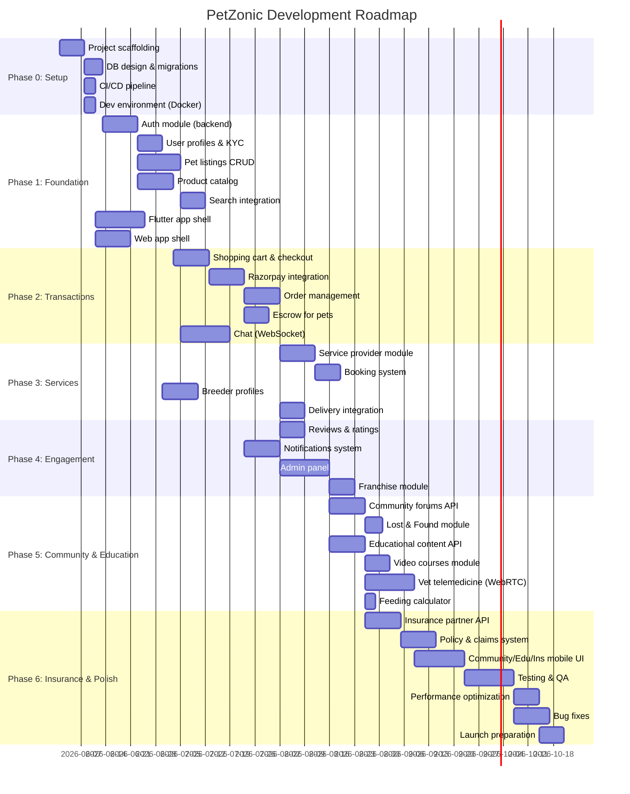
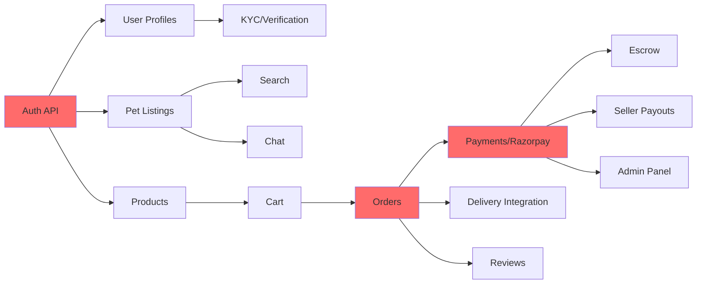

# PetZonic — Project Roadmap & Milestones

> **Version**: 1.0.0  
> **Date**: May 28, 2026

---

## 1. Development Phases

---

## 2. Phase Details

### Phase 0: Project Setup (Week 1-2)

| Deliverable | Description | Owner |
|-------------|-------------|-------|
| Repo setup | Create all repos (api, customer-app, seller-app, web, admin, infra) | Tech Lead |
| NestJS boilerplate | Base API with auth guards, validation, error handling | Backend |
| Flutter boilerplate | Base app with navigation, state management, API client | Mobile |
| Next.js boilerplate | Base web with layout, routing, API integration | Frontend |
| Database setup | Prisma schema, initial migration, seed data | Backend |
| Docker Compose | Local dev environment (Postgres, Redis, Meilisearch) | DevOps |
| CI pipeline | GitHub Actions: lint, test, build on PR | DevOps |
| AWS foundation | VPC, ECR, S3 bucket (Terraform) | DevOps |

**Exit Criteria**: All developers can clone, install, and run locally.

---

### Phase 1: Foundation (Week 3-6)

| Deliverable | Description | Priority |
|-------------|-------------|----------|
| **Backend** | | |
| Auth API | OTP, email/password, Google, Apple, JWT, refresh | P0 |
| User management | Profile CRUD, roles, KYC submission | P0 |
| Pet listings API | Full CRUD, status management, moderation queue | P0 |
| Product catalog API | Products, variants, categories, inventory | P0 |
| Media upload | S3 pre-signed URLs, image processing | P0 |
| Search API | Meilisearch indexing, search, filters | P0 |
| Taxonomy API | Species, breeds, categories CRUD | P0 |
| **Mobile** | | |
| Auth screens | Login, OTP, profile setup | P0 |
| Home screen | Categories, featured listings | P0 |
| Pet browse & detail | Listings grid, filters, detail page | P0 |
| Product browse | Product listing, detail | P0 |
| Navigation | Bottom tabs, drawer, routing | P0 |
| **Web** | | |
| Homepage | Hero, categories, featured content | P0 |
| Pet listing pages | SSR, filters, pagination | P0 |
| Product pages | Categories, detail, SEO | P0 |
| Auth flow | Login/register pages | P0 |

**Exit Criteria**: Users can register, browse pets, browse products, and search.

---

### Phase 2: Transactions (Week 7-10)

| Deliverable | Description | Priority |
|-------------|-------------|----------|
| **Backend** | | |
| Cart API | Add/remove/update items, cart persistence | P0 |
| Order API | Checkout, order creation, status management | P0 |
| Razorpay integration | Payment creation, verification, webhooks | P0 |
| Escrow system | Hold/release/refund for pet purchases | P0 |
| Chat API | WebSocket server, rooms, message persistence | P0 |
| Coupon system | Validation, discount calculation | P1 |
| **Mobile** | | |
| Cart & checkout | Full purchase flow | P0 |
| Payment screens | Razorpay SDK integration | P0 |
| Order tracking | Status timeline, history | P0 |
| Chat UI | Chat list, room, messaging | P0 |
| Pet purchase flow | Escrow-specific UI, confirm receipt | P0 |
| **Web** | | |
| Cart & checkout | Web checkout flow | P0 |
| My orders | Order history and tracking | P0 |
| Account pages | Profile, addresses | P1 |

**Exit Criteria**: Complete purchase flow works end-to-end (product + pet with escrow).

---

### Phase 3: Services & Trust (Week 8-12)

| Deliverable | Description | Priority |
|-------------|-------------|----------|
| **Backend** | | |
| Service provider API | CRUD, availability, search | P1 |
| Booking API | Slot management, booking lifecycle | P1 |
| Breeder profile API | Enhanced profiles, parents, litters | P1 |
| Delivery integration | Shiprocket API, tracking webhooks | P1 |
| Seller payout system | Weekly settlement, commission calculation | P0 |
| **Mobile** | | |
| Services tab | Provider listing, booking flow | P1 |
| Breeder features (seller app) | Profile, parents, litter management | P1 |
| KYC flow (seller app) | Document upload, status tracking | P0 |
| Delivery tracking | Shipment status in orders | P1 |
| **Web** | | |
| Services section | Provider discovery, booking | P1 |
| Seller onboarding | Become a seller flow | P1 |

**Exit Criteria**: Services bookable, delivery tracking works, sellers receive payouts.

---

### Phase 4: Engagement & Admin (Week 10-14)

| Deliverable | Description | Priority |
|-------------|-------------|----------|
| **Backend** | | |
| Reviews API | Create, edit, respond, aggregate | P1 |
| Notifications API | FCM, SMS, email triggers | P0 |
| Admin API | Dashboard, moderation, user mgmt | P0 |
| Franchise API | Application, onboarding, revenue share | P2 |
| Wishlist & saved searches | Alert system | P1 |
| **Mobile** | | |
| Reviews UI | Write, view, seller response | P1 |
| Push notifications | FCM integration, deep links | P0 |
| Notification center | In-app notification feed | P1 |
| Wishlist | Save/unsave, alert for new matches | P1 |
| **Web** | | |
| Reviews on web | Display and write reviews | P1 |
| **Admin Panel** | | |
| Dashboard | KPI metrics, charts | P0 |
| User management | Search, view, suspend/ban | P0 |
| Listing moderation | Queue, approve/reject | P0 |
| Order management | View, refund, cancel | P0 |
| Product management | CRUD, bulk upload | P0 |
| Revenue reports | Daily/weekly/monthly | P1 |
| Franchise management | Applications, onboarding | P2 |

**Exit Criteria**: Admin can moderate the platform, notifications work, reviews functional.

---

### Phase 5: Community, Education & Insurance (Week 14-19)

| Deliverable | Description | Priority |
|-------------|-------------|----------|
| **Backend** | | |
| Community forums API | Posts, replies, voting, following, search | P1 |
| Lost & Found API | Geo-based posts, notifications to nearby users | P1 |
| Educational content API | Articles, videos, courses CRUD | P1 |
| Video course system | Enrollment, progress tracking, premium payments | P1 |
| Vet telemedicine | WebRTC video rooms, scheduling, prescriptions | P2 |
| Vet Q&A | Public Q&A, vet answers, moderation | P2 |
| Feeding calculator | Breed/age/weight based recommendations | P2 |
| Insurance partner integration | Plan sync, premium calculator, policy issuance | P2 |
| Claims system | File claim, track status, partner webhook | P2 |
| **Mobile** | | |
| Community tab | Forums, posts, replies, voting UI | P1 |
| Lost & Found screens | Create/browse lost pets, map view | P1 |
| Education/Learn tab | Videos, articles, courses, progress | P1 |
| Vet consultation screens | Book, video call, prescription view | P2 |
| Insurance screens | Browse plans, compare, buy, claims | P2 |
| **Web** | | |
| Community pages | Forums, posts (SSR for SEO) | P1 |
| Education pages | Content library, courses (SSR for SEO) | P1 |
| Insurance pages | Plans, comparison, purchase flow | P2 |
| **Admin Panel** | | |
| Forum moderation | Reported posts, ban users, manage categories | P1 |
| Content management | Review queue, approve/reject, analytics | P1 |
| Insurance partner management | Onboard partners, manage plans, claims oversight | P2 |

**Exit Criteria**: Community forums active, educational content browsable, insurance purchasable.

---

### Phase 6: Polish & Launch (Week 19-22)

| Deliverable | Description | Priority |
|-------------|-------------|----------|
| Integration testing | E2E flows across all apps | P0 |
| Performance testing | Load test API (1000 concurrent) | P0 |
| Security audit | OWASP scan, penetration testing | P0 |
| Bug fixes | Address all P0/P1 bugs | P0 |
| App store preparation | Screenshots, descriptions, listings | P0 |
| SEO optimization | Meta tags, sitemap, structured data | P1 |
| Content seeding | Sample products, breed data, FAQs | P0 |
| Breeder onboarding | Onboard 50+ breeders pre-launch | P0 |
| Monitoring setup | Sentry, CloudWatch alarms, alerting | P0 |
| Documentation | API docs (Swagger), user guides | P1 |
| Soft launch | Invite-only beta (Bangalore) | P0 |
| Public launch | App Store + Play Store + Website | P0 |

**Exit Criteria**: All critical bugs fixed, performance targets met, 50+ breeders onboarded.

---

## 3. Priority Definitions

| Priority | Meaning | Action |
|----------|---------|--------|
| **P0** | Must have for launch | Cannot launch without it |
| **P1** | Should have for launch | Strong preference, launch degraded without it |
| **P2** | Nice to have | Can launch without, add post-launch |
| **P3** | Future | Planned for v2.0 |

---

## 4. Dependencies & Critical Path

**Critical Path**: Auth → Pet Listings → Cart → Orders → Payments

Secondary paths:
- Auth → Forums → Lost & Found
- Auth → Educational Content → Courses → Telemedicine
- Orders → Insurance Recommendations → Policy Purchase → Claims

If payments are delayed, entire launch is blocked.

---

## 5. Risk Mitigation by Phase

| Phase | Risk | Mitigation |
|-------|------|-----------|
| Phase 0 | Wrong architecture decisions | Document decisions, get team buy-in |
| Phase 1 | Scope creep on features | Strict feature freeze (this document) |
| Phase 2 | Payment integration issues | Start Razorpay sandbox early, dedicated testing |
| Phase 3 | Third-party API reliability | Circuit breakers, fallbacks, mock for testing |
| Phase 4 | Admin panel taking too long | Use off-the-shelf admin UI (React Admin/refine) |
| Phase 5 | Too many bugs | Continuous testing from Phase 1, not just Phase 5 |

---

## 6. Team Composition (Recommended)

| Role | Count | Responsibility |
|------|:-----:|---------------|
| Tech Lead / Architect | 1 | Architecture decisions, code review, unblocking |
| Backend Developer (NestJS) | 2 | API development, database, integrations |
| Flutter Developer | 2 | Customer app + Seller app |
| Frontend Developer (React/Next.js) | 1 | Website + Admin panel |
| UI/UX Designer | 1 | App & web design, prototypes |
| QA Engineer | 1 | Testing strategy, manual + automated testing |
| DevOps / Cloud | 1 (part-time) | AWS, CI/CD, monitoring |
| Product Manager | 1 | Requirements, priorities, stakeholder communication |
| **Total** | **9-10** | |

For a smaller team (5-6), combine:
- Tech Lead also does backend
- One Flutter dev handles both apps
- Frontend dev also handles admin
- QA shared with developers

---

## 7. Launch Checklist

- [ ] All P0 features working end-to-end
- [ ] Security audit passed (no critical/high vulnerabilities)
- [ ] Performance: API p95 < 500ms under load
- [ ] App Store: approved and ready to publish
- [ ] Play Store: approved and ready to publish
- [ ] Website: live on petzonic.com with SSL
- [ ] 50+ verified breeders onboarded (supply)
- [ ] 500+ products in store (inventory stocked)
- [ ] Payment processing tested with real transactions
- [ ] Customer support email/chat operational
- [ ] Legal: Terms of Service, Privacy Policy published
- [ ] Monitoring & alerting configured
- [ ] Backup & recovery tested
- [ ] Rollback plan documented
- [ ] Launch day communication plan ready
