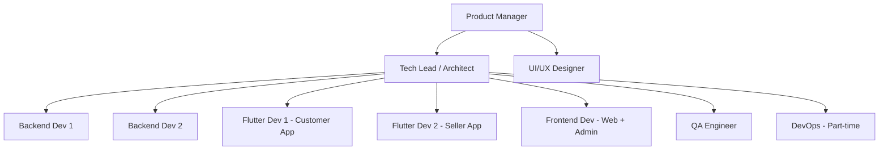
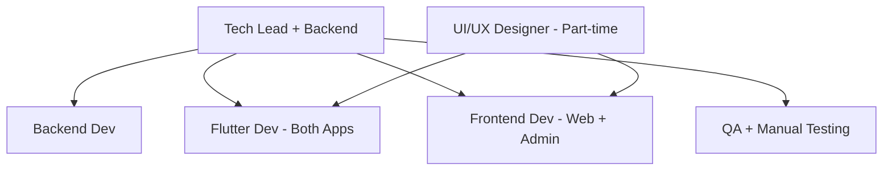

# PetZonic — Team Roles & Responsibilities

> **Version**: 1.0.0  
> **Date**: May 28, 2026

---

## 1. Recommended Team Structure

### Full Team (9-10 people)

### Lean Team (5-6 people)

---

## 2. Role Definitions

### 2.1 Product Manager

| Aspect | Details |
|--------|---------|
| **Focus** | Requirements, priorities, stakeholders, user feedback |
| **Key Skills** | Product thinking, market research, communication, data analysis |
| **Responsibilities** | |
| | Define and maintain product roadmap |
| | Write user stories and acceptance criteria |
| | Prioritize backlog (P0/P1/P2 decisions) |
| | Conduct user research and interviews |
| | Coordinate with breeder/seller onboarding |
| | Define KPIs and success metrics |
| | Sprint planning and stakeholder updates |
| **Tools** | Jira/Linear, Figma (review), Analytics (Mixpanel/Amplitude) |
| **Allocation** | 100% |

---

### 2.2 Tech Lead / Architect

| Aspect | Details |
|--------|---------|
| **Focus** | Technical decisions, architecture, team enablement, code quality |
| **Key Skills** | Node.js, Express 5, TypeScript, PostgreSQL, AWS, code review, mentoring |
| **Responsibilities** | |
| | Define system architecture and tech stack decisions |
| | Set up project boilerplate and coding standards |
| | Design database schema and API contracts |
| | Code review all PRs (at least high-level) |
| | Unblock team members on technical issues |
| | Handle complex integrations (Razorpay, Escrow) |
| | Performance optimization and security oversight |
| | 40% coding + 60% architecture/review/mentoring |
| **Tools** | VS Code, GitHub, AWS Console, Postman, Prisma Studio |
| **Allocation** | 100% |

---

### 2.3 Backend Developer 1 (Core)

| Aspect | Details |
|--------|---------|
| **Focus** | Core business logic — Auth, Users, Pets, Orders, Payments |
| **Key Skills** | Express 5, TypeScript, PostgreSQL, Prisma, Redis, REST API design |
| **Responsibilities** | |
| | Implement auth module (OTP, OAuth, JWT) |
| | User management and KYC verification flow |
| | Pet listings CRUD with status management |
| | Order lifecycle management |
| | Razorpay payment integration |
| | Escrow system implementation |
| | Seller payout system |
| | Write unit + integration tests (Vitest) |
| **Tools** | Express 5, Prisma, Vitest, Postman, Redis CLI |
| **Allocation** | 100% |

---

### 2.4 Backend Developer 2 (Features)

| Aspect | Details |
|--------|---------|
| **Focus** | Supporting features — Products, Search, Chat, Services, Notifications |
| **Key Skills** | Express 5, TypeScript, Socket.io, PostgreSQL pg_trgm, Gemini AI, Redis |
| **Responsibilities** | |
| | Product catalog and inventory management |
| | Shopping cart implementation |
| | Native PostgreSQL pg_trgm search indexing & queries |
| | Gemini AI pet photo assistance |
| | Real-time chat with Socket.io |
| | Service provider and booking module |
| | Notification system (push, SMS, email) |
| | Background jobs & outbox event dispatch |
| | File upload (S3 / Cloudflare R2 pre-signed URLs) |
| **Tools** | Express 5, Socket.io, Prisma Studio, Vitest, AWS S3 / R2 |
| **Allocation** | 100% |

---

### 2.5 Flutter Developer 1 (Customer App)

| Aspect | Details |
|--------|---------|
| **Focus** | Customer-facing mobile app (iOS + Android) |
| **Key Skills** | Flutter/Dart, state management (Riverpod/Bloc), REST API consumption, UI/UX |
| **Responsibilities** | |
| | App architecture and navigation setup |
| | Auth flow (OTP, social login) |
| | Home screen and browsing experience |
| | Pet marketplace screens |
| | Product store and cart/checkout |
| | Service booking flow |
| | Chat UI (Socket.io client) |
| | Push notification handling |
| | Payment integration (Razorpay Flutter SDK) |
| | App store deployment |
| **Tools** | Flutter, VS Code/Android Studio, Xcode, Firebase, Riverpod |
| **Allocation** | 100% |

---

### 2.6 Flutter Developer 2 (Seller App)

| Aspect | Details |
|--------|---------|
| **Focus** | Seller-facing mobile app + shared packages |
| **Key Skills** | Flutter/Dart, form handling, image upload, state management |
| **Responsibilities** | |
| | Seller app architecture |
| | Seller dashboard and analytics |
| | Listing creation wizard (multi-step form) |
| | Listing management (edit, boost, deactivate) |
| | Seller order management (accept/decline) |
| | Earnings and payout screens |
| | KYC submission flow |
| | Seller chat interface |
| | Shared Flutter packages (API client, models, widgets) |
| **Tools** | Flutter, VS Code/Android Studio, Xcode |
| **Allocation** | 100% |

---

### 2.7 Frontend Developer (Web + Admin)

| Aspect | Details |
|--------|---------|
| **Focus** | Customer website (SEO-critical) + Admin panel |
| **Key Skills** | Next.js 15, React 19, TypeScript, Tailwind CSS, SSR/SEO |
| **Responsibilities** | |
| | Next.js website with SSR for SEO |
| | Homepage, listing pages, product pages |
| | Customer account pages |
| | Cart and checkout flow (web) |
| | Admin panel (dashboard, tables, forms) |
| | Moderation workflow UI |
| | Revenue reports and charts |
| | SEO optimization (meta, sitemap, structured data) |
| | Responsive design (desktop + mobile web) |
| **Tools** | Next.js, React, Tailwind, shadcn/ui, Chart.js/Recharts, Vercel |
| **Allocation** | 100% (60% website, 40% admin panel) |

---

### 2.8 UI/UX Designer

| Aspect | Details |
|--------|---------|
| **Focus** | User experience, visual design, prototyping |
| **Key Skills** | Figma, user research, mobile design, design systems, prototyping |
| **Responsibilities** | |
| | Design system (colors, typography, components) |
| | Customer app screen designs |
| | Seller app screen designs |
| | Website design |
| | Admin panel wireframes (can be lower fidelity) |
| | Prototype key flows for testing |
| | Icon design and illustration |
| | Design review during implementation |
| | User testing sessions |
| **Deliverables** | Figma file with all screens, component library, style guide |
| **Allocation** | 100% (Phase 0-2), 50% (Phase 3-5) |

---

### 2.9 QA Engineer

| Aspect | Details |
|--------|---------|
| **Focus** | Quality assurance, test strategy, automation |
| **Key Skills** | Manual testing, API testing, mobile testing, automation (Detox/Appium), performance |
| **Responsibilities** | |
| | Define test strategy and test plans |
| | Write and maintain test cases |
| | API testing (Postman collections, automated) |
| | Mobile app testing (both platforms) |
| | Cross-browser web testing |
| | Regression testing before releases |
| | Performance testing (k6/Artillery) |
| | Bug reporting and tracking |
| | Exploratory testing |
| | UAT coordination |
| **Tools** | Postman, Detox/Appium, k6, BrowserStack, Jira |
| **Allocation** | 100% |

---

### 2.10 DevOps Engineer (Part-time)

| Aspect | Details |
|--------|---------|
| **Focus** | Infrastructure, CI/CD, monitoring, deployments |
| **Key Skills** | AWS, Docker, Terraform, GitHub Actions, monitoring (CloudWatch/Sentry) |
| **Responsibilities** | |
| | AWS infrastructure setup (Terraform) |
| | Docker containerization |
| | CI/CD pipelines (GitHub Actions) |
| | Database backups and recovery |
| | SSL, DNS, CDN configuration |
| | Monitoring and alerting setup |
| | Performance tuning (server-side) |
| | Security hardening |
| | Deployment automation (staging → production) |
| **Tools** | AWS (ECS, RDS, S3, CloudFront), Docker, Terraform, GitHub Actions, Sentry |
| **Allocation** | 50% (full-time in Phase 0 and Phase 5) |

---

## 3. Skills Matrix

| Skill | Required By | Priority |
|-------|-------------|:--------:|
| TypeScript | All devs | P0 |
| Node.js / Express 5 | Backend devs, Tech Lead | P0 |
| Flutter/Dart | Mobile devs | P0 |
| Next.js/React | Frontend dev | P0 |
| PostgreSQL | Backend devs | P0 |
| Redis | Backend devs | P1 |
| Socket.io | Backend Dev 2, Mobile devs | P1 |
| Razorpay SDK | Backend Dev 1, Mobile/Web | P0 |
| AWS (ECS, RDS, S3) | DevOps, Tech Lead | P0 |
| Docker | All devs (local), DevOps | P0 |
| Git/GitHub | All devs | P0 |
| Figma | Designer, all devs (reading) | P0 |
| SEO | Frontend dev, PM | P1 |
| Firebase/FCM | Backend Dev 2, Mobile devs | P1 |

---

## 4. Communication & Ceremonies

| Ceremony | Frequency | Duration | Participants |
|----------|-----------|----------|-------------|
| Daily Standup | Daily | 15 min | All devs |
| Sprint Planning | Bi-weekly | 1 hour | All |
| Sprint Retro | Bi-weekly | 45 min | All |
| Design Review | Weekly | 30 min | Designer + devs |
| Code Review | Async | — | Tech Lead + author |
| Architecture Sync | Weekly | 30 min | Tech Lead + Backend devs |
| Demo/Showcase | Bi-weekly | 30 min | All + stakeholders |
| 1:1 with Tech Lead | Weekly | 15 min | Individual devs |

---

## 5. Hiring Priority (If Building Team)

| Priority | Role | Why First |
|:--------:|------|-----------|
| 1 | Tech Lead | Makes all architecture decisions, sets up project |
| 2 | Backend Dev 1 | Core API must be ready for others to build against |
| 3 | Flutter Dev 1 | Customer app is primary revenue channel |
| 4 | Frontend Dev | Website needed for SEO and user acquisition |
| 5 | UI/UX Designer | Designs should be ready before devs build screens |
| 6 | Backend Dev 2 | Features layer once core is stable |
| 7 | Flutter Dev 2 | Seller app needed before marketplace launch |
| 8 | QA Engineer | Critical from Phase 2 onward |
| 9 | DevOps | Part-time, can be outsourced initially |
| 10 | Product Manager | Can be founder initially |

---

## 6. Budget Estimation (India Market)

### Full-time Team (Monthly, INR)

| Role | Range (per month) | Notes |
|------|:-----------------:|-------|
| Tech Lead | ₹1,50,000 - ₹2,50,000 | 5+ years experience |
| Backend Dev | ₹80,000 - ₹1,50,000 | 3+ years Node.js / Express / TS |
| Flutter Dev | ₹80,000 - ₹1,50,000 | 2+ years Flutter |
| Frontend Dev | ₹80,000 - ₹1,50,000 | 3+ years React/Next.js |
| UI/UX Designer | ₹60,000 - ₹1,20,000 | 3+ years product design |
| QA Engineer | ₹50,000 - ₹1,00,000 | 2+ years mobile + API |
| DevOps (part-time) | ₹40,000 - ₹75,000 | 50% allocation |
| **Total (lean team)** | **₹4,00,000 - ₹7,00,000** | 5-6 people |
| **Total (full team)** | **₹7,00,000 - ₹12,00,000** | 9-10 people |

### Freelance/Contract Alternative

| Role | Hourly Rate (INR) | Monthly (160 hrs) |
|------|:-----------------:|:-----------------:|
| Senior Backend | ₹1,500 - ₹3,000 | ₹2,40,000 - ₹4,80,000 |
| Senior Flutter | ₹1,500 - ₹3,000 | ₹2,40,000 - ₹4,80,000 |
| Senior Frontend | ₹1,200 - ₹2,500 | ₹1,92,000 - ₹4,00,000 |

---

## 7. Onboarding Checklist (New Team Member)

- [ ] Access granted: GitHub, Jira/Linear, Figma, Slack, AWS
- [ ] Local dev environment running (Docker Compose)
- [ ] Architecture document read
- [ ] PR guidelines and coding standards reviewed
- [ ] First paired programming session with Tech Lead
- [ ] Assigned first small task (bug fix or minor feature)
- [ ] Completed first PR and received review
- [ ] Understands deployment process
- [ ] Added to all relevant communication channels
