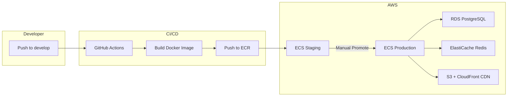

# PetZonic — Deployment Runbook

> **Version**: 1.0.0  
> **Date**: May 28, 2026  
> **On-Call Escalation**: Tech Lead → CTO

---

## 1. Deployment Architecture



---

## 2. Environments

| Environment | URL | Branch | Deploy Trigger | Purpose |
|-------------|-----|--------|:-------------:|---------|
| **Development** | localhost | feature/* | Manual | Local development |
| **Staging** | staging.petzonic.com | develop | Auto on merge | QA & testing |
| **Production** | api.petzonic.com | main | Manual approval | Live users |

---

## 3. Pre-Deployment Checklist

### Before Every Production Deploy

- [ ] All CI checks passing on the release branch
- [ ] QA sign-off on staging
- [ ] No P0/P1 bugs open against this release
- [ ] Database migrations tested on staging
- [ ] Load test passed (if significant changes)
- [ ] Security scan clean (no critical/high)
- [ ] Rollback plan confirmed
- [ ] On-call person identified and available
- [ ] Team notified in #deployments Slack channel
- [ ] Avoid deploying on Fridays or before holidays

### Pre-Deploy Communication

```
📢 @channel DEPLOYMENT PLANNED

Service: petzonic-api
Version: v1.3.0
Time: 2026-05-28 14:00 IST
Changes: [link to release notes]
Deploy Lead: [name]
Rollback Plan: Revert to v1.2.0 (ECS task revision)
ETA: 15 minutes (zero-downtime)
```

---

## 4. Deployment Procedures

### 4.1 Backend API (Express 5 → Docker / AWS ECS)

#### Automated (Standard Deploy)

```bash
# 1. Merge release branch to main
git checkout main
git merge release/1.3.0
git tag -a v1.3.0 -m "Release 1.3.0"
git push origin main --tags

# 2. GitHub Actions auto-triggers:
#    - Build Docker image
#    - Push to ECR (tagged: v1.3.0 + latest)
#    - Update ECS task definition
#    - Deploy to ECS (rolling update)

# 3. Monitor deployment in AWS Console
#    ECS → Clusters → petzonic-prod → Services → petzonic-api
#    Wait for "Running tasks" to show new revision
```

#### Manual Deploy (Emergency / Override)

```bash
# 1. Build and push Docker image manually
docker build -t petzonic-api:v1.3.0 .
docker tag petzonic-api:v1.3.0 \
  123456789.dkr.ecr.ap-south-1.amazonaws.com/petzonic-api:v1.3.0

aws ecr get-login-password --region ap-south-1 | \
  docker login --username AWS --password-stdin \
  123456789.dkr.ecr.ap-south-1.amazonaws.com

docker push 123456789.dkr.ecr.ap-south-1.amazonaws.com/petzonic-api:v1.3.0

# 2. Update ECS service to use new image
aws ecs update-service \
  --cluster petzonic-prod \
  --service petzonic-api \
  --force-new-deployment

# 3. Monitor
aws ecs wait services-stable --cluster petzonic-prod --services petzonic-api
echo "Deploy complete!"
```

#### Database Migrations

```bash
# ⚠️ ALWAYS run migrations BEFORE deploying new code
# (new code expects new schema, old code must tolerate new schema)

# 1. SSH to bastion host (or use ECS exec)
aws ecs execute-command \
  --cluster petzonic-prod \
  --task <task-id> \
  --container petzonic-api \
  --interactive \
  --command "/bin/sh"

# 2. Run migration
npx prisma migrate deploy

# 3. Verify migration applied
npx prisma migrate status

# 4. THEN deploy new code (update ECS)
```

**Migration Safety Rules**:
- ✅ Additive changes (new columns, tables) — safe, deploy migration first
- ✅ Column rename — use 2-step: add new → deploy code using both → remove old
- ⚠️ Removing columns — only AFTER code no longer references them
- ❌ Never drop tables in production without data backup
- ❌ Never run `prisma migrate reset` in production

---

### 4.2 Website (Next.js → Vercel or AWS)

#### Vercel (Recommended for Web)

```bash
# Auto-deploy on push to main
# Vercel handles build + CDN + SSL automatically

# Manual deploy if needed:
npx vercel --prod
```

#### AWS (ECS + CloudFront)

```bash
# Same Docker flow as backend API
# CloudFront invalidation after deploy:
aws cloudfront create-invalidation \
  --distribution-id E1234567 \
  --paths "/*"
```

---

### 4.3 Mobile Apps (Flutter → App Store / Play Store)

#### Android (Play Store)

```bash
# 1. Bump version in pubspec.yaml
#    version: 1.3.0+15  (versionName+buildNumber)

# 2. Build release APK/AAB
flutter build appbundle --release

# 3. Upload to Play Console
#    Build → App bundles → Upload
#    Or via Fastlane:
cd android && fastlane deploy

# 4. Staged rollout: 10% → 50% → 100%
#    Monitor crash-free rate between stages
```

#### iOS (App Store)

```bash
# 1. Bump version in pubspec.yaml

# 2. Build
flutter build ipa --release

# 3. Upload via Xcode or Transporter app
#    Or via Fastlane:
cd ios && fastlane deploy

# 4. Submit for App Store Review (takes 24-48 hours)
# 5. Once approved → Release (manual or auto)
```

#### Mobile Hotfix (CodePush Alternative)

For critical UI-only fixes, use Shorebird (Flutter code push):

```bash
# Push OTA update (no App Store review needed)
shorebird patch android --release-version 1.3.0
shorebird patch ios --release-version 1.3.0
```

---

## 5. Rollback Procedures

### 5.1 Backend API Rollback (< 5 minutes)

```bash
# Option A: Revert ECS to previous task definition
aws ecs update-service \
  --cluster petzonic-prod \
  --service petzonic-api \
  --task-definition petzonic-api:<previous-revision>

# Option B: Deploy previous Docker image tag
aws ecs update-service \
  --cluster petzonic-prod \
  --service petzonic-api \
  --force-new-deployment
# (With task def pointing to previous image tag)

# Verify rollback
aws ecs wait services-stable --cluster petzonic-prod --services petzonic-api
curl https://api.petzonic.com/health
```

### 5.2 Database Rollback

```bash
# ⚠️ CAUTION: Only if migration just ran and caused issues

# Check current migration status
npx prisma migrate status

# If migration needs rollback, apply manual SQL:
# Each migration should have a corresponding down.sql file
psql $DATABASE_URL < prisma/migrations/<migration_name>/down.sql

# Then rollback application code
```

**Important**: If data has been written using the new schema, a simple rollback may cause data loss. In that case:
1. Fix forward (deploy a patch) rather than rolling back
2. If rollback is essential, restore from the most recent backup

### 5.3 Website Rollback

```bash
# Vercel: Instant rollback to previous deployment
vercel rollback

# AWS: Revert ECS task to previous revision (same as API)
```

### 5.4 Mobile App Rollback

- **Play Store**: Halt rollout → revert to previous version (takes hours)
- **App Store**: Remove from sale → re-release previous version (takes days)
- **Emergency**: Use Shorebird to push a patch reverting the change (minutes)
- **Feature flags**: Disable broken feature remotely without re-deploy

---

## 6. Zero-Downtime Deploy Strategy

### ECS Rolling Update Configuration

```json
{
  "deploymentConfiguration": {
    "maximumPercent": 200,
    "minimumHealthyPercent": 100
  },
  "healthCheckGracePeriodSeconds": 60
}
```

**How it works**:
1. New tasks start alongside old tasks (200% capacity temporarily)
2. Load balancer health checks new tasks
3. Once healthy, traffic shifts to new tasks
4. Old tasks drain connections and stop
5. Result: Zero dropped requests

### Health Check Endpoint

```typescript
// /health — checked by ALB every 30 seconds
@Get('health')
health() {
  return {
    status: 'ok',
    version: process.env.APP_VERSION,
    uptime: process.uptime(),
    timestamp: new Date().toISOString(),
  };
}

// /health/ready — full readiness check
@Get('health/ready')
async ready() {
  const db = await this.prisma.$queryRaw`SELECT 1`;
  const redis = await this.redis.ping();
  return {
    status: 'ok',
    database: db ? 'connected' : 'disconnected',
    redis: redis === 'PONG' ? 'connected' : 'disconnected',
    search: await this.searchHealth(),
  };
}
```

---

## 7. Post-Deployment Verification

### Smoke Tests (Run immediately after deploy)

```bash
# Automated smoke test script
#!/bin/bash
BASE_URL="https://api.petzonic.com/api/v1"

echo "🔍 Running smoke tests..."

# Health check
curl -sf "$BASE_URL/../health" || exit 1
echo "✅ Health OK"

# Public endpoint
curl -sf "$BASE_URL/pets?limit=1" | jq '.data | length' | grep -q "1" || exit 1
echo "✅ Pet listing OK"

# Auth endpoint (register shouldn't 500)
curl -sf -o /dev/null -w "%{http_code}" "$BASE_URL/auth/send-otp" \
  -H "Content-Type: application/json" \
  -d '{"phone":"+919999999999"}' | grep -q "200\|429" || exit 1
echo "✅ Auth endpoint OK"

# Search
curl -sf "$BASE_URL/pets/search?q=labrador" | jq '.data' || exit 1
echo "✅ Search OK"

echo "🎉 All smoke tests passed!"
```

### Monitoring Dashboard (First 30 minutes)

Watch these metrics immediately after deploy:

| Metric | Normal | Alert If |
|--------|--------|----------|
| Error rate (5xx) | < 0.1% | > 1% |
| Response time p95 | < 500ms | > 2000ms |
| CPU utilization | < 60% | > 85% |
| Memory utilization | < 70% | > 90% |
| Active connections | Stable | Dropping to 0 |
| Successful health checks | 100% | < 100% |

---

## 8. Incident Response

### Severity Levels

| Level | Definition | Response Time | Example |
|-------|-----------|:------------:|---------|
| **SEV-1** | Complete outage, all users affected | 15 min | API returning 500, DB down |
| **SEV-2** | Major feature broken, many affected | 30 min | Payments failing, chat down |
| **SEV-3** | Minor feature degraded, some affected | 2 hours | Search slow, images not loading |
| **SEV-4** | Cosmetic, minimal impact | Next business day | Typo, minor UI glitch |

### SEV-1 Response Playbook

```
1. ASSESS (5 min)
   - Check monitoring dashboards
   - Identify which service is failing
   - Check recent deployments

2. COMMUNICATE (immediate)
   - Post in #incidents channel
   - Notify on-call if not already aware
   - Update status page: https://status.petzonic.com

3. MITIGATE (15 min target)
   - If deploy-related → ROLLBACK immediately
   - If infrastructure → Check AWS health dashboard
   - If database → Check connections, disk, locks
   - If third-party → Enable fallback / circuit breaker

4. RESOLVE
   - Apply fix (hotfix branch if code change needed)
   - Verify fix in staging → deploy to prod
   - Confirm metrics back to normal

5. POST-MORTEM (within 48 hours)
   - Timeline of events
   - Root cause analysis
   - Action items to prevent recurrence
   - Document in /docs/incidents/
```

---

## 9. Infrastructure Runbook

### Database (RDS PostgreSQL)

| Scenario | Action |
|----------|--------|
| High CPU | Check slow queries: `SELECT * FROM pg_stat_activity WHERE state = 'active'` |
| Storage full | Increase storage (no downtime): AWS Console → Modify |
| Connection limit | Check connection pool. Max: 100 for db.t3.medium |
| Restore from backup | RDS → Snapshots → Restore to point in time |

### Redis (ElastiCache)

| Scenario | Action |
|----------|--------|
| Memory full | Eviction policy handles it (allkeys-lru). Check for memory leaks |
| Connection refused | Check security group, restart node |
| Slow | Check key patterns: `redis-cli --bigkeys` |

### ECS Tasks

| Scenario | Action |
|----------|--------|
| Task keeps crashing | Check logs: `aws logs tail /ecs/petzonic-api --follow` |
| OOM killed | Increase task memory in task definition |
| Stuck deployment | Force new deployment or rollback |

---

## 10. Secrets Management

| Secret | Storage | Rotation |
|--------|---------|----------|
| Database password | AWS Secrets Manager | 90 days |
| JWT secret | AWS Secrets Manager | On security incident |
| Razorpay keys | AWS Secrets Manager | Never (unless compromised) |
| Firebase keys | AWS Secrets Manager | Never |
| API keys (SMS, etc.) | AWS Secrets Manager | Annually |

```bash
# Retrieve secret
aws secretsmanager get-secret-value --secret-id petzonic/prod/database

# Rotate secret
aws secretsmanager rotate-secret --secret-id petzonic/prod/database
# (Lambda function handles rotation)
```

**Rules**:
- ❌ Never store secrets in code or .env files in production
- ❌ Never log secrets
- ✅ Use AWS Secrets Manager or SSM Parameter Store
- ✅ Inject secrets via ECS task definition environment variables
- ✅ Rotate credentials regularly

---

## 11. Backup & Recovery

### Automated Backups

| Resource | Backup Method | Frequency | Retention |
|----------|:-------------|:---------:|:---------:|
| PostgreSQL | RDS automated snapshots | Daily | 30 days |
| PostgreSQL | Point-in-time recovery | Continuous | 7 days |
| Redis | ElastiCache snapshots | Daily | 7 days |
| S3 (media) | Cross-region replication | Real-time | Permanent |
| Code | Git (GitHub) | Every push | Permanent |

### Recovery Time Objectives

| Scenario | RTO | RPO | Procedure |
|----------|:---:|:---:|-----------|
| Database corruption | 1 hour | 5 minutes | Point-in-time restore |
| Complete DB loss | 2 hours | 24 hours | Restore from snapshot |
| Redis failure | 5 minutes | Session loss OK | Auto-failover (Multi-AZ) |
| S3 data loss | N/A | 0 | Cross-region replica |
| Full region failure | 4 hours | 5 minutes | Failover to secondary region |

### Manual Backup (Before Risky Operations)

```bash
# Create manual RDS snapshot before migration
aws rds create-db-snapshot \
  --db-instance-identifier petzonic-prod \
  --db-snapshot-identifier pre-migration-v1-3-0-$(date +%Y%m%d)

# Verify snapshot is available
aws rds wait db-snapshot-available \
  --db-snapshot-identifier pre-migration-v1-3-0-20260528
```

---

## 12. Deployment Schedule

| Day | Allowed Deploys | Notes |
|-----|:---------------:|-------|
| Monday | ✅ | Normal deploys |
| Tuesday | ✅ | Normal deploys |
| Wednesday | ✅ | Normal deploys |
| Thursday | ✅ | Last day for non-trivial changes |
| Friday | ⚠️ Hotfix only | No feature deploys |
| Saturday | ⚠️ Hotfix only | Emergency only |
| Sunday | ⚠️ Hotfix only | Emergency only |

**Blackout periods**: No deploys during:
- Major sale events (unless critical fix)
- Peak hours (12:00-14:00, 19:00-22:00 IST) for non-urgent deploys
- Public holidays

---

## 13. Contacts & Escalation

| Role | Contact | When to Escalate |
|------|---------|-----------------|
| On-Call Engineer | PagerDuty rotation | Any SEV-1/SEV-2 alert |
| Tech Lead | [name] — Slack/phone | SEV-1, deployment failures |
| AWS Support | Enterprise support console | Infrastructure issues |
| Razorpay Support | support@razorpay.com | Payment processing issues |
| Shiprocket Support | [account manager] | Delivery API failures |
