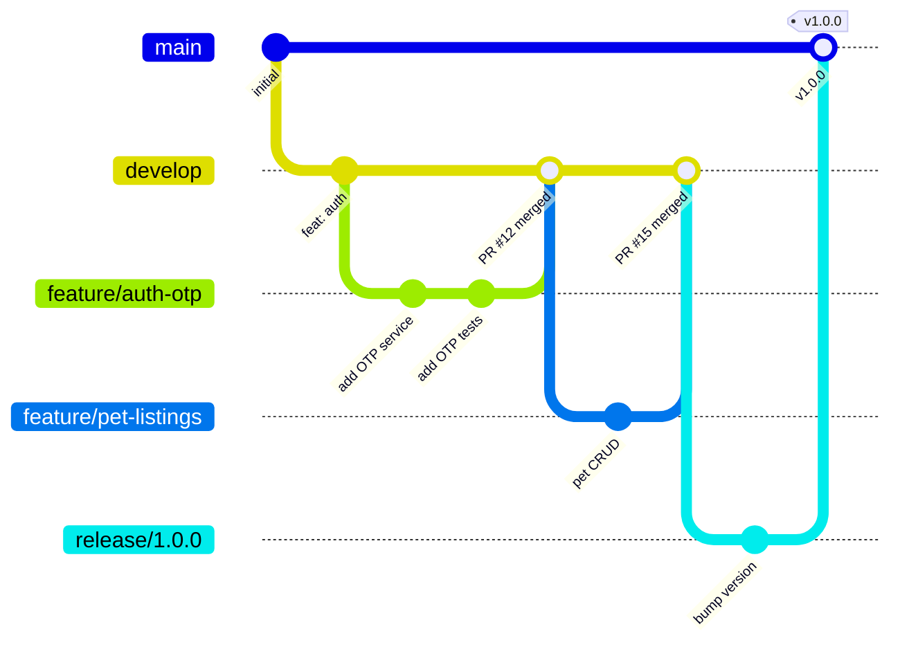
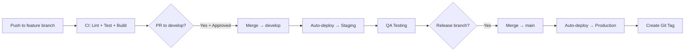

# PetZonic — Git Workflow & Branching Strategy

> **Version**: 1.0.0  
> **Date**: May 28, 2026

---

## 1. Branching Model

We use a **GitHub Flow** variant with environment branches:



---

## 2. Branch Types

| Branch | Pattern | Purpose | Lifetime |
|--------|---------|---------|----------|
| `main` | `main` | Production code — always deployable | Permanent |
| `develop` | `develop` | Integration branch — latest features | Permanent |
| `feature/*` | `feature/short-description` | New features | Until merged |
| `fix/*` | `fix/short-description` | Bug fixes | Until merged |
| `hotfix/*` | `hotfix/short-description` | Urgent production fix | Until merged |
| `release/*` | `release/x.y.z` | Release preparation | Until merged to main |

### Branch Naming Examples

```
feature/auth-otp-login
feature/pet-listing-crud
feature/razorpay-integration
fix/cart-quantity-validation
fix/chat-reconnection
hotfix/payment-webhook-timeout
release/1.0.0
release/1.1.0
```

---

## 3. Workflow

### 3.1 Feature Development

```bash
# 1. Start from develop
git checkout develop
git pull origin develop

# 2. Create feature branch
git checkout -b feature/pet-listing-search

# 3. Work on feature (commit often)
git add .
git commit -m "feat(pets): add pg_trgm search indexing on pet listings"
git commit -m "feat(pets): implement search endpoint with filters"
git commit -m "test(pets): add search service unit tests"

# 4. Push and create PR
git push origin feature/pet-listing-search
# → Create Pull Request: feature/pet-listing-search → develop
```

### 3.2 Pull Request Process

1. **Create PR** against `develop`
2. **Fill PR template** (description, testing notes, screenshots)
3. **Automated checks run**: lint, test, build
4. **Request review** from Tech Lead or peer
5. **Address feedback** (push new commits, don't force-push)
6. **Approval** (minimum 1 approval required)
7. **Squash & merge** into develop
8. **Delete branch** after merge

### 3.3 Release Process

```bash
# 1. Create release branch from develop
git checkout develop
git pull
git checkout -b release/1.2.0

# 2. Bump version, update changelog
# Only bug fixes and docs allowed on release branch

# 3. Deploy to staging for QA
# Fix any issues found (commit to release branch)

# 4. When approved:
# Merge release → main (creates tag)
# Merge release → develop (back-port fixes)
git checkout main
git merge release/1.2.0
git tag -a v1.2.0 -m "Release 1.2.0"
git push origin main --tags

git checkout develop
git merge release/1.2.0
git push origin develop
```

### 3.4 Hotfix Process

```bash
# 1. Branch from main
git checkout main
git checkout -b hotfix/fix-payment-timeout

# 2. Fix the issue
git commit -m "fix(payments): increase Razorpay webhook timeout to 30s"

# 3. PR to main (expedited review)
# After merge → auto-deploy to production

# 4. Back-port to develop
git checkout develop
git merge hotfix/fix-payment-timeout
```

---

## 4. Commit Message Convention

### Format (Conventional Commits)

```
<type>(<scope>): <subject>

[optional body]

[optional footer]
```

### Types

| Type | When to Use |
|------|------------|
| `feat` | New feature |
| `fix` | Bug fix |
| `docs` | Documentation only |
| `style` | Formatting (no logic change) |
| `refactor` | Code restructuring (no new feature/fix) |
| `test` | Adding/updating tests |
| `chore` | Build, CI, tooling changes |
| `perf` | Performance improvement |
| `revert` | Reverting a previous commit |

### Scopes

```
auth, users, pets, products, orders, payments, chat, services,
reviews, notifications, admin, search, delivery, franchise,
infra, ci, deps
```

### Examples

```bash
feat(pets): add breed autocomplete to search
fix(orders): prevent double payment submission
docs(api): add WebSocket event documentation
refactor(auth): extract token refresh to middleware
test(payments): add Razorpay webhook integration tests
chore(deps): upgrade Express to 5.1.0
perf(search): add Redis cache for popular breed queries
```

### Rules (Enforced by commitlint)

- Subject line ≤ 72 characters
- Use imperative mood: "add" not "added" or "adds"
- No period at end of subject
- Body wrapped at 80 characters
- Reference issue numbers in footer: `Closes #123`

---

## 5. Pull Request Template

```markdown
## Description
Brief description of what this PR does.

## Type
- [ ] Feature
- [ ] Bug fix
- [ ] Refactor
- [ ] Documentation
- [ ] Chore

## Changes
- Added X
- Modified Y
- Removed Z

## Testing
- [ ] Unit tests added/updated
- [ ] Manual testing performed
- [ ] Tested on: iOS / Android / Web (as applicable)

## Screenshots / Video (if UI change)
| Before | After |
|--------|-------|
| ... | ... |

## Checklist
- [ ] Code follows project coding standards
- [ ] No console.log / print statements left
- [ ] No hardcoded values (use env/config)
- [ ] Error cases handled
- [ ] Loading states handled (mobile/web)
- [ ] Responsive/accessible (web)

## Related Issues
Closes #___
```

---

## 6. Code Review Guidelines

### For Reviewers

| Check | What to Look For |
|-------|-----------------|
| **Correctness** | Does it do what the PR claims? Edge cases handled? |
| **Security** | Input validation? Auth checks? Data exposure? |
| **Performance** | N+1 queries? Missing indexes? Unnecessary computation? |
| **Tests** | Adequate coverage? Tests actually test behavior? |
| **Standards** | Follows naming, structure, and API conventions? |
| **Simplicity** | Over-engineered? Can it be simpler? |

### Review Response Times

| Priority | Response Within |
|----------|:--------------:|
| Hotfix | 1 hour |
| Bug fix | 4 hours |
| Feature | 24 hours |
| Refactor/docs | 48 hours |

### Approval Rules

| Branch Target | Approvals Required | Who |
|---------------|:-----------------:|-----|
| `develop` | 1 | Any team member |
| `main` (hotfix) | 1 | Tech Lead |
| `main` (release) | 2 | Tech Lead + 1 other |

---

## 7. Protected Branch Rules

### `main`
- ❌ No direct pushes
- ✅ Requires PR with approvals
- ✅ Requires all CI checks passing
- ✅ Requires up-to-date with base
- ❌ No force pushes
- Auto-deploys to **production**

### `develop`
- ❌ No direct pushes
- ✅ Requires PR with 1 approval
- ✅ Requires CI checks passing
- Auto-deploys to **staging**

---

## 8. Repository Structure (Multi-Repo)

| Repository | Contents | Language |
|-----------|----------|----------|
| `petzonic-api` | Node.js / Express 5 backend API | TypeScript |
| `petzonic-customer-app` | Flutter customer app | Dart |
| `petzonic-seller-app` | Flutter seller app | Dart |
| `petzonic-web` | Next.js website + admin | TypeScript |
| `petzonic-infra` | Terraform + Docker configs | HCL/YAML |
| `petzonic-docs` | This documentation | Markdown |

### Shared Code

```
petzonic-shared/          # Shared packages (NPM private)
├── @petzonic/types       # TypeScript types shared between API & web
├── @petzonic/validators  # Validation schemas (Zod) shared
└── @petzonic/constants   # Enums, error codes
```

---

## 9. CI/CD Integration



### CI Checks (Run on Every PR)

1. ✅ ESLint / dart analyze (no errors)
2. ✅ TypeScript / Dart compile (no errors)
3. ✅ Unit tests pass (>80% coverage)
4. ✅ Build succeeds (Docker image / Flutter APK / Next.js)
5. ✅ No security vulnerabilities (npm audit / snyk)

---

## 10. Versioning

Follow **Semantic Versioning** (SemVer): `MAJOR.MINOR.PATCH`

| Version Part | When to Increment |
|-------------|-------------------|
| MAJOR (1.x.x) | Breaking API changes, major redesign |
| MINOR (x.1.x) | New features (backward compatible) |
| PATCH (x.x.1) | Bug fixes, minor improvements |

**Pre-release**: `1.0.0-beta.1`, `1.0.0-rc.1`

### Version Locations

| App | Where Version Lives |
|-----|-------------------|
| API | `package.json` → deployed as Docker tag |
| Customer App | `pubspec.yaml` → app store version |
| Seller App | `pubspec.yaml` → app store version |
| Web | `package.json` → meta tag |
