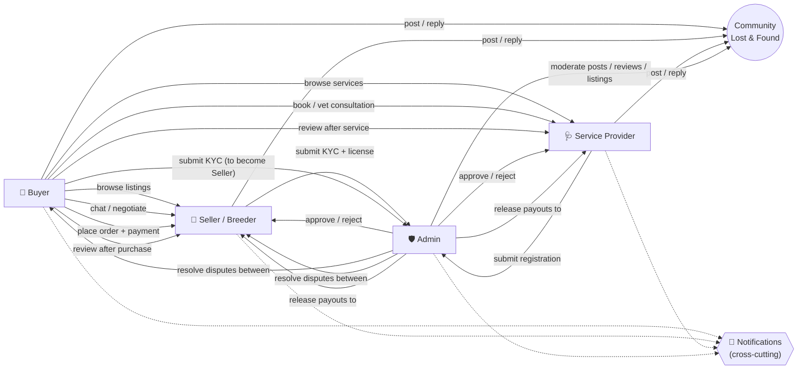
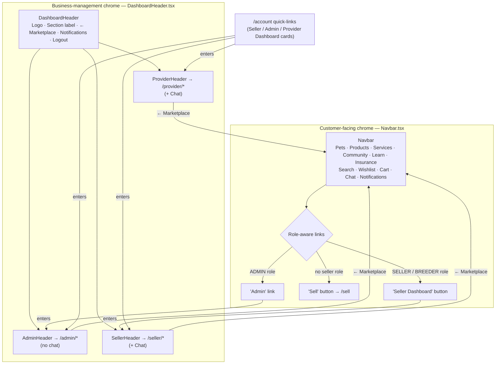
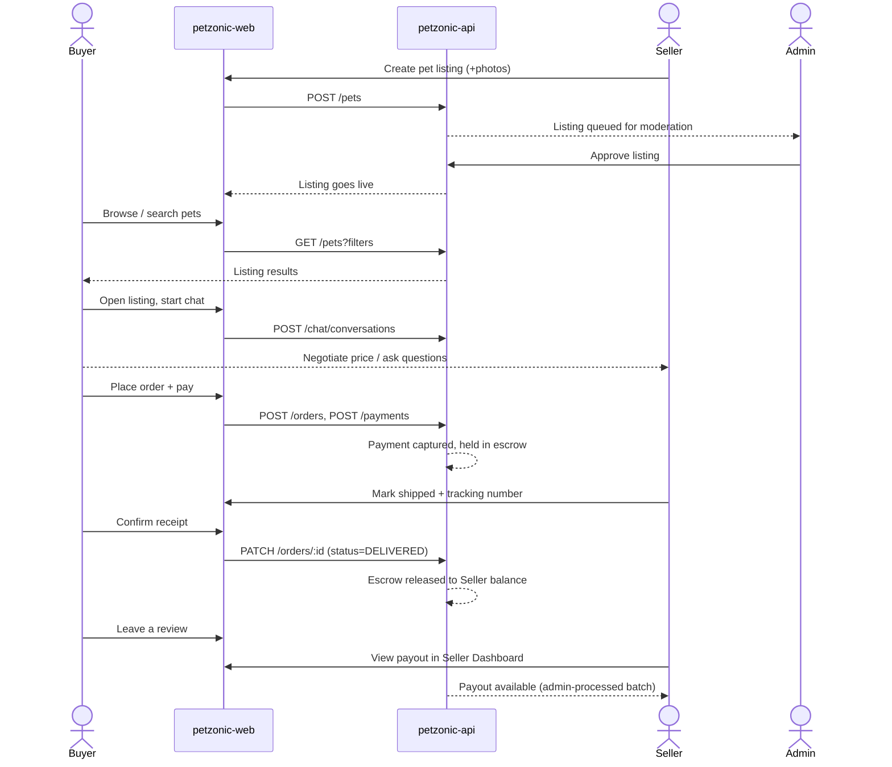
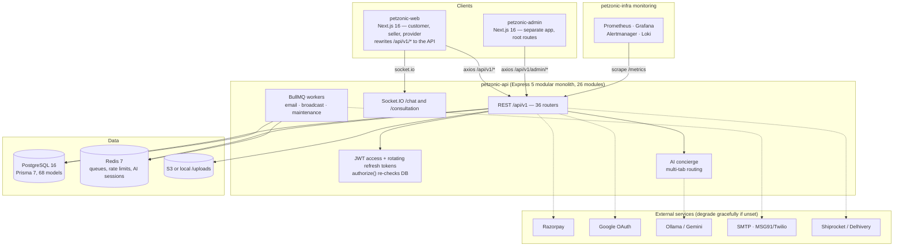
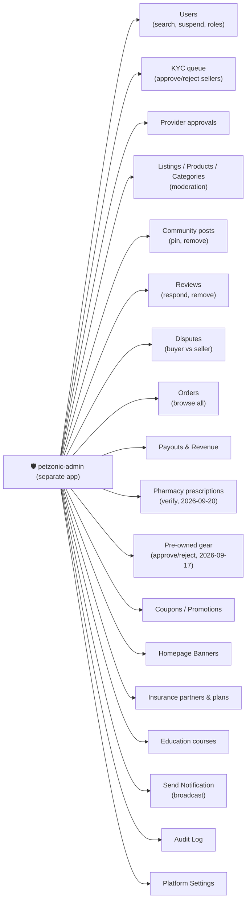

# PetZonic — Application Interconnection Diagrams

> How the Customer, Seller, Breeder, Service Provider, and Admin surfaces of
> `petzonic-web` actually connect to each other and to the backend, as
> currently implemented (not the original aspirational spec — see
> `02-technical-architecture/system-architecture.md` for that).

---

## 1. User Roles at a Glance

| Role | Tracked via | Primary surface |
|---|---|---|
| **Buyer** | `Role.BUYER` (default on signup) | Customer site (`/pets`, `/products`, `/services`, `/cart`, `/checkout`, `/account`) |
| **Seller** | `Role.SELLER` (granted after KYC approval) | Seller Dashboard (`/seller/*`) |
| **Breeder** | `Role.BREEDER` (granted after KYC + license approval) | Seller Dashboard (`/seller/*`, same as Seller) |
| **Service Provider** (Vet/Groomer/Sitter/Walker/Trainer) | Separate `ServiceProvider` row + status (`PENDING`/`APPROVED`/`REJECTED`) — **not** a `Role` | Provider Dashboard (`/provider/*`) |
| **Admin** | `Role.ADMIN` | Admin Panel — separate `petzonic-admin` app, routes at its root (`/users`, `/kyc`, …) |

A single logged-in user can hold multiple roles at once (e.g. a Buyer who is
also a Seller) — the UI below reflects that everywhere it says "role-aware."

---

## 2. Role Interconnection Map



---

## 3. Navigation & Interface Separation

Every page used to share one customer `Navbar` (shopping links + Cart +
Wishlist) no matter which section you were in. Fixed so business-management
sections get a minimal, purpose-built header instead — same separation
Amazon Seller Central / OLX's Dealer App use.



---

## 4. Core Marketplace Flow (Buy a Pet, end to end)



---

## 5. Actual System Architecture

Updated 2026-09-26 to match the code (the previous diagram said "no Redis yet" and showed
only the web app).



The maintenance queue runs scheduled jobs: escrow auto-release (hourly) and abandoned-order
expiry (every 15 minutes).

---

## 6. What Admin Can Touch



---

## 7. Basic UI Wireframes

Simple text wireframes of each shell as actually implemented — the header
row is what differs between them (see §3); page content below the header
is representative, not exhaustive.

### 7.1 Customer site — `Navbar.tsx` (shopping chrome)

```
+--------------------------------------------------------------------+
| 🐾 PetZonic   Pets  Products  Services  Community  Learn  Insurance |
|                        🔍  ❤(2)  🛒(3)  🔔  💬   Hi, Rahul  Logout  |
|                                                    [ Sell ]         |  <- "Seller Dashboard"
+--------------------------------------------------------------------+  instead, if user has
|                                                                      |  SELLER/BREEDER role
|   [ Hero banner ]                                                   |
|                                                                      |
|   Featured Pets                                                     |
|   +--------+  +--------+  +--------+  +--------+                   |
|   | photo  |  | photo  |  | photo  |  | photo  |                    |
|   | name   |  | name   |  | name   |  | name   |                    |
|   | price  |  | price  |  | price  |  | price  |                    |
|   +--------+  +--------+  +--------+  +--------+                   |
|                                                                      |
+--------------------------------------------------------------------+
| About Us · Careers · Blog   Help · Contact · Track Order            |
| Terms · Privacy · Refund     [ Newsletter signup form ]             |
+--------------------------------------------------------------------+
```

### 7.2 Seller Dashboard — `SellerHeader.tsx`

```
+--------------------------------------------------------------------+
| 🐾 PetZonic | Seller Dashboard        ← Marketplace 🔔 💬 Hi,Asha Logout |
+--------------------------------------------------------------------+
|                                                                      |
|  Seller Dashboard                                                   |
|  Total Listings: 12   Active: 9   Pending Orders: 3   Earnings: ₹.. |
|                                                                      |
|  +----------------+  +----------------+  +----------------+        |
|  | 📦 My Listings  |  | 🛍️ Orders       |  | 💰 Payouts &    |        |
|  | Manage pet      |  | Incoming orders |  |    Earnings     |        |
|  | listings     →  |  | for listings →  |  | Balance/hist →  |        |
|  +----------------+  +----------------+  +----------------+        |
|                                                                      |
+--------------------------------------------------------------------+
    (no marketing footer — dashboard ends here)
```

### 7.3 Admin Panel — `AdminHeader.tsx`

```
+--------------------------------------------------------------------+
| 🐾 PetZonic | Admin Panel              ← Marketplace 🔔  Logout      |
+--------------------------------------------------------------------+
|                                                                      |
|  Admin Dashboard        [Today] [Week] [Month] [Year]  Moderation → |
|                                                                      |
|  +-------------+  +-------------+  +-------------+  +-------------+ |
|  | DAU/Orders  |  | Revenue     |  | Active       |  | Pending     | |
|  | today       |  | today       |  | listings     |  | approvals   | |
|  +-------------+  +-------------+  +-------------+  +-------------+ |
|                                                                      |
|  Quick links: Users · KYC · Disputes · Payouts · Providers ·        |
|               Listings · Community · Reviews · Insurance ·          |
|               Promotions · Banners · Education · Audit Log          |
|                                                                      |
+--------------------------------------------------------------------+
```

### 7.4 Provider Dashboard — `ProviderHeader.tsx`

```
+--------------------------------------------------------------------+
| 🐾 PetZonic | Provider Dashboard      ← Marketplace 🔔 💬 Hi,Dr.P Logout |
+--------------------------------------------------------------------+
|                                                                      |
|  🩺 Service Provider Dashboard                                       |
|  Dr. Priya's Clinic · Veterinary · Bangalore, KA      [ APPROVED ]  |
|                                                                      |
|  +----------------+  +----------------+  +----------------+        |
|  | 📋 Services     |  | 📅 Schedule     |  | 🗂️ Bookings     |        |
|  | Manage bookable |  | Weekly          |  | Incoming        |        |
|  | services     →  |  | availability →  |  | customer     →  |        |
|  +----------------+  +----------------+  +----------------+        |
|  +----------------+   (Consultations card only for VET_CONSULTATION) |
|  | 🩺 Consultations|                                                  |
|  | Complete booked |                                                  |
|  | vet consults  → |                                                  |
|  +----------------+                                                  |
|                                                                      |
+--------------------------------------------------------------------+
```
