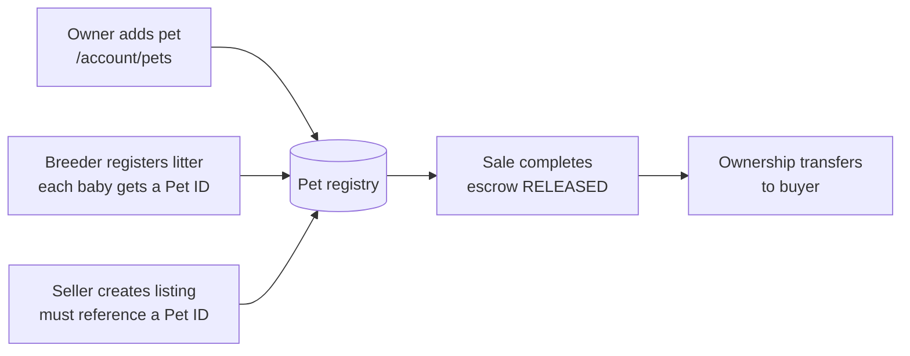

# 01 — Pet Registry & Lineage

> **Status**: Proposed — not implemented · **Last Updated**: 2026-09-26  
> Back to [feature overview](README.md)

Every pet gets one lifelong **PetZonic Pet ID**, created the first time it appears on the
platform and carried across owners.

---

## 1. Pet ID format

```
PZ-TN-2026-000123
│  │  │    └── 6-digit running serial per state per year
│  │  └─────── year of first registration
│  └────────── state code of FIRST registration (never changes)
└───────────── PetZonic prefix
```

- The state code is where the pet was **first registered**. It never changes when the pet
  moves; the pet's current location lives in separate `district` / `state` fields.
- A short **ring code** (`PZTN26000123`, 12 characters, no dashes) is used on physical leg rings
  because ring marking is limited to 16 characters. See [02 — Identity Marks](02-pet-identity-marks.md).
- Pet IDs are **never reused**, including after death or ring removal.
- State codes follow the vehicle-registration style two-letter codes (TN, KA, MH, DL, …).

## 2. How a pet enters the registry



1. **Owner adds a pet** in `/account/pets` (upgrade of today's `UserPetProfile`).
2. **Breeder registers a litter**: sire, dam, birth date, count, breed. Each puppy, kitten or
   chick gets a Pet ID at birth.
3. **Seller creates a listing**: the listing must point to a Pet ID (new or existing). A home
   breeder's litter posts therefore become registry entries automatically.
4. **Sale completes** (after the handover check and escrow `RELEASED`): ownership transfers to
   the buyer, who sees the pet in their account with its full history.

## 3. What each record holds

| Group | Fields |
|---|---|
| Identity | Pet ID, name, species and breed (FK to `PetSpecies` / `PetBreed`, not free text), sex, date of birth, colour, photos |
| Location | Current district and state only (from owner's address). Full address is never shown in any shared view |
| Lineage | Sire Pet ID, dam Pet ID, litter ID, breeder profile |
| Identity marks | Ring number, microchip number, nose-print photo, trust level (see [02](02-pet-identity-marks.md)) |
| External IDs | KCI registration number, municipal licence number — marked self-declared until checked |
| Ownership history | One transfer row per change: date, from, to, reason (sale, gift, rehoming), linked order |
| Status | `ALIVE`, `DECEASED`, `RING_REMOVED` |
| Visibility | `PUBLIC_LIMITED` (default) or `PRIVATE` |

## 4. What people see

- **Public pet page** `/registry/[petCode]`: photo, breed, age, Pet ID, trust badge, 3-generation
  family tree, breeder, vaccination status, "Lives in <district>". Owner shown only as
  "Owner in <district>".
- **Pedigree certificate (PDF)** for pets at trust level *Verified ID* from verified breeders.
- **Breeders** see their litter counts and where their pets live today, by district.
- **Owners** see all their pets, history, and can switch visibility to private.

## 5. Ownership transfer

| Trigger | Behaviour |
|---|---|
| PetZonic sale | Automatic on escrow release, after a successful handover check. Transfer row linked to `orderId` |
| Off-platform sale / gift / rehoming | Current owner starts a transfer; receiving user accepts within 7 days |
| Death | Current owner marks deceased (optional vet note). Pet ID retired forever |
| Dispute | Admin can reverse a transfer; action written to `AuditLog` |

## 6. Anti-abuse rules

- One pet per Pet ID; one ring or chip number per pet (unique indexes).
- Duplicate detection on microchip, ring, and breeder + litter + birth date.
- A dam can register at most **2 litters per 12 months**; more triggers admin review
  (over-breeding flag).
- A lineage link (sire/dam) needs the other pet's owner to confirm, unless both pets belong to
  the same breeder.
- A pet cannot be transferred or marked deceased without the current owner's confirmation.

## 7. Acceptance criteria

- [ ] Creating a pet returns a unique Pet ID in the documented format.
- [ ] A new `PetListing` cannot be submitted for review without a `petId`.
- [ ] Escrow release on a pet order transfers ownership in the same transaction.
- [ ] A public pet page never exposes owner name, phone, email or address.
- [ ] A third litter for the same dam within 12 months is flagged for admin review.
- [ ] Existing `UserPetProfile` rows migrate to `Pet` with no data loss and pharmacy
      prescriptions still resolve.
