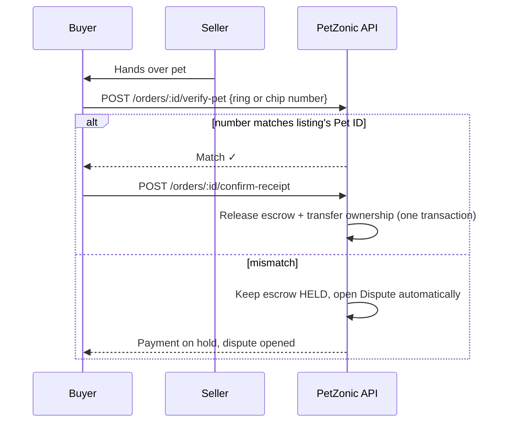

# 02 — Pet Identity Marks: Proving It Is the Right Pet

> **Status**: Proposed — not implemented · **Last Updated**: 2026-09-26  
> Back to [feature overview](README.md)

A Pet ID is only trustworthy if it is tied to a **permanent physical mark on the animal**. The
bird leg ring is the model: fitted in the first days of life, a closed ring cannot come off an
adult bird without cutting it. Every species needs an equivalent, and the Pet ID record stores
that mark's number.

---

## 1. Permanent mark per species

| Species | Permanent mark | When fitted | Who fits it | Can it be faked or moved? |
|---|---|---|---|---|
| Birds (budgies, cockatiels, lovebirds, finches, parrots) | **PetZonic closed leg ring**, ring code laser-etched, size per species | Chick about 5–10 days old, before the foot grows | Verified breeder | No — a closed ring only slips on while the foot is small. An adult with a closed ring was ringed as a chick |
| Dogs and cats | **ISO 11784/11785 FDX-B microchip**, 15-digit number | From about 6–8 weeks, before sale | Vet (PetZonic ID point or partner vet) | Very hard — under the skin for life; any vet scanner reads it |
| Dogs (supporting) | **Nose print** photo (unique per dog) | Any age | Owner or breeder in app | Supporting evidence only; photo matching is a later feature |
| Rabbits, guinea pigs, ferrets | Microchip | Adult size | Vet | As dogs and cats |
| Fish, reptiles, small animals | Photos of patterns/scales + breeder batch record | At registration | Breeder or owner | Weak — stays *Self-declared* |

## 2. Trust levels

| Level | Enum | How it is reached | Shown as |
|---|---|---|---|
| Self-declared | `SELF_DECLARED` | Photos only | Small grey text, no badge |
| Marked | `MARKED` | Owner or breeder enters a ring or chip number | Slate outline badge |
| Verified ID | `VERIFIED` | A verified breeder or vet scans the ring/chip and uploads a photo of it on the pet | Teal outline badge; eligible for pedigree certificate |

## 3. PetZonic leg rings (birds)

- PetZonic sells ring packs **only to verified breeders**. Every ring is pre-assigned a Pet ID
  before shipping, so a ring number that is not in the registry cannot exist.
- Ring code = compact Pet ID without dashes: `PZTN26000123` (12 characters; supplier marking
  limit is 16).
- Rings are **colour-coded by year**, as bird clubs already do, so a buyer can spot an age lie.
- The breeder registers the clutch, then links each ring to a chick in the app **within 14 days**.
- Ring sizes by species (supplier sizes seen in India): lovebird/budgie 4.5 mm, cockatiel/small
  conure 5.5–6 mm, sun conure 6.7 mm, ringneck 8 mm, alexandrine 9–9.5 mm, African grey 11 mm,
  macaw 13 mm, finch 2.7 mm.
- Lost or cut ring → record marked `RING_REMOVED` with a vet or admin note. The ring code is
  never reissued.

## 4. Microchips (dogs, cats, small mammals)

- Standard: ISO 11784/11785, FDX-B, 134.2 kHz, 15-digit number.
- **Phones cannot read these chips.** A dedicated scanner is required. Verified breeders and
  shops can buy Bluetooth scanners; otherwise the check happens at a PetZonic ID point (partner vet).
- Chips already implanted elsewhere (KCI registration, city programmes such as Chennai's
  mandatory dog microchipping) are **imported**: the owner enters the number, and a vet scan
  upgrades it to *Verified ID*.

## 5. Handover check at sale

- A listing from a verified breeder must show the ring or chip number in a photo.
- Birds: buyer reads and types the ring code. Dogs/cats: seller's Bluetooth scanner or a
  PetZonic ID point.
- `confirm-receipt` on a pet order is rejected until `verify-pet` has succeeded.
- Up to 3 attempts; the 3rd mismatch opens the dispute.

## 6. Anti-fraud rules

- Unique index on `ringNumber` and `microchipNumber`; a second registration is blocked and sent
  to admin review.
- Death and transfer need the current owner's confirmation; Pet ID retired on death, never reused.
- Admin can see every mark change in the pet's history (who, when, evidence photo).

## 7. Acceptance criteria

- [ ] A ring code that was not issued in a `RingBatch` cannot be linked to a pet.
- [ ] A duplicate chip or ring number is rejected with a conflict error.
- [ ] `confirm-receipt` on a pet order fails unless `verify-pet` has matched.
- [ ] A mismatch after 3 attempts creates a `Dispute` and keeps `escrowStatus = HELD`.
- [ ] Only a verified breeder or verified vet can raise a pet to `VERIFIED`.
