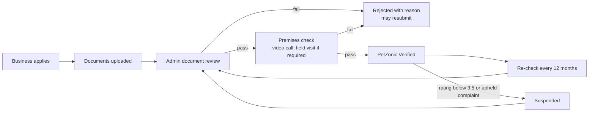

# 03 — PetZonic Verified Network & Near Me

> **Status**: Proposed — not implemented · **Last Updated**: 2026-09-26  
> Back to [feature overview](README.md)

A **PetZonic Verified** badge means a PetZonic admin checked documents and the premises, and the
business keeps meeting quality rules. Buyers find these businesses on `/near-me`.

---

## 1. Who can be verified

| Business type | Existing model | Change |
|---|---|---|
| Pet shop | — | New `PetShop` model |
| Breeder | `BreederProfile` | Add lat/lng; verification through the new workflow (today `isVerified` defaults `false` but nothing can grant it) |
| Pharmacy | `PharmacySellerProfile` | Already has `isVerified`/`verifiedById`; moves onto the shared workflow |
| Vet, groomer, boarding, trainer | `ServiceProvider` | Approval already exists; `isVerified` now granted through the shared workflow |
| NGO / shelter | — | New `Shelter` model; free verification ([15 — Adoption & Shelters](15-adoption-and-shelters.md)) |

All four use one `VerificationApplication` table and one admin queue.

## 2. Verification workflow

**States** (`VerificationStatus`): `DRAFT → SUBMITTED → DOCS_APPROVED → PREMISES_SCHEDULED →
VERIFIED`, plus `REJECTED`, `SUSPENDED`, `EXPIRED`.

**Premises check (decided)**: every applicant gets a **video call**. A **field visit** is also
required for pet shops, breeders with 5 or more breeding animals, and any business with an
upheld complaint.

## 3. Checklist per business type

| Type | Documents | Premises check |
|---|---|---|
| Pet shop | GSTIN, shop & establishment licence, owner ID, State Animal Welfare Board registration where required | Animal housing, cleanliness, water, space |
| Breeder | Owner ID, state breeder registration where required, KCI kennel prefix (optional) | Kennel/aviary conditions, dam health, litter frequency from the registry |
| Pharmacy | Drug licence, pharmacist registration, GSTIN (already captured) | Not required |
| Vet / clinic | Veterinary Council registration, clinic licence | Clinic visit or video tour |

## 4. Staying verified

- Verification expires after **12 months**; reminders at 30 and 7 days (new task on the existing maintenance queue).
- Automatic suspension when average rating falls below **3.5** (min. 10 reviews) or a complaint
  is upheld by admin.
- Every grant, rejection, suspension and expiry is written to `AuditLog`.

## 5. Near me

- **Route**: `/near-me` (web), backed by `GET /api/v1/near-me?lat&lng&radius&type&openNow`.
- Covers verified pet shops, breeders, pharmacies and service providers.
- **Radius** 1–50 km; reuses the haversine approach already in the `services` module
  (no PostGIS until volume requires it).
- **Filters**: All · Shops · Breeders · Vets · Pharmacy; open now; species served; rating.
- **Ranking**: Verified Plus first, then distance, then rating.
- Location: browser geolocation, falling back to the user's saved address district.

## 6. Pet shops on PetZonic (decided)

Verified pet shops both:
- **sell through PetZonic checkout** — products and pets, with the same server-side pricing,
  Razorpay and escrow rules as existing sellers (shop owners get the `SELLER` role through KYC), and
- **appear in `/near-me`** for walk-in customers.

## 7. Where the badge appears

Listing cards, breeder cards and pages, product seller line, search results, `/near-me`, and the
seller section of order pages. Verified sellers get a ranking boost in search.

## 8. Business model

| Tier | Price (proposed) | Includes |
|---|---|---|
| Basic Verified | Free for first 6 months, then ₹2,999/year | Badge, near-me listing |
| Verified Plus | ₹9,999/year | Priority ranking, featured near-me slot, district insights for their category, field visit included |

The badge is never sold on its own — payment cannot skip the checks. Pricing rationale in
[08 — Suppliers & Pricing](08-suppliers-and-pricing.md).

## 9. Acceptance criteria

- [ ] Only an admin can move an application to `VERIFIED`; the grant sets `isVerified`,
      `verifiedAt`, `verifiedById` on the subject.
- [ ] Rejection requires a reason shown to the applicant.
- [ ] `/near-me` returns only `VERIFIED`, active businesses within the radius, sorted as specified.
- [ ] Expired or suspended businesses lose the badge everywhere within one refresh.
- [ ] Admin sidebar shows a live count of pending verifications.
