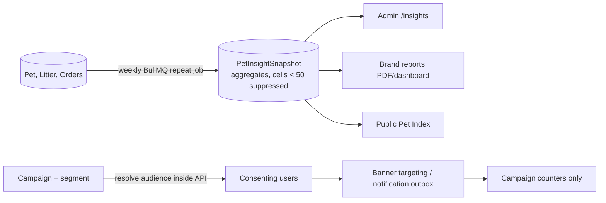

# 04 — Pet Data Insights & Brand Promotion

> **Status**: Proposed — not implemented · **Last Updated**: 2026-09-26  
> Back to [feature overview](README.md)

Brands buy **reach and aggregate reports**, never personal data. PetZonic keeps every owner's
identity inside the platform and shows brands only counts and campaign results.

---

## 1. Insights PetZonic can produce

| Insight | Source data | Refresh |
|---|---|---|
| Pet population by species, breed, age band, district | `Pet` registry | Weekly |
| Breeding activity: litters per breed per district, average litter size | `Litter` | Weekly |
| Demand: listing views, searches, wishlists by breed and district | `PetListing.viewCount`, search logs, wishlist | Weekly |
| Spend: product category and pharmacy orders per pet segment | `Order`, `OrderItem` | Monthly |
| Verified network coverage: verified businesses per district | `VerificationApplication` | Weekly |

**PetZonic India Pet Index** — a free, public quarterly summary (top breeds by state, growth,
cats vs dogs vs birds) to earn press coverage and trust. Detailed cuts are sold to brands.

## 2. Brand products

| Product | What the brand gets | What the brand sees |
|---|---|---|
| Targeted banners & placements | Slots shown to a segment, e.g. "Labrador owners, age 0–1, Chennai" | Impressions, clicks, orders |
| Sponsored notifications | One push/email/SMS to consenting owners in a segment | Sent, opened, clicked counts |
| Breed & district reports | Dashboard or PDF of aggregates | Aggregates only |
| Sampling campaigns | Free samples to opted-in owners; PetZonic fulfils | Units delivered, reviews |

**Segment dimensions allowed**: species, breed, age band (0–1, 1–3, 3–7, 7+ years), district,
state, purchase category. Nothing else.

## 3. Privacy rules built into the product

- **Minimum cell size of 50 pets** for every published or reported number; smaller cells are
  merged into "Other" or hidden.
- No names, phones, emails, addresses or Pet IDs ever leave PetZonic.
- Sponsored messages go only to owners with `BRAND_OFFERS` consent; aggregates include only
  owners with `ANALYTICS` consent.
- Medical notes, allergies and prescriptions are **never** used for insights or targeting.
- Every campaign send and report download is written to `AuditLog`.

Full compliance rules: [07 — Privacy & DPDP](07-privacy-and-compliance.md).

## 4. How it works technically

- Snapshots are computed **inside** the API; brand-facing endpoints read only
  `PetInsightSnapshot` and campaign counters, never user tables.
- Audience resolution for a campaign happens server-side; the brand never receives the list.
- Sponsored notifications reuse the existing `NotificationOutbox` and broadcast queue.

## 5. Acceptance criteria

- [ ] No brand-facing endpoint returns any cell with `petCount < 50`.
- [ ] A user who withdraws `BRAND_OFFERS` receives no further sponsored messages.
- [ ] A user who withdraws `ANALYTICS` is excluded from the next snapshot.
- [ ] Campaign reports show only aggregate counters.
- [ ] Medical fields are excluded from every snapshot query (covered by a test).
