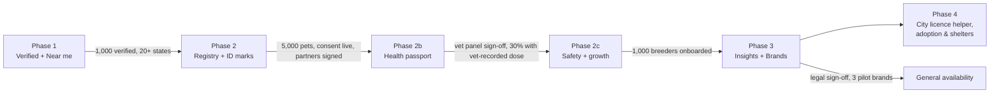

# 09 — Rollout Plan, Metrics & Open Items

> **Status**: Proposed · **Last Updated**: 2026-09-26  
> Back to [feature overview](README.md)

Ship in three phases, each gated on the one before, starting with verification because it
builds trust and supply fastest. Launch is **all-India** from day one.

---

## 1. Phases

| Phase | Scope | Gate to move on |
|---|---|---|
| 1. Verified network + near me | `VerificationApplication`, `PetShop`, admin verification queue (also unblocks breeder verification), `/near-me`, unified badges, verification-expiry job on the existing maintenance queue | 1,000 verified businesses across at least 20 states |
| 2. Pet registry + identity marks | `Pet`, `Litter`, transfers, `PetMarkEvent`, `RingBatch`, listings linked to Pet IDs, public pet page, handover check, `UserPetProfile` migration, `DataConsent` | 5,000 registered pets; consent screens live; ring and chip partners signed |
| 2b. Health passport | `PetLifeEvent`, `PetVaccination`, vaccine catalog and schedules (vet-panel approved), planned doses, reminders, certificate PDF, `petId` on consultations/bookings/insurance/lost-found | Vet panel sign-off on schedules; 30% of registered dogs/cats with a vet-recorded dose |
| 2c. Safety + growth | Lost/stolen alert + QR tag, 3-step litter registration + free rings + referrals, health guarantee (needs insurance payment fix for the insurance offer), breeder score | 1,000 breeders onboarded through the 3-step flow; stolen-listing block live |
| 3. Insights + brands | Snapshots, admin insights, campaigns, brand reports, public Pet Index | Legal sign-off; 3 pilot brands |
| 4. City + community | City licence helper (Chennai, Bengaluru, Mumbai first), shelters and adoption | Rules checked for 3 cities; 50 verified shelters |

## 2. Success metrics

- Registered pets per month; share of new listings linked to a Pet ID (target 100% after Phase 2).
- Share of registered pets at *Verified ID* level.
- Verified businesses per district; conversion rate of verified vs unverified sellers.
- Handover-check mismatch rate (fraud signal).
- Consent opt-in rate for `ANALYTICS` and `BRAND_OFFERS`.
- Brand campaign revenue and click-through rate.

## 3. Open items

- [ ] Test proposed prices ([08](08-suppliers-and-pricing.md)) with 10 shops and 3 brands.
- [ ] Get an Avigene quote for 1 lakh etched closed rings across 5 sizes.
- [ ] Open partner talks with Whizzles (registry + 900+ vets) and Vetic (clinic chain).
- [ ] Ask the Greater Chennai Corporation and other cities about importing their chip numbers.
- [ ] Form a vet advisory panel to approve vaccine and deworming schedules per species.
- [ ] Choose a QR collar tag supplier (target ~₹199 retail).
- [ ] Choose a WhatsApp Business solution provider and get message templates approved.
- [ ] Vet panel to define which conditions the 7-day health guarantee covers.
- [ ] Research official licence rules for Chennai, Bengaluru and Mumbai.
- [ ] Legal review: privacy policy, consent text, brand contracts (DPDP Act 2023).
- [ ] Decide Hindi/Tamil translation approach for consent notices (web is English-only today).

## 4. Prerequisites in the current codebase

- Scheduler: already exists (`petzonic-maintenance-queue`, 2026-09-22) — new jobs are added as tasks on it.
- Admin has zero tests; add a test setup before shipping the verification queue.
- TLS and secrets hardening must land before any real documents (licences, IDs) are uploaded.
