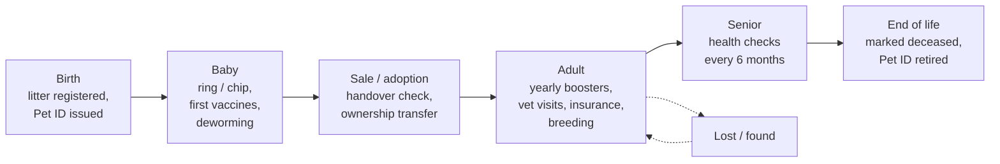

# 10 — Pet Lifecycle & Health Passport

> **Status**: Proposed — not implemented · **Last Updated**: 2026-09-26  
> Back to [feature overview](README.md)

The Pet ID becomes the pet's **lifelong record from birth to death**: every vaccination,
deworming, vet visit, prescription, weight check, sale, insurance policy and lost report is an
event on one timeline. The record moves with the pet when it changes owner, and PetZonic reminds
the owner when the next vaccine is due.

---

## 1. Why

- **Owners forget due dates.** Paper vaccination cards get lost; there is no reminder.
- **Buyers cannot check health claims.** A listing says "vaccinated" with no proof.
- **Health data is scattered today.** In the current schema `VetConsultation`, `Prescription`,
  `InsurancePolicy`, `Booking` and `LostFoundPost` each store `petName` / `petSpecies` as free
  text. None of them link to a pet, so no pet has a history.
- **It brings owners back.** Every reminder leads to a vet booking (services module) or a
  pharmacy order — the lifecycle feeds existing revenue lines.

## 2. Life stages



| Stage | What PetZonic records | What PetZonic prompts |
|---|---|---|
| Birth | Litter, parents, birth date, Pet ID | Fit ring (birds) within 14 days |
| Baby (0–6 months) | Ring/chip, puppy/kitten vaccines, deworming, weight | Next vaccine and deworming dates; microchip before sale |
| Sale / adoption | Transfer, handover check, health status at sale | New owner accepts the passport and reminders |
| Adult | Boosters, vet visits, prescriptions, insurance, litters (if breeding) | Yearly boosters, insurance renewal |
| Senior (dogs/cats 7+ years) | Health checks, chronic conditions (owner-only) | Health check every 6 months |
| End of life | Date, optional cause and vet note | Stop all reminders, close insurance, retire Pet ID |

## 3. The timeline: one event per life moment

Every change is a `PetLifeEvent` on the pet's timeline, newest first.

| Event type | Created by | Linked record |
|---|---|---|
| `BIRTH`, `REGISTERED` | Breeder / owner | `Litter`, `Pet` |
| `RING_FITTED`, `MICROCHIPPED` | Breeder / vet | `PetMarkEvent` |
| `VACCINATION` | Vet / breeder / owner | `PetVaccination` |
| `DEWORMING`, `TICK_FLEA_TREATMENT` | Vet / owner | `PetVaccination` (same table, `kind` field) |
| `VET_VISIT` | System | `VetConsultation` or `Booking` |
| `PRESCRIPTION` | System | `Prescription` |
| `WEIGHT` | Owner / vet | value on the event |
| `NEUTERED` | Vet | — |
| `TRANSFER` | System | `PetOwnershipTransfer` |
| `INSURED`, `INSURANCE_CLAIM` | System | `InsurancePolicy`, `InsuranceClaim` |
| `LITTER` | Breeder | `Litter` (as parent) |
| `LOST`, `FOUND` | Owner | `LostFoundPost` |
| `DECEASED` | Owner / vet | — |

## 4. Vaccinations

### 4.1 What a record holds (`PetVaccination`)

| Field | Notes |
|---|---|
| `kind` | `VACCINE`, `DEWORMING`, `TICK_FLEA` |
| `vaccineCode` | From `VaccineCatalog` (e.g. `DOG_DHPPI`, `DOG_RABIES`, `CAT_FVRCP`) |
| `doseNumber` | 1, 2, 3, booster |
| `givenAt` | Date given |
| `nextDueAt` | Calculated from the schedule; vet can override |
| `batchNumber` | Vaccine lot number from the vial sticker |
| `vetId?`, `clinicName?` | Who gave it |
| `evidenceUrl?` | Photo of the vaccination card sticker |
| `source` | `OWNER`, `BREEDER`, `VET` |
| `verification` | `SELF_REPORTED`, `VET_RECORDED` |

### 4.2 Who can add a record, and how much it is trusted

| Added by | How | Shown as |
|---|---|---|
| Owner | Enters it and uploads a photo of the vaccination card | "Self-reported" (grey) |
| Breeder | Records early vaccines before sale, with card photo | "Recorded by breeder" (grey, badge if breeder verified) |
| Verified vet | Opens the pet by Pet ID, ring, chip or QR, and records it at the clinic | "Vet recorded" (teal) |

- A verified vet's record is saved immediately and the owner is notified; the owner can flag a
  wrong entry, which goes to admin.
- Only `VET_RECORDED` vaccinations count toward the public "Vaccines up to date" mark and the
  vaccination certificate.

### 4.3 Vaccine schedules (`VaccineSchedule`)

Schedules are **data, not code**: admin-editable per species, reviewed by a PetZonic vet
advisory panel before launch. The rows below are the typical Indian pattern used as the
starting draft; **each value must be confirmed by the vet panel**.

| Species | Vaccine / treatment | Typical draft schedule |
|---|---|---|
| Dog | DHPPi (distemper, hepatitis, parvo, parainfluenza) + leptospirosis | From 6–8 weeks, repeat every 3–4 weeks until about 16 weeks, then yearly |
| Dog | Anti-rabies | From about 12 weeks, then yearly |
| Cat | FVRCP ("tricat") | From 6–8 weeks, repeat every 3–4 weeks until about 16 weeks, then yearly |
| Cat | Anti-rabies | From about 12 weeks, then yearly |
| Dog / cat | Deworming | Every 2 weeks until 12 weeks, monthly until 6 months, then every 3 months |
| Birds | No routine vaccines for common pet birds | Yearly health check and deworming as advised by a vet |

When a pet is registered, the schedule generates **planned** doses with due dates; recording a
dose marks it done and moves the next due date.

### 4.4 Reminders

| When | Channel | Action button |
|---|---|---|
| 7 days before due | Push / email (per `NotificationPreference`) | "Book a vet" → services booking pre-filled with the pet |
| On the due date | Push + SMS | "Book a vet" / "Mark as done" |
| 3 days overdue | Push | "Find a vet near me" → `/near-me?type=vet` |
| 30 days overdue | Email | Stops after this; status becomes "Overdue" |

Reminders run as a daily `lifecycle.reminders` task on the existing `petzonic-maintenance-queue`. Following the house
rule, if Redis is down the job logs that reminders are paused — it never marks them sent.

### 4.5 Vaccination certificate

A PDF with Pet ID, pet photo, ring/chip number and every `VET_RECORDED` vaccination (vaccine,
batch, date, vet registration number, clinic). Useful for:

- city pet licences (e.g. rabies proof for Chennai / Bengaluru licensing),
- boarding and grooming bookings (providers can ask for it),
- travel and resale.

## 5. Linking existing modules to the Pet ID

Add an optional `petId` to each model; keep existing free-text fields for old rows.

| Existing model | Change | Benefit |
|---|---|---|
| `VetConsultation` | `petId?` | Vet sees full history in the consultation room; visit lands on timeline |
| `Prescription` | `petProfileId` → `petId` (already planned) | Pharmacy refills tied to the pet |
| `Booking` | `petId?` | Grooming, boarding, vet bookings on the timeline; provider can check vaccines |
| `InsurancePolicy` | `petId?` | Premium from real age and breed; claims can use vet records (owner consent) |
| `LostFoundPost` | `petId?` | Lost report linked to Pet ID; ring/chip lookup shows "reported lost" |
| `PetListing` | `petId` (already planned) | Listing shows vaccination status straight from the passport |

## 6. At sale and transfer

- The listing shows **"Vaccines: 2 of 3 puppy doses done · vet recorded"** from the passport,
  not from the seller's text. The existing `isVaccinated` flag is filled automatically.
- On transfer the **whole history moves to the new owner**; the previous owner loses access to
  new entries but keeps a read-only copy of the history up to the sale date.
- Remaining planned doses and reminders switch to the new owner.

## 7. Privacy

- Health records are **medical data**: never used for insights or brand targeting
  (see [07](07-privacy-and-compliance.md)).
- Visible to the owner and to vets the owner books or who scan the pet at a clinic.
- The public pet page shows only **"Vaccines up to date: Yes / No / Unknown"** — no dates,
  no conditions, no prescriptions.
- Chronic conditions and medical notes are owner-only unless shared with a vet.

## 8. Data model additions

| Model | Key fields |
|---|---|
| `PetLifeEvent` | `petId`, `type`, `occurredAt`, `recordedById`, `source`, `refType?`, `refId?`, `value?` (JSON, e.g. weight), `note?` |
| `PetVaccination` | fields in §4.1, `petId` |
| `VaccineCatalog` | `code`, `speciesId`, `name`, `kind`, `description` |
| `VaccineSchedule` | `speciesId`, `vaccineCode`, `doseNumber`, `ageWeeks?`, `intervalDaysAfterPrevious?`, `repeatEveryDays?`, `approvedByVetPanelAt?` |
| `PetPlannedDose` | `petId`, `vaccineCode`, `doseNumber`, `dueAt`, `status` (`PLANNED`/`DONE`/`OVERDUE`/`SKIPPED`), `vaccinationId?`, `lastReminderAt?` |

Indexes: `PetLifeEvent @@index([petId, occurredAt])`; `PetPlannedDose @@index([status, dueAt])`
for the reminder job.

## 9. API additions (`registry` module)

| Method | Path | Auth | Purpose |
|---|---|---|---|
| GET | `/registry/pets/:id/timeline` | owner or vet with access | Life events, paginated |
| GET | `/registry/pets/:id/health` | owner or vet with access | Vaccinations, planned doses, status |
| POST | `/registry/pets/:id/vaccinations` | owner / breeder / verified vet | Add a vaccination, deworming or tick treatment |
| POST | `/registry/pets/:id/weights` | owner / vet | Add a weight entry |
| POST | `/registry/pets/:id/vaccinations/:vid/flag` | owner | Dispute a vet entry |
| GET | `/registry/pets/:id/certificate.pdf` | owner | Vaccination certificate |
| GET | `/registry/lookup?code=` | verified vet | Open a pet by Pet ID, ring, chip or QR at the clinic |
| CRUD | `/admin/vaccine-schedules` | authorize(ADMIN) | Manage catalog and schedules |

Vet access rule: a verified vet can read and write a pet's health data when (a) the owner has a
booking or consultation with them, or (b) they look it up by the physical mark at the clinic;
every access is logged in `AuditLog`.

## 10. UI

- **Pet page for the owner** (`/account/pets/[id]`): tabs **Overview · Health · Timeline ·
  Documents**.
- **Health tab**: a "Next due" card on top (orange action button "Book a vet"), then a list of
  vaccines with status chips — Done (teal), Due soon (amber), Overdue (red), Planned (grey).
- **Timeline tab**: vertical list, newest first, one line per event with an icon, date and who
  recorded it.
- **Vet screen**: "Scan or enter Pet ID / ring / chip" → pet summary → "Add vaccination" form
  with vaccine picker, batch number and next-due date pre-filled.

```
+-----------------------------------+
|  Bruno · Health                   |
|  +-----------------------------+  |
|  | Next due: Rabies booster    |  |
|  | 14 Oct 2026 (in 18 days)    |  |
|  | [      Book a vet       ]   |  |   <- orange
|  +-----------------------------+  |
|                                   |
|  DHPPi dose 1   12 Mar  [Done]    |   <- teal chip
|  DHPPi dose 2   09 Apr  [Done]    |
|  DHPPi dose 3   07 May  [Done]    |
|  Rabies         07 May  [Done]    |
|  Rabies booster 14 Oct  [Due soon]|   <- amber chip
|  Deworming      02 Oct  [Overdue] |   <- red chip
|                                   |
|  [ Download certificate (PDF) ]   |
+-----------------------------------+
```

## 11. Acceptance criteria

- [ ] Registering a dog or cat creates planned doses from the active schedule for its species.
- [ ] Recording a dose marks the planned dose `DONE` and sets the next due date.
- [ ] Reminders fire at 7 days before, on the day, 3 and 30 days overdue, respecting
      notification preferences, and stop when the dose is recorded or the pet is deceased.
- [ ] Only `VET_RECORDED` doses count toward "Vaccines up to date" and the certificate.
- [ ] On ownership transfer, history and planned doses move to the new owner.
- [ ] The public pet page exposes no vaccination dates, conditions or prescriptions.
- [ ] Health data never appears in `PetInsightSnapshot` or campaign segments (covered by a test).
- [ ] Every vet read/write of a pet's health data is written to `AuditLog`.
