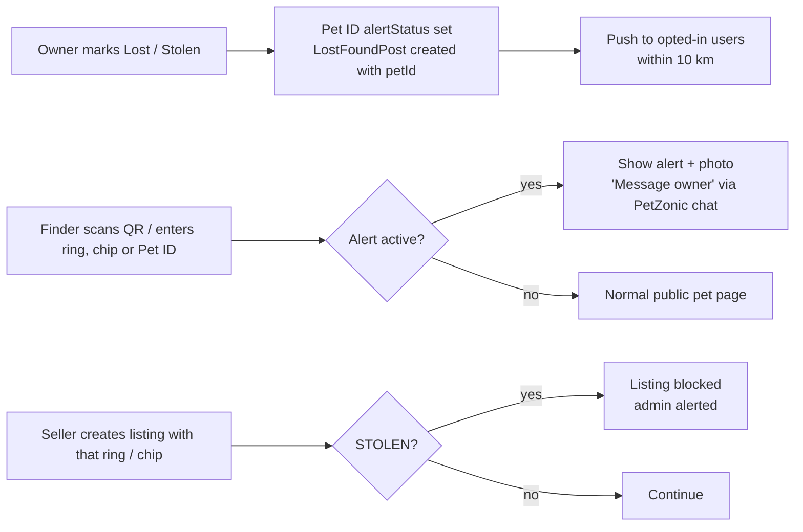

# 11 — Lost & Stolen Pet Alert and QR Collar Tag

> **Status**: Proposed — not implemented · **Last Updated**: 2026-09-26  
> Back to [feature overview](README.md)

An owner can mark a pet **Lost** or **Stolen** on its Pet ID. Anyone who looks up that pet's
ring, chip, Pet ID or QR tag sees the alert and can message the owner through PetZonic chat
without seeing their phone number. A stolen pet's ring or chip is **blocked from every new
listing**, so stolen birds and dogs cannot be resold on PetZonic — a strong reason for owners
to register.

---

## 1. What exists today

- `LostFoundPost` (community module) stores `type` (`LOST`/`FOUND`), pet name, species, breed,
  colour, photos, last-seen place, lat/lng, city and a **plain `contactPhone`**. It is not linked
  to any pet and exposes the phone number publicly.
- `Conversation` / `Message` and the `/chat` Socket.IO gateway already provide in-app chat.

## 2. Alert states

| Pet `alertStatus` | Set by | Effect |
|---|---|---|
| `NONE` | default | Normal |
| `LOST` | Owner | Public alert on pet page and lookups; nearby notification (opt-in); lost-found post created |
| `STOLEN` | Owner (police complaint number optional but encouraged) | Everything in `LOST` **plus** listing block on ring/chip/Pet ID; admin review |
| `FOUND` | Owner, or admin | Alert cleared; timeline event `FOUND`; thank-you message to helpers |

## 3. Flow

## 4. Rules

- **Phone number never shown.** `contactPhone` becomes optional and hidden for posts linked to a
  Pet ID; finders contact the owner through a new chat conversation (`type: LOST_FOUND`).
- **Anonymous finders** (not logged in) can send one message with a mobile number verified by
  OTP (existing OTP service), rate-limited per IP and per pet.
- **Stolen block**: `POST /pets` (listing create) and `/registry/pets/:id/mark` reject any pet
  whose ring, chip or Pet ID has `alertStatus = STOLEN`; the attempt is logged and admin gets a
  notification with the seller's details.
- **Transfer freeze**: a pet marked `LOST` or `STOLEN` cannot be transferred until `FOUND`.
- **Abuse guard**: only the current owner can raise an alert; a second owner claiming the same
  ring or chip goes to admin as a dispute.
- **Nearby push** only to users who opted in ("Help find lost pets near me", off by default).
- Found pets are marked `FOUND` by the owner; alerts older than 90 days prompt the owner to
  confirm status.

## 5. QR collar tag (about ₹199)

Phones cannot read microchips, but any phone camera can scan a QR code.

- A metal or hard-plastic collar tag with a QR code and the printed Pet ID.
- QR encodes `https://petzonic.in/t/<tagCode>` (short random code, **not** the Pet ID itself, so a
  lost tag can be revoked and re-issued).
- Scanning opens the pet's public page; if an alert is active, the alert and "Message owner"
  button are shown first.
- Owner can print a free paper version from the app; the metal tag is sold through the
  existing product catalog as a normal product (about ₹199, supplier to be chosen).
- Each scan is logged (time, approximate location if the finder allows it) and the owner is
  notified: "Bruno's tag was scanned near Anna Nagar".

## 6. Data model

| Change | Fields |
|---|---|
| `Pet` | `alertStatus` (`NONE`/`LOST`/`STOLEN`/`FOUND`), `alertSince?`, `policeComplaintNo?` |
| `LostFoundPost` | `petId?`; `contactPhone` becomes optional and hidden when `petId` is set |
| `PetTag` (new) | `petId`, `tagCode` (unique), `type` (`QR_METAL`/`QR_PAPER`), `status` (`ACTIVE`/`REVOKED`), `issuedAt` |
| `PetTagScan` (new) | `tagId`, `scannedAt`, `lat?`, `lng?`, `finderUserId?` |
| `Conversation` | Add `type` `LOST_FOUND` and optional `petId` |

## 7. API

| Method | Path | Auth | Purpose |
|---|---|---|---|
| POST | `/registry/pets/:id/alert` | owner | Set `LOST` / `STOLEN` / `FOUND` |
| GET | `/registry/lookup/public?code=` | public, rate-limited | Look up by Pet ID, ring or chip; returns public page + alert |
| GET | `/t/:tagCode` (web route) → `/registry/tags/:tagCode` | public | QR resolve, logs scan |
| POST | `/registry/pets/:id/contact-owner` | authenticate or OTP | Opens a `LOST_FOUND` chat conversation |
| POST | `/registry/pets/:id/tags` | owner | Issue / revoke a tag |

## 8. UI

- **Owner pet page**: red-outline button "Report lost" / "Report stolen"; when active, a red
  banner on top with "Mark as found".
- **Public pet page with alert**: red banner "This pet is reported lost since 3 Oct", last-seen
  area (district only), primary button "Message owner".
- **Lost pets near me**: filter chip "Lost pets" on `/near-me` and on `/community`.
- **Tag page** `/t/[tagCode]`: minimal, loads fast on mobile data, big "Message owner" button.

## 9. Acceptance criteria

- [ ] A listing with a ring or chip of a `STOLEN` pet is rejected and admin is notified.
- [ ] No response for a Pet-ID-linked lost post contains the owner's phone number.
- [ ] Scanning a revoked tag shows "This tag is no longer active".
- [ ] Transfer of a `LOST` or `STOLEN` pet is rejected.
- [ ] Anonymous contact is limited (e.g. 3 messages per hour per IP) and requires OTP.
