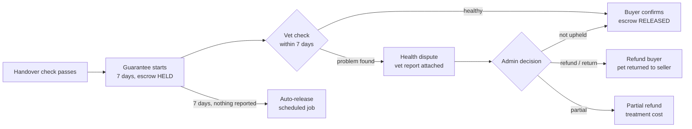

# 13 — Health Guarantee at Sale & Insurance at Handover

> **Status**: Proposed — not implemented · **Last Updated**: 2026-09-26  
> Back to [feature overview](README.md)

Every living pet sold on PetZonic comes with a **7-day health guarantee**: the buyer gets a
check by a verified vet within 7 days, and the seller's payment is released only after a clean
check or after 7 days with no problem reported. At handover, PetZonic offers pet insurance from
the existing insurance module.

---

## 1. Fit with what exists

- Escrow already holds payment for pet orders (`Order.escrowStatus = HELD`) and releases on
  buyer `confirm-receipt`.
- `autoReleaseExpiredEscrows()` implements "release 7+ days after delivery with no dispute" and
  **runs hourly** since 2026-09-22 (`auto-release-escrows` job in `petzonic-maintenance-queue`).
  This feature changes its rule: skip orders with an open health dispute.
- `Dispute` already records reason, evidence, resolution, refund amount and seller penalty.
- Insurance plans, premiums and policies exist, **but policies are currently issued with no
  payment gate** (a known, documented gap). That must be fixed before selling insurance at
  handover.

## 2. Flow

## 3. Rules

- Guarantee applies to all `PetListing` sales through checkout; shown on every listing:
  "7-day health guarantee".
- **Vet check**: free first check at a PetZonic ID point (verified vet), booked from the order
  page. The vet records findings on the health passport and marks **Healthy** or **Problem
  found**.
- **Covered problems** (draft, for vet panel review): conditions a vet judges were present
  before sale — e.g. parvovirus or distemper symptoms in puppies, serious congenital defects,
  parasites beyond routine treatment. Accidents after handover are not covered.
- **Outcomes**: full refund with return of the pet, partial refund (treatment cost), or not
  upheld. Decided by admin using the vet report; recorded on `Dispute`.
- A health claim can only be raised with a vet report from a verified vet.
- Upheld claims lower the seller's **breeder score** ([12](12-breeder-onboarding-and-score.md)).
- If the pet dies within 7 days, the buyer uploads a vet certificate; the claim goes straight to
  admin with priority.

## 4. Insurance at handover

- After the handover check passes, the buyer sees one card: "Protect Bruno from day one" with
  the recommended plan from the existing `/insurance/recommend` logic, pre-filled from the Pet ID
  (species, breed, age — no retyping).
- `InsurancePolicy` gets `petId` (see [10](10-pet-lifecycle.md)).
- **Prerequisite**: add a payment step for insurance policies (today a policy is issued
  without payment). Until then this card links to the plan page only.

## 5. Data model

| Change | Fields |
|---|---|
| `Order` (pet orders) | `guaranteeEndsAt?`, `healthCheckStatus` (`PENDING`/`HEALTHY`/`PROBLEM`/`SKIPPED`) |
| `Dispute` | `type` (`GENERAL`/`HEALTH_GUARANTEE`/`IDENTITY_MISMATCH`), `vetReportUrl?`, `vetId?` |
| `HealthCheck` (new) | `orderId`, `petId`, `vetId`, `checkedAt`, `result`, `findings`, `reportUrl` |

## 6. API

| Method | Path | Auth | Purpose |
|---|---|---|---|
| POST | `/orders/:id/health-check/book` | buyer | Book the free check at an ID point |
| POST | `/orders/:id/health-check` | verified vet | Record result |
| POST | `/orders/:id/health-claim` | buyer | Open `HEALTH_GUARANTEE` dispute with vet report |
| Scheduled | existing `auto-release-escrows` (hourly) | — | Extend `autoReleaseExpiredEscrows()` to skip orders with an open health dispute |

## 7. UI

- Listing and pet card: small line "7-day health guarantee" (slate, shield icon).
- Order page after handover: a card with a countdown "Guarantee ends in 5 days", buttons
  "Book free vet check" and "Report a health problem", then the insurance card.

## 8. Acceptance criteria

- [ ] Pet order escrow is not auto-released while a health dispute is open.
- [ ] Escrow auto-releases 7 days after handover when no dispute exists (existing hourly job).
- [ ] A health claim without a verified-vet report is rejected.
- [ ] Insurance at handover is only purchasable once policy payment exists.
