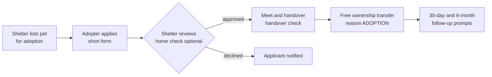

# 15 — Adoption & Shelters

> **Status**: Proposed — not implemented · **Last Updated**: 2026-09-26  
> Back to [feature overview](README.md)

NGOs and shelters join as a **verified business type**. Adoptions are **free ownership
transfers**, so rescued and street pets get Pet IDs, health passports and reminders too. It
builds trust, brings a new group of owners, and is good for press.

---

## 1. Shelters as verified businesses

- New `VerificationSubject` value `SHELTER` and a `Shelter` model.
- Documents: registration as a trust/society/Section 8 company, Animal Welfare Board of India
  recognition where held, PAN, address proof, a responsible person's ID.
- Premises check: video call; field visit for shelters housing more than 20 animals.
- Verified shelters appear in `/near-me` under a new chip "Shelters" and get a
  "PetZonic Verified Shelter" badge.
- Free forever — no Verified Plus fee for shelters.

## 2. Adoption listings

- `PetListing` gets `listingType` `SALE` / `ADOPTION`. Adoption listings have **no price** and no
  Razorpay checkout; an optional adoption fee set by the shelter is shown as text and paid to
  the shelter directly (PetZonic does not process it in this phase).
- Every adoption pet has a Pet ID; vaccinations, neutering and deworming done by the shelter's
  vet appear as vet-recorded entries.
- Filter "Adopt" on `/pets` and a dedicated `/adopt` page.

## 3. Adoption flow

- Adoption application: household, other pets, experience, home type, consent to a home check.
- Transfer reason `ADOPTION`; the passport, planned doses and reminders move to the adopter.
- Follow-up prompts at 30 days and 6 months ask the adopter for a photo and update; the shelter
  sees the answers.
- If an adoption fails, the adopter can return the pet to the shelter through a transfer back.

## 4. Street and community animals

A verified shelter can register street dogs it vaccinates or sterilises (ABC programmes) as Pet
IDs with owner = the shelter and `status` "community animal", so their vaccination and
sterilisation history is on record. These pets are excluded from brand insights.

## 5. Data model

| Change | Fields |
|---|---|
| `Shelter` (new) | `ownerId`, `name`, `registrationType`, `registrationNumber`, `awbiRecognitionNo?`, `address`, `district`, `state`, `latitude`, `longitude`, `capacity`, `isVerified`, `verifiedAt?` |
| `VerificationSubject` | add `SHELTER` |
| `PetListing` | `listingType` (`SALE`/`ADOPTION`), `shelterId?`, `adoptionFeeText?` |
| `AdoptionApplication` (new) | `listingId`, `applicantId`, `answers` (JSON), `status` (`SUBMITTED`/`APPROVED`/`DECLINED`/`WITHDRAWN`), `decidedAt?` |
| `TransferReason` | add `ADOPTION` |
| `Pet` | `isCommunityAnimal` |

## 6. API

| Method | Path | Auth | Purpose |
|---|---|---|---|
| POST/PUT | `/shelters`, `/shelters/me` | authenticate | Shelter profile |
| GET | `/adopt` (listings with `listingType=ADOPTION`) | public | Browse |
| POST | `/adoptions/:listingId/apply` | authenticate | Apply |
| POST | `/adoptions/:id/approve` \| `/decline` | shelter owner | Decide |
| POST | `/adoptions/:id/complete` | shelter owner | Handover → free transfer |

## 7. Acceptance criteria

- [ ] Adoption listings never reach Razorpay checkout.
- [ ] Only verified shelters can create adoption listings.
- [ ] Completing an adoption transfers the Pet ID with reason `ADOPTION` and moves reminders.
- [ ] Community animals are excluded from `PetInsightSnapshot`.
